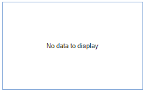
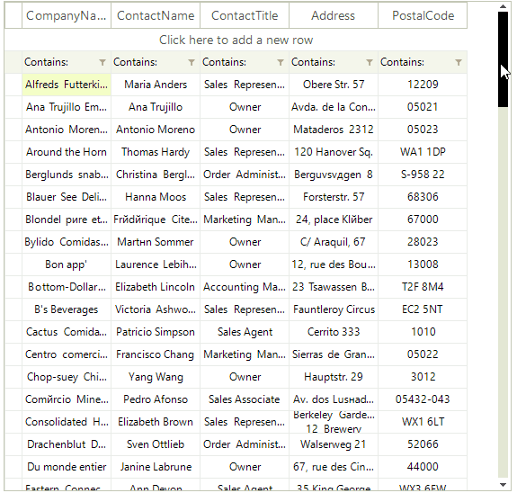

# Populating with data

__RadVirtualGrid__ is a control that allows you to display and edit tabular data from any kind of data source and large number of records. By default, no data is displayed in the grid. You can control whether the *no data* message will be shown by using the __ShowNoDataText__ property:

|ShowNoDataText = *true*|ShowNoDataText = *false*|
|----|----|
|||
 

In order to fill the grid with data, you should follow the steps below:

1\. Handle the __CellValueNeeded__ event. You should specify the __Value__ argument in the __VirtualGridCellValueNeededEventArgs__. 

2\. You will also need to set the __RowCount__ and __ColumnCount__ properties so that the grid will know how many rows/columns it needs to display.

The code snippet below demonstrates how to select data from the Northwind.Customers table stored in a mdb file. While reading the returned result, we fill a *List* of custom objects which is needed to track the number of records and sync the RadVirtualGrid. __RowCount__ property.

#### Populate with data

<snippet id='virtualgrid-virtualgridpopulatingwithdata-filldata-cs' />
<snippet id='virtualgrid-virtualgridpopulatingwithdata-filldata-vb' />

#### Customer class

<snippet id='virtualgrid-virtualgridpopulatingwithdata-customerclass-cs' />
<snippet id='virtualgrid-virtualgridpopulatingwithdata-customerclass-vb' />

# See Also
* [Handle Add, Delete and Update of Rows]()
* [Live Data in VirtualGrid]()

