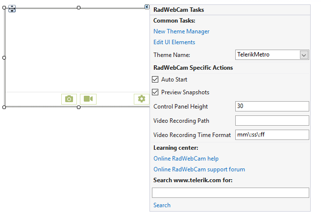

# Design Time

To start using **RadWebCam** just drag it from the toolbox and drop it on the form.

## Smart Tag

Select **RadWebCam** and click the small arrow at the top right position in order to open the Smart Tag.

>caption Figure 1: RadWebCam's Smart Tag

* Common Tasks

	* New Theme Manager: Adds a new RadThemeManager component to the form.

	* Edit UI elements: Opens a dialog that displays the Element Hierarchy Editor. This editor lets you browse all the elements in the control.

	* Theme Name: Select a theme name from the drop down list of themes available for that control. Selecting a theme allows you to change all aspects of the controls visual style at one time.

* RadWebCam Specific Actions

	* **Auto Start**: Gets or sets whether the control will start the first webcam it finds upon starting the application.
	* **Preview Snapshots**: Gets or sets whether the control will go into preview mode when a snapshot is taken.
	* **Control Panel Height**: Gets or sets the height of the panel with the camera controls.
	* **Video Recording Path**: Gets or sets the location where video files are stored when capturing.
	* **Video Recording Time Format**: Gets or sets the format of the elapsed time displayed during recording.
	

* Learning Center: Navigate to the Telerik help, code library projects or support forum.

* Search: Search the Telerik site for a given string.

## See Also
* [Overview]()
* [Structure]()
* [Getting Started]()

