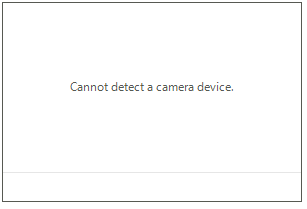

# Events

**RadWebCam** exposes the following events, specific for the control:

## SnapshotTaken

The **SnapshotTaken** event fires when the "Take snapshot" button is pressed or when you call the **TakeSnapshot** method of **RadWebCam**.

The purpose of the event is to notify you that a snapshot has been taken and you need to take action, like saving it to a file.

The event arguments are of type **SnapshotTakenEventArgs** which exposes a **Snapshot** property (of type **Image**).

{{source=..\SamplesCS\WebCam\WebCamGettingStarted.cs region=Snapshot}} 
{{source=..\SamplesVB\WebCam\WebCamGettingStarted.vb region=Snapshot}} 

````C#

        private void RadWebCam1_SnapshotTaken(object sender, SnapshotTakenEventArgs e)
        {
            Image snapshot = e.Snapshot;
            // here you save the source to a file, in memory, or to show it in the UI 
        }

````
````VB.NET

    Private Sub RadWebCam1_SnapshotTaken(ByVal sender As Object, ByVal e As SnapshotTakenEventArgs)
        Dim snapshot As System.Drawing.Image = e.Snapshot
    End Sub

````

{{endregion}} 

## CameraError

The **CameraError** event fires when one of the expected camera errors appears.

The event can be used to notify you about the corresponding error, or to replace the error message shown in the control.

The event arguments are of type **CameraErrorEventArgs** and they expose an **Error** property that contains information about the error. The **Error** property is of type **ErrorInfo** which gives you access to the message and state of the error via the **Message** and **ErrorState** properties.

{{source=..\SamplesCS\WebCam\WebCamGettingStarted.cs region=Errors}} 
{{source=..\SamplesVB\WebCam\WebCamGettingStarted.vb region=Errors}} 

````C#

        private void RadWebCam1_CameraError(object sender, CameraErrorEventArgs e)
        { 
            if (e.Error.ErrorState == CameraErrorState.NoCamera)
            {
                e.Error.Message = "Cannot detect a camera device.";
            }
        }

````
````VB.NET

    Private Sub RadWebCam1_CameraError(ByVal sender As Object, ByVal e As CameraErrorEventArgs)
        If e.[Error].ErrorState = CameraErrorState.NoCamera Then
            e.[Error].Message = "Cannot detect a camera device."
        End If
    End Sub

````

{{endregion}} 

>caption Customized error message




## See Also
* [Structure]()
* [Design Time]()
* [Overview]()
