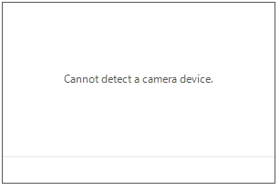

# Events

**RadWebCam** exposes the following events, specific for the control:

## SnapshotTaken

The **SnapshotTaken** event fires when the "Take snapshot" button is pressed or when you call the **TakeSnapshot** method of **RadWebCam**.

The purpose of the event is to notify you that a snapshot has been taken and you need to take action, like saving it to a file.

The event arguments are of type **SnapshotTakenEventArgs** which exposes a **Snapshot** property (of type **Image**).

<snippet id='webcam-webcamgettingstarted-snapshot-cs' />
<snippet id='webcam-webcamgettingstarted-snapshot-vb' />

## CameraError

The **CameraError** event fires when one of the expected camera errors appears.

The event can be used to notify you about the corresponding error, or to replace the error message shown in the control.

The event arguments are of type **CameraErrorEventArgs** and they expose an **Error** property that contains information about the error. The **Error** property is of type **ErrorInfo** which gives you access to the message and state of the error via the **Message** and **ErrorState** properties.

<snippet id='webcam-webcamgettingstarted-errors-cs' />
<snippet id='webcam-webcamgettingstarted-errors-vb' />

>caption Customized error message

## See Also
* [Structure]()
* [Design Time]()
* [Overview]()
