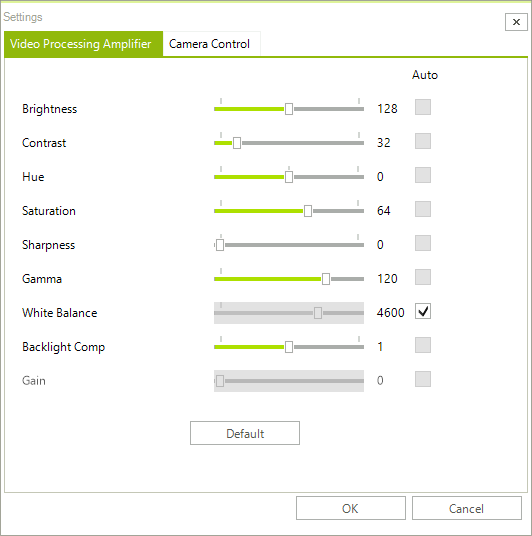

# Settings Dialog

**RadWebCam** allows you to control the settings of the connected camera. You can do this using the settings dialog which opens when you press the [Open settings dialog button]().

>important The changes applied via the settings dialog reflects the settings of the camera device. This means that when you close the application, the settings will be still applied to the device.

**RadWebCam** offers the **SettingsDialogShowing** event. It is a cancelable event. Hence, you can prevent the dialog from showing in certain conditions. The **CameraSettingsDialogShowingEventArgs** gives you access to the **CameraSettingsDialog**. 

## See Also
* [Snapshots]()
* [Video Recording]()
* [Media Information]()
* [Settings Dialog]()
* [Errors]()
