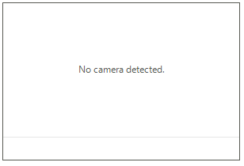
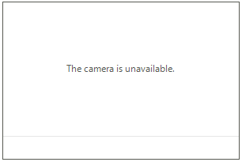
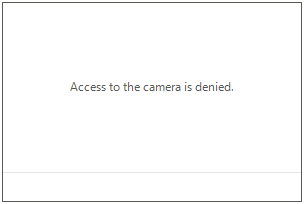
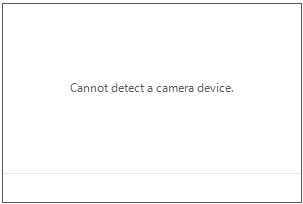

# Errors

This article demonstrates how to customize the error content shown when one of the few known camera errors appear.

When one of the following errors appears, the camera buttons and player get replaced by an error message.

## Error Types

There are few expected errors that could appear using the control:

* CameraErrorState.**NoCamera**: This error appears when there is no camera device connected to the computer.

	

* CameraErrorState.**CameraIsBusy**: This error appears when another application is using the camera device.

	

>caution **RadWebCam** can be used by a single application. Once a second application tries to access it, **CameraIsBusy** error will be shown. 

* CameraErrorState.**CameraAccessDenied**: This error appears when the access to the camera is denied.

	

## Replacing the Error Message

To replace the error message use the **CameraError** event of **RadWebCam**. The **CameraErrorEventArgs** give access to an **ErrorInfo** object, which contains information about the error state and message. Use the event to replace the default message with a custom one.

{{source=..\SamplesCS\WebCam\WebCamGettingStarted.cs region=Errors}} 
{{source=..\SamplesVB\WebCam\WebCamGettingStarted.vb region=Errors}} 

````C#

        private void RadWebCam1_CameraError(object sender, CameraErrorEventArgs e)
        { 
            if (e.Error.ErrorState == CameraErrorState.NoCamera)
            {
                e.Error.Message = "Cannot detect a camera device.";
            }
        }

````
````VB.NET

    Private Sub RadWebCam1_CameraError(ByVal sender As Object, ByVal e As CameraErrorEventArgs)
        If e.[Error].ErrorState = CameraErrorState.NoCamera Then
            e.[Error].Message = "Cannot detect a camera device."
        End If
    End Sub

````

{{endregion}} 




## See Also
* [Commands]()
* [Snapshots]()
* [Video Recording]()
* [Media Information]()
* [Settings Dialog]() 

