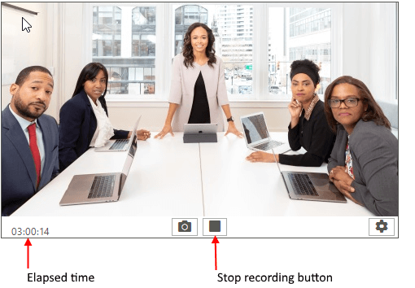

# Recording Video

To start recording a video you can press the "Start recording" button or call the **StartRecording** method of **RadWebCam** control.


To enable video recording set the **RecordingFilePath** property of the control. This is the path to the video where the recording will be stored.

{{source=..\SamplesCS\WebCam\WebCamGettingStarted.cs region=Video}} 
{{source=..\SamplesVB\WebCam\WebCamGettingStarted.vb region=Video}} 

````C#

            radWebCam1.RecordingFilePath = path + @"\Video1.mp4";
            radWebCam1.StartRecording();

````
````VB.NET

        radWebCam1.RecordingFilePath = path + "\Video1.mp4"
        radWebCam1.StartRecording()      

````

{{endregion}} 

To stop recording, press the "Stop" button or call the **StopRecording** method of **RadWebCam**. This will stop the recording and close the file stream.

{{source=..\SamplesCS\WebCam\WebCamGettingStarted.cs region=EndRecording}} 
{{source=..\SamplesVB\WebCam\WebCamGettingStarted.vb region=EndRecording}} 

````C#

        radWebCam1.StopRecording();

````
````VB.NET

        radWebCam1.StopRecording()      

````

{{endregion}} 

You can indicate that the camera control is recording via its **IsRecording** property.

>note Setting the **IsRecording** property of **RadWebCam** will also start or stop the recording.

## Elapsed Time Format

The control allows you to replace the default elapsed date-time format. To do this, set the **VideoRecordingElapsedTimeFormat** property of the **RadWebCam** control.



{{source=..\SamplesCS\WebCam\WebCamGettingStarted.cs region=EllapsedTimeFormat}} 
{{source=..\SamplesVB\WebCam\WebCamGettingStarted.vb region=EllapsedTimeFormat}} 

````C#

            radWebCam1.VideoRecordingElapsedTimeFormat = "ss";

````
````VB.NET

              radWebCam1.VideoRecordingElapsedTimeFormat = "ss"

````

{{endregion}} 

## See Also
* [Commands]()
* [Snapshots]()
* [Media Information]()
* [Settings Dialog]()
* [Errors]()

