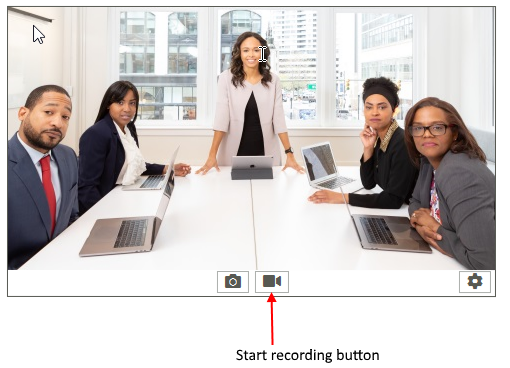
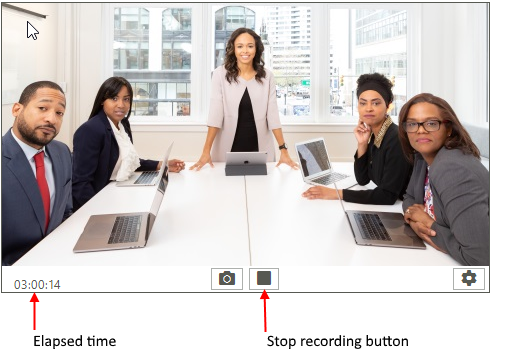

# Recording Video

To start recording a video you can press the "Start recording" button or call the **StartRecording** method of **RadWebCam** control.

To enable video recording set the **RecordingFilePath** property of the control. This is the path to the video where the recording will be stored.

<snippet id='webcam-webcamgettingstarted-video-cs' />
<snippet id='webcam-webcamgettingstarted-video-vb' />

To stop recording, press the "Stop" button or call the **StopRecording** method of **RadWebCam**. This will stop the recording and close the file stream.

<snippet id='webcam-webcamgettingstarted-endrecording-cs' />
<snippet id='webcam-webcamgettingstarted-endrecording-vb' />

You can indicate that the camera control is recording via its **IsRecording** property.

>note Setting the **IsRecording** property of **RadWebCam** will also start or stop the recording.

## Elapsed Time Format

The control allows you to replace the default elapsed date-time format. To do this, set the **VideoRecordingElapsedTimeFormat** property of the **RadWebCam** control.

<snippet id='webcam-webcamgettingstarted-ellapsedtimeformat-cs' />
<snippet id='webcam-webcamgettingstarted-ellapsedtimeformat-vb' />

## See Also
* [Commands]()
* [Snapshots]()
* [Media Information]()
* [Settings Dialog]()
* [Errors]()

