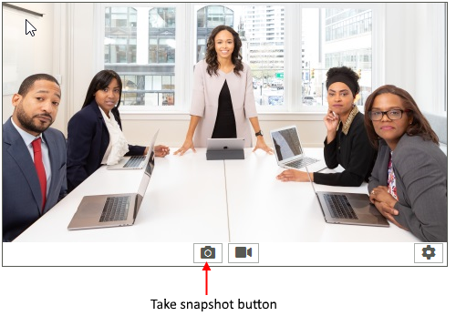

# Snapshots

**RadWebCam** allows you to snapshot the currently displayed video feed. This can be done via the "Take snapshot" button of the control, or the **TakeSnapshot** method. This will fire the **SnapshotTaken** event where you can get the Image object.

#### Taking a snapshot in code

<snippet id='webcam-webcamfeatures-takesnapshots-cs' />
<snippet id='webcam-webcamfeatures-takesnapshots-vb' />

## Preview Snapshots

By default, when you take a snapshot a preview of the image will be shown. To disable this, set the **PreviewSnapshots** property to *false*.

<snippet id='webcam-webcamfeatures-preview-cs' />
<snippet id='webcam-webcamfeatures-previewcamerasnapshot-vb' />

You can indicate if the snapshot preview is displayed via the **IsPreviewingSnapshot** property of **RadWebCam**.

## See Also
* [Commands]()
* [Video Recording]()
* [Media Information]()
* [Settings Dialog]()
* [Errors]()

