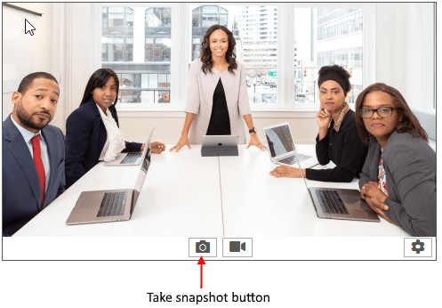

# Save Snapshot to File

This article shows how to take and save a snapshot to a file.

## Setting up the Control

Add a **RadWebCam** to the form and subscribe to its **SnapshotTaken** event. In the event handler you have access to an Image object holding the snapshot. You can use this to save it to the file system.

#### Opening a file dialog in the SnapshotTaken event handler and saving it to a file

{{source=..\SamplesCS\WebCam\WebCamFeatures.cs region=SaveSnapshot}} 
{{source=..\SamplesVB\WebCam\WebCamFeatures.vb region=SaveSnapshot}} 

````C#

        private void radWebCam_SnapshotTaken(object sender, SnapshotTakenEventArgs e)
        {
            SaveFileDialog dialog = new SaveFileDialog();
            dialog.Filter = "Images|.png;.bmp;*.jpg";
            dialog.DefaultExt = ".png";
            dialog.FilterIndex = 0;
            if (dialog.ShowDialog() == System.Windows.Forms.DialogResult.OK)
            {
                e.Snapshot.Save(dialog.FileName);
            }
        }

````
````VB.NET

     Private Sub RadWebCam_SnapshotTaken(ByVal sender As Object, ByVal e As SnapshotTakenEventArgs)
        Dim dialog As SaveFileDialog = New SaveFileDialog()
        dialog.Filter = "Images|.png;.bmp;*.jpg"
        dialog.DefaultExt = ".png"
        dialog.FilterIndex = 0

        If dialog.ShowDialog() = System.Windows.Forms.DialogResult.OK Then
            e.Snapshot.Save(dialog.FileName)
        End If
    End Sub       

````

{{endregion}} 

## Taking Snapshot

To take the snapshot press the "Take snapshot" button. Or call the **TakeSnapshot** method. This will fire the **SnapshotTaken** event.

>note By default, a preview of the snapshot will be shown that allows you to choose if it should be saved or not. If you choose to save it the **SnapshotTaken** event will fire. To disable the preview set the **IsPreviewingSnapshot** property of **RadWebCam** to *false*.
 


## See Also
* [Commands]()
* [Snapshots]()
* [Video Recording]()
* [Media Information]()
* [Settings Dialog]()
* [Errors]()
