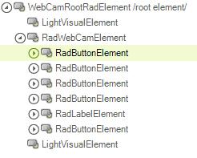
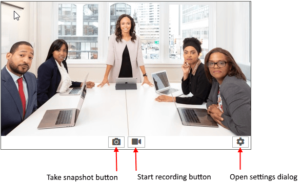
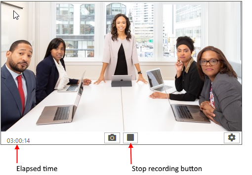

# Structure

This article shows the inner structure and organization of the elements which build the **RadWebCam** control.
 
>caption Figure 1: RadWebCam's elements hierarchy

>caption Figure 2: RadWebCam - Initial State

>caption Figure 3: RadWebCam - Recording State

>caption Figure 4: RadWebCam - Settings Dialog

## See Also
* [Overview]()
* [Design Time]()
* [Getting Started]()

