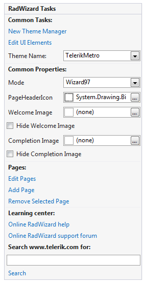
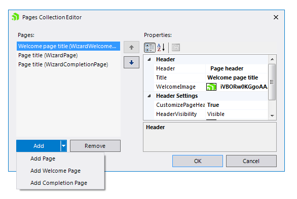

# Design Time

__RadWizard__ provides handful __Smart Tag__ and __Pages Collection Editor__ at design time. There is a set of properties listed below:

>caption Figure 1: Smart Tag

* __New Theme Manager__: Adds a new [RadThemeManager]().

* __Edit UI Elements__: Opens a dialog that displays the [Element Hierarchy Editor](). This editor lets you browse all the elements in the control.

* __Theme Name__: Select a theme name from the drop down list of themes available for that control. Selecting a theme allows you to change all aspects of the controls visual style at one time.

* __Mode__: Gets or sets the mode of the control.

* __PageHeaderIcon__: Gets or sets the icon of the page header.

* __WelcomeImage__: Gets or sets the image of the welcome pages.

* __Hide Welcome Image__: Gets or sets a value indicating whether the image of the welcome pages should be visible.

* __CompletionImage__: Gets or sets the image of the completion pages.

* __Hide Completion Image__: Gets or sets a value indicating whether the image of the completion pages should be visible.

* __Edit Pages__: Opens the **Pages Collection Editor**. It allows you to:

	* Add __Internal__, __Welcome__ and __Completion__ pages

	* Remove pages

	* Rearrange pages

	* Customize page properties

	>caption Figure 2: Pages Collection Editor
	
	

* __Add Pages__: Adds a new **WizardPage**.

* __Remove Selected Page__: Removes the selected page.

* __Learning Center__: Navigate to the Telerik help, code library projects or support forum.

* __Search__: Search the Telerik site for a given string.    

# See Also

* [Modes]()	
* [Structure]()
