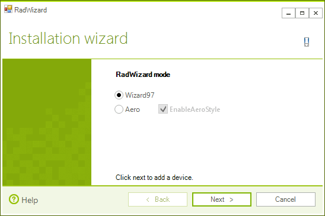
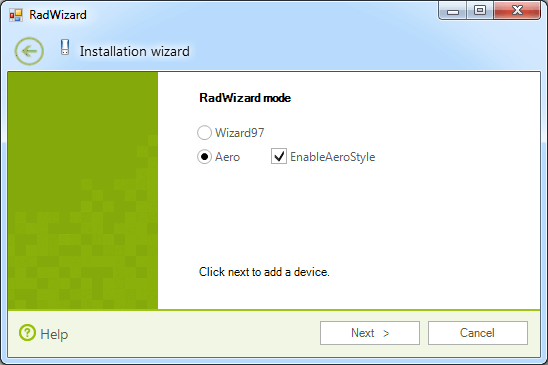
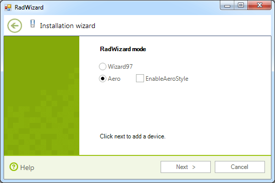

# Modes

__RadWizard__ supports both *Wizard 97* and *Wizard Aero* specifications. You can set the mode of the control using its __Mode__ property:

#### Setting modes

{{source=..\SamplesCS\Wizard\Modes.cs region=settingMode}} 
{{source=..\SamplesVB\Wizard\Modes.vb region=settingMode}} 

````C#
this.radWizard1.Mode = WizardMode.Wizard97;

````
````VB.NET
Me.RadWizard1.Mode = WizardMode.Wizard97

````

{{endregion}} 

>caption Figire 1: WizardMode.Wizard97



The aero style of WizardMode.*Aero* can be enabled (for Windows Vista and later versions) or disabled. You can achieve it using the **EnableAeroStyle**  property of __RadWizard__.

#### Enabling aero style

{{source=..\SamplesCS\Wizard\Modes.cs region=EnableAeroStyle}} 
{{source=..\SamplesVB\Wizard\Modes.vb region=EnableAeroStyle}} 

````C#
this.radWizard1.Mode = WizardMode.Aero;
this.radWizard1.EnableAeroStyle = true;

````
````VB.NET
Me.RadWizard1.Mode = WizardMode.Aero
Me.RadWizard1.EnableAeroStyle = True

````

{{endregion}} 

>caption Figure 2: WizardMode.Aero with enabled aero



#### Disable __Aero Style__

{{source=..\SamplesCS\Wizard\Modes.cs region=disableAeroStyle}} 
{{source=..\SamplesVB\Wizard\Modes.vb region=disableAeroStyle}} 

````C#
this.radWizard1.Mode = WizardMode.Aero;
this.radWizard1.EnableAeroStyle = false;

````
````VB.NET
Me.RadWizard1.Mode = WizardMode.Aero
Me.RadWizard1.EnableAeroStyle = False

````

{{endregion}} 

>caption Figure 3: WizardMode.Aero with disabled aero



When __RadWizard__ is in __Aero mode__ with disabled __Aero style__, 
the appearance of the control is defined by the styles in its theme.

# See Also

* [Design Time]()	
* [Structure]()
		
