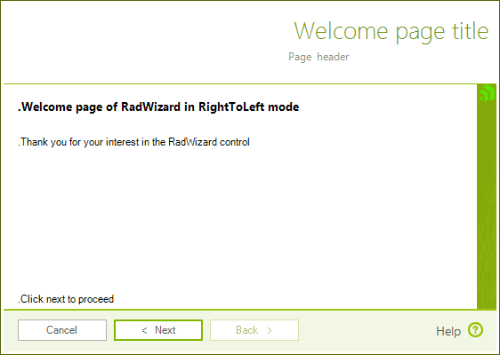

# Right-to-Left support

__RadWizard__ also supports __RightToLeft__ alignment of its elements:



You can enable the right-to-left functionality, by setting the __RightToLeft__ property to *True*:
			
#### Setting Right-to-Left mode

{{source=..\SamplesCS\Wizard\WizardStructure.cs region=RTL}} 
{{source=..\SamplesVB\Wizard\WizardStructure.vb region=RTL}} 

````C#
this.radWizard1.RightToLeft = RightToLeft.Yes;
this.radLabel1.RightToLeft = RightToLeft.Yes;
this.radLabel1.Text = "Welcome page of RadWizard in RightToLeft mode.";

````
````VB.NET
RadWizard1.RightToLeft = System.Windows.Forms.RightToLeft.Yes
RadLabel1.RightToLeft = System.Windows.Forms.RightToLeft.Yes
RadLabel1.Text = "Welcome page of RadWizard in RightToLeft mode."

````

{{endregion}} 

# See Also

* [Localization]()	

