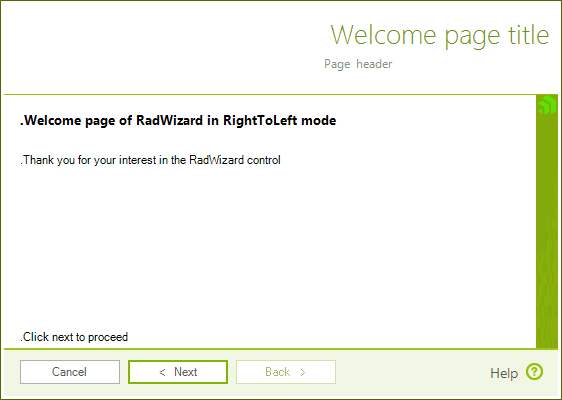

# Right-to-Left support

__RadWizard__ also supports __RightToLeft__ alignment of its elements:

You can enable the right-to-left functionality, by setting the __RightToLeft__ property to *True*:
			
#### Setting Right-to-Left mode

<snippet id='wizard-wizardstructure-rtl-cs' />
<snippet id='wizard-wizardstructure-rtl-vb' />

# See Also

* [Localization]()	

