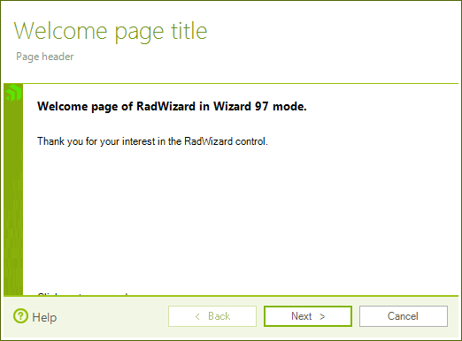
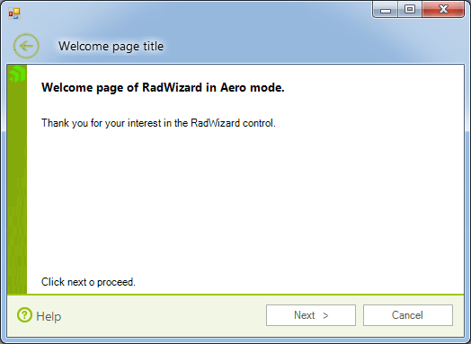
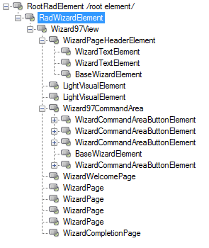
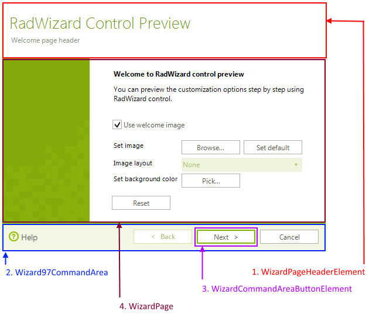

# Structure

__RadWizardElement__ encapsulates the UI representation and functionality of __RadWizard__. This element initializes the view of the control:

* __WizardMode.Wizard97__ for the __Wizard 97 mode__.

* __WizardMode.Aero__ for __Wizard Aero mode__.

The view contains the following elements:

* __Pages__ collection – collection which contains *Internal*, *Welcome* and *Completion RadWizard* pages.

* __Page header__ – element which is located above each page and contains elements for *title text*, *header text* and *page icon*.

* __Command area__– element which is located below each page and contains command button – *Back (Wizard 97)*, *Next, Cancel, Finish,* and *Help*.

* __Welcome image__– element which contains the image of the *Welcome* page.

* __Completion image__ - element which contains the image of the *Completion* page.

* __Top element__– element which contains the *Back* button of *Wizard Aero* view.

On the screenshots below, you can see the Welcome pages for both wizard mode with the described elements in them:

>caption Figure 1: Wizard97

>caption Figure 2: Wizard Aero

## 

The following screenshots describe the inner structure and organization of the elements which build the **RadWizard** control.

>caption Figure 3: RadWizard's elements hierarchy in WizardMode.Wizard97

 
        
>caption Figure 4: RadWizard visual structure in WizardMode.Wizard97

 

# See Also

* [Design Time]()	
* [Modes]()
