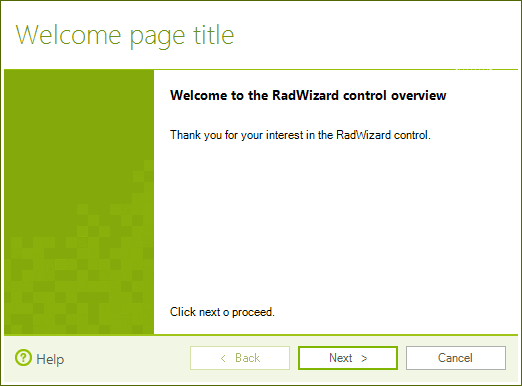

# WinForms Wizard Overview

__RadWizard__ will help you differentiate a complex process into separate steps and provide your users with the ability to govern the process upon their decisions. It is useful for creating  installation, registration and other types of wizards.    

**RadWizard** supports both *Wizard 97* and *Wizard Aero* specifications. The control provides the developers with predesigned *Welcome*, *Completion* and *Internal* pages. Follows an example of a **RadWizard** Welcome page:
 



       

The [design time]() capabilities of the **RadWizard** control are rich and intuitive to use. They allow the developers to create and manage the control and its pages. Handful [events]() help you to follow the state of the control at run time, implement custom pages sequence and page processing validation.

## Telerik UI for WinForms Learning Resources
* [Telerik UI for WinForms Wizard Homepage](https://www.telerik.com/products/winforms/wizard.aspx)
* [Telerik UI for WinForms API Reference](https://docs.telerik.com/devtools/winforms/api/)
* [Getting Started with Telerik UI for WinForms Components]()
* [Telerik UI for WinForms Virtual Classroom (Training Courses for Registered Users)](https://learn.telerik.com/learn/course/external/view/elearning/17/TelerikUIforWinForms) 
* [Telerik UI for WinForms Forum](https://www.telerik.com/forums/winforms)
* [Telerik UI for WinForms Knowledge Base](https://docs.telerik.com/devtools/winforms/knowledge-base)

## Telerik UI for WinForms Additional Resources
* [Telerik UI for WinForms Product Overview](https://www.telerik.com/products/winforms.aspx)
* [Telerik UI for WinForms Blog](https://www.telerik.com/blogs/desktop-winforms)
* [Telerik UI for WinForms Videos](https://www.telerik.com/videos/product/winforms)
* [Telerik UI for WinForms Roadmap](https://www.telerik.com/support/whats-new/winforms/roadmap)
* [Telerik UI for WinForms Pricing](https://www.telerik.com/purchase/individual/winforms.aspx)
* [Telerik UI for WinForms Code Library](https://www.telerik.com/support/code-library/winforms)
* [Telerik UI for WinForms Support](https://www.telerik.com/support/winforms)
* [What’s New in Telerik UI for WinForms](https://www.telerik.com/support/whats-new/winforms)

## See Also

* [Design Time]()	
* [Structure]()
        
