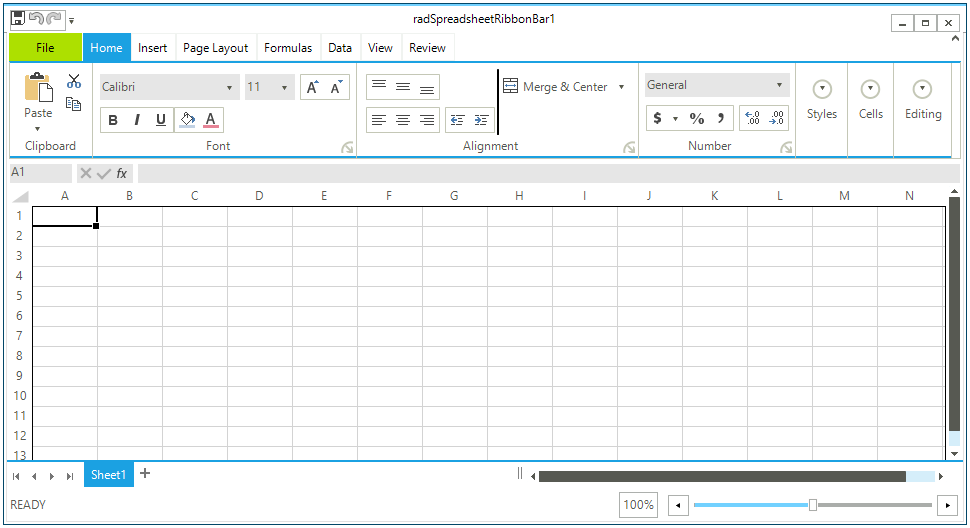
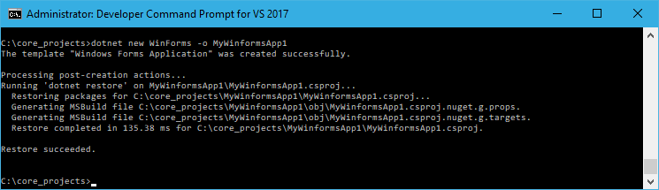
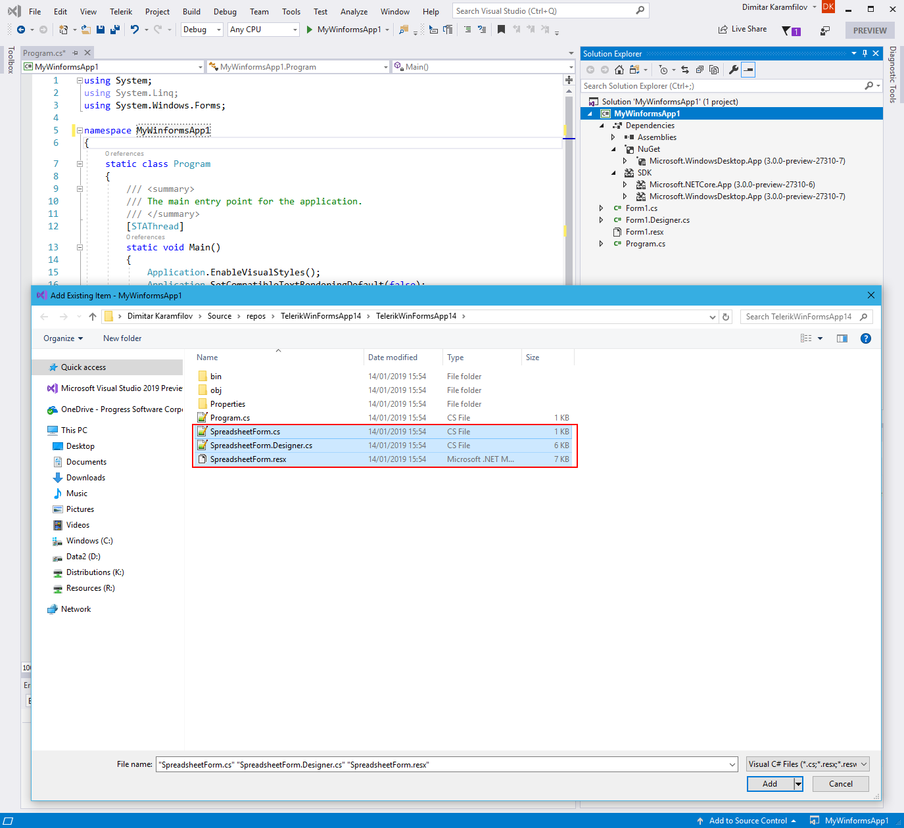
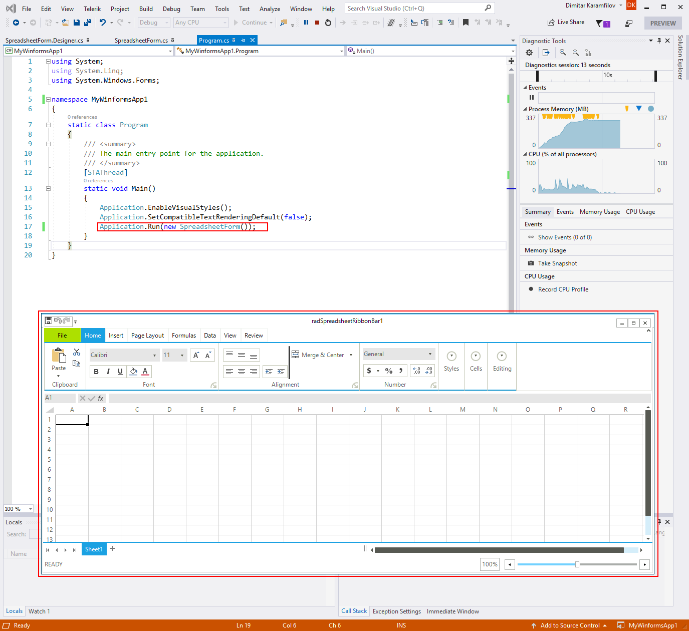

# Migrating to .NET Core  

## Requirements

Before proceeding with this article please make sure that the following requirements are met:
*  Visual Studio 2017 Update 15.8 or higher and select the .NET desktop development workload with the following options: 
    - .NET Framework 4.7.2 development tools
    - .NET Core 2.1 development tools
* .NET Core 3.0 SDK - DownLoad from here: [.NET Core Daily Builds](https://github.com/dotnet/core/blob/master/daily-builds.md)
* Telerik UI for Winforms R1 2019 or newer. 
* Visual Studio 2019 to open the .NET Core project. 

## Example 

1\. Create a new WinForms application using one of our [templates](). This way you will have a fully functional application that you will migrate to .NET core (at this point the .NET Core does not provide a designer and this is why you cannot start by creating a new application). You can use any application that uses the Telerik UI for Winforms controls as well.  

In this case I am using the excel inspired template.

>caption Figure 1: New Application

>tip You can check your application compatibility with the following tool: [The Portability Analyzer](https://blogs.msdn.microsoft.com/dotnet/2018/08/08/are-your-windows-forms-and-wpf-applications-ready-for-net-core-3-0/)

2\. You need to create a WinForms .NET Core project. Currently this can be done from the Conosle. Open a new *Development Command Prompt for VS2017* and type the following command (you can use any preferred directory). 

#### Creating WinForms project from the Command Prompt

`C:\core_projects>dotnet new WinForms -o MyWinformsApp1`

Once this is done you will see the following message.

3\. Now open the project in Visual Studio 2019. Go to the Solution Explorer and right click dependencies and then click Add Reference. Navigate to the install folder of the winforms suite and choose the __NetCore__ folder. Select all required assemblies (you can see them in the standard project).  

4\. In Visual Studio 2019 go to Project -> Add Existing Item. Navigate to the standard application and select the form files. 

5\.Change the namespace in the newly added files to __MyWinformsApp1__ and then change the startup form in the Program.cs file. That is all, now you can start the new application.

