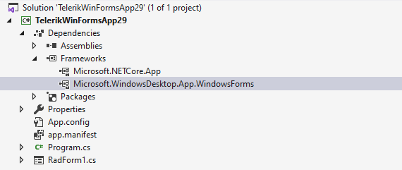
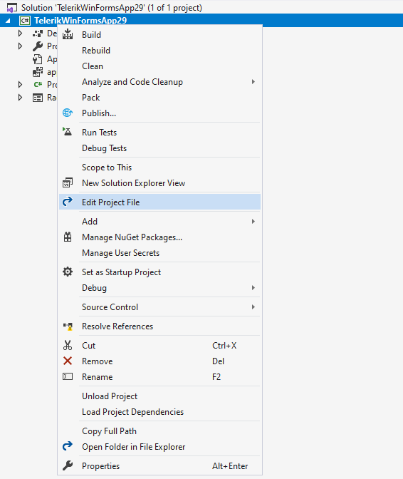
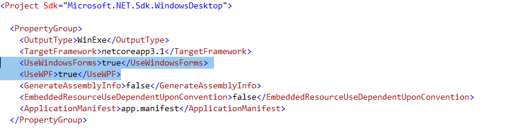
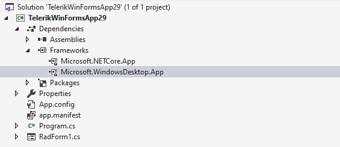

# Telerik Document Processing Libraries and WinForms .NET Core application. 

Since the Telerik Document Processing Libraries depend on some types from WPF using any library in a WinForms application requires making changes in the project file. This is not necessary in the .NET framework projects where you can just add the references in Visual Studio. 

By default, when creating a WinForms .NET Core application the **Microsoft.WindowsDesktop.App.WindowsForms** framework is added. This does not include the required WPF references. 

To add the required references, you need to:

1\. Edit the project file:  

2\. Under the **UseWindowsForms** line, add the **UseWPF** tag. The file should look like this:

3\. Save and reload the file. Now, you should see the **Microsoft.WindowsDesktop.App** in the frameworks node:

This is all that is required and now you can continue with your application. 

>important The Telerik Document Processing libraries are available in two versions:
>
>* A version for __.Net Framework 4.0__ or later
>
>* A version for __.Net Standard 2.0__
>
>Both versions are available as [NuGet packages](https://docs.telerik.com/devtools/document-processing/getting-started/installation/nuget-packages). Make sure that the (Assemblies for .NET Framework)(https://docs.telerik.com/devtools/document-processing/getting-started/getting-started#assemblies-for-net-framework) are used in a WinForms project.

