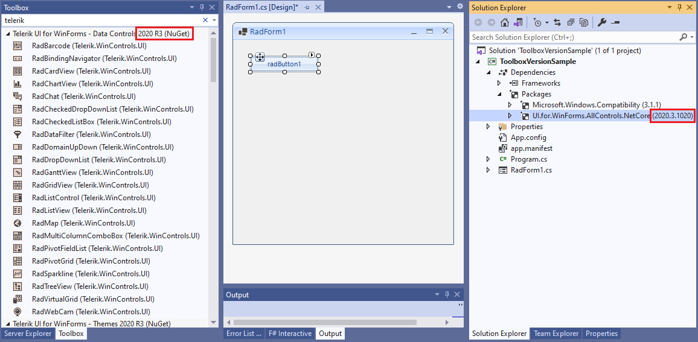
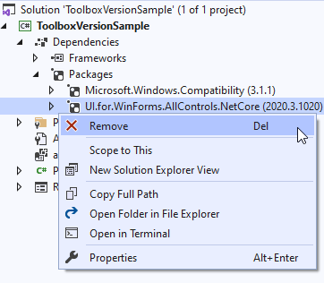
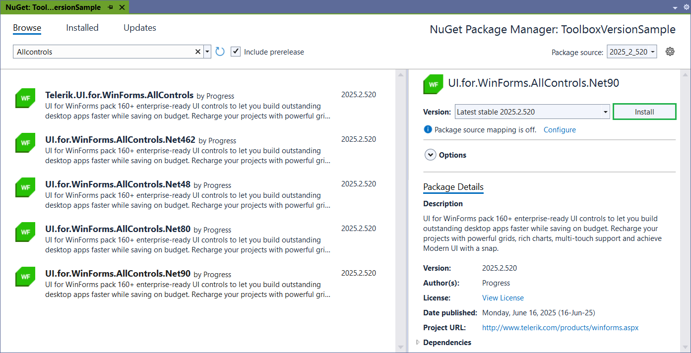
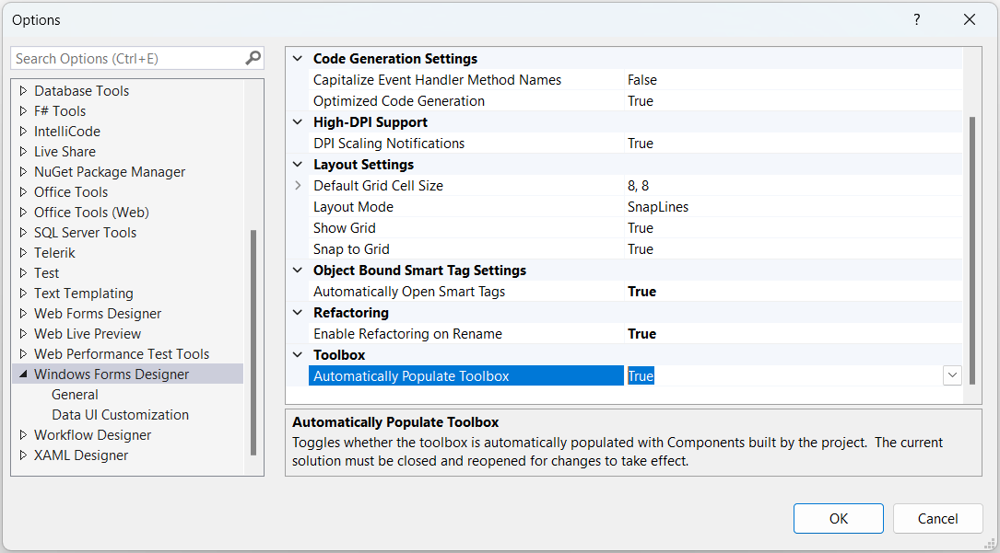

# Adding RadControls to Visual Studio Toolbox in .NET Core Projects

Telerik UI for WinForms controls used to be automatically added to Visual Studio's Toolbox during the [installation]() process when using **.NET 2.0 (up to 4.8)** Framework in your project. This means that the Toolbox population relies on the Telerik WinForms version available in the Global Assembly Cache.

With the introduction of .NET Core/.NET 5 and the WinForms designer, the Toolbox configuration doesn't rely on the GAC anymore and it is not necessary to have an installation of the Telerik UI for WinForms suite. 

>important In order to enable the WinForms Designer, please get familiar with the requirements you need to meet: [Design Time]().

## Toolbox Version

The Toolbox version depends on the version of installed NuGet package:

>caption Toolbox version R3 2020 SP1 (2020.3.10.20)

For example, if you have the UI.for.WinForms.AllControls.NetCore and you want to get another version in the Toolbox, it is necessary to:

1\. Remove the current version of the **UI.for.WinForms.AllControls.NetCore** package:

2\. Install the desired NuGet version: [Install using NuGet Packages]()

3\. Rebuild the project.

>note The same approach is also valid for the other Telerik UI for WinForms packages, e.g. UI.for.WinForms.AllControls.Net60, UI.for.WinForms.Common, etc.

## Troubleshooting Visual Studio Toolbox

#### Issue: Telerik controls for UI for WinForms are not visible in Toolbox after upgrade

After installing or updating the Telerik NuGet, controls will automatically appear in the Toolbox, with no further action required by you. However, you may experience issues with missing Telerik items in the Toolbox at design time. 

#### Solution

The *Automatically Populate Toolbox* option affects whether controls are populated in the .NET Core designer. If set to *false* the Telerik controls are not visible in the Toolbox. It is necessary to ensure that ***Automatically Populate Toolbox*** is set to ***True*** in the Visual Studio. 

In Visual Studio 2022 navigate to *Tools >> Options >> Windows Forms Designer*:

# See Also

* [Design Time]()
* [Migrating to .NET Core]()
* [.NET Core Project Converter]()
* [Windows Forms Designer for .NET Core Released](https://devblogs.microsoft.com/dotnet/windows-forms-designer-for-net-core-released/)
* [Handle Toolbox Issues with .NET Core]()
* [How to Build Custom Telerik Assemblies when Using .NET Core and Enable Design Time Experience]()
