# .NET Core Project Converter

Since **R2 2020** Telerik UI for WinForms suite provides tooling in **Visual Studio 2019**, via our [Visual Studio Extensions](), that will convert client projects that use **.NET Framework 4.8** (or lower) into **.NET Core** projects to ease out the migration.  

>note It is based on the [Try-Convert](https://github.com/dotnet/try-convert) tool and the [.NET Portability Analyzer ](https://github.com/microsoft/dotnet-apiport) that Microsoft offers to help .NET developers port their projects to .NET Core. Please have in mind that even though the conversion may be successful, we don't guarantee that the project will be compiled and you may need to fine-tune the output.

This article will guide you through the conversion process:

1. Let's start with an existing Telerik WinForms project that uses .NET Framework 4.5:

	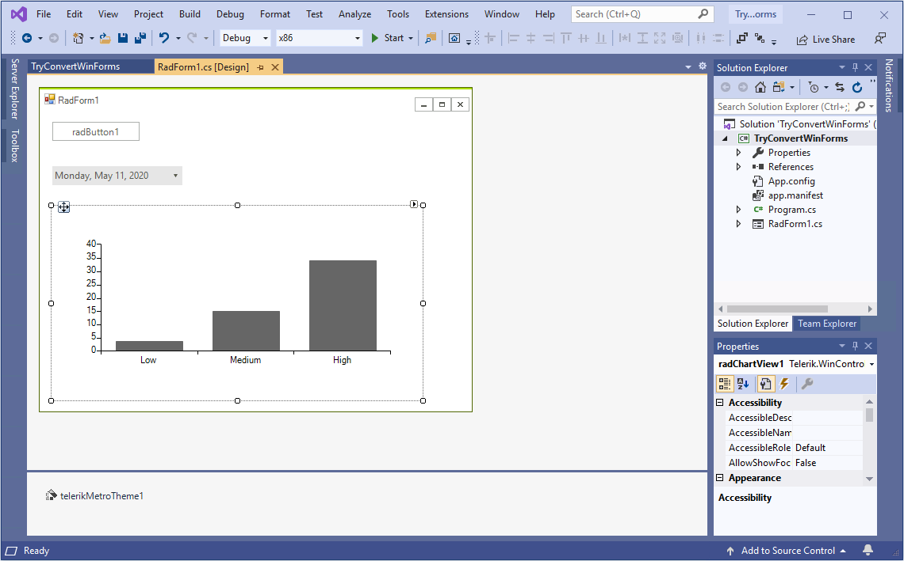  

	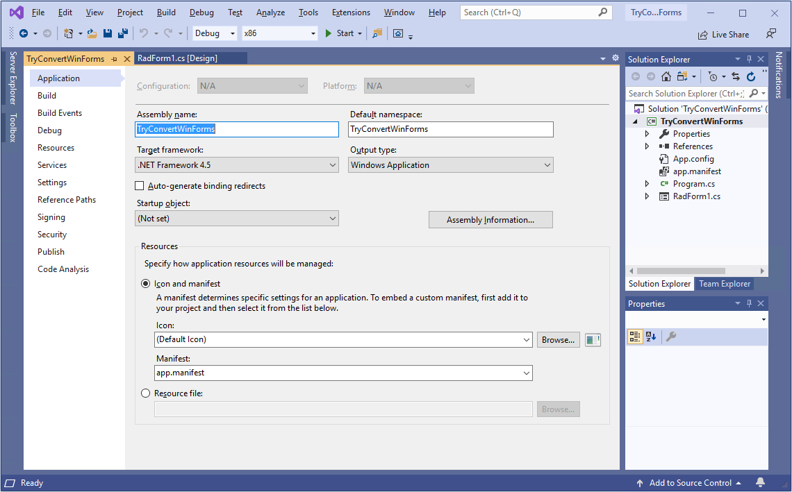  

2. Navigate to the **Extensions** menu. If the Telerik menu item is not available, click **Manage Extensions** and download it:

	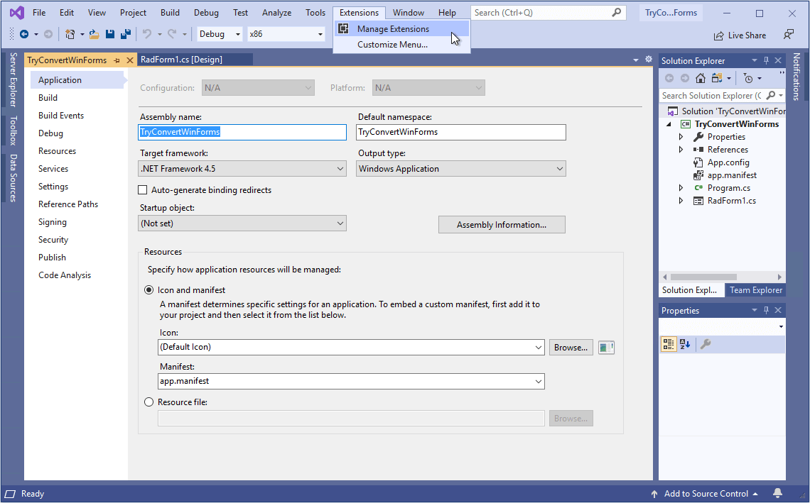  

	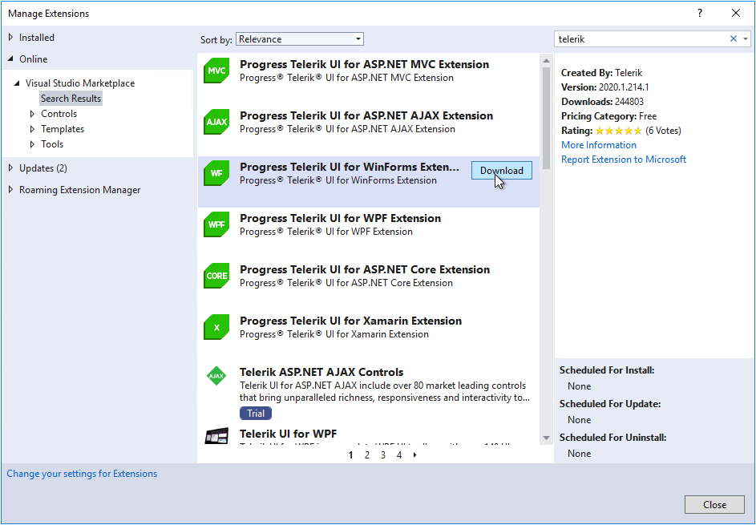  

3. After restarting Visual Studio, you are expected to see the **.NET Core Project Converter** option in the **Extensions** menu and in the project's context menu as well:

	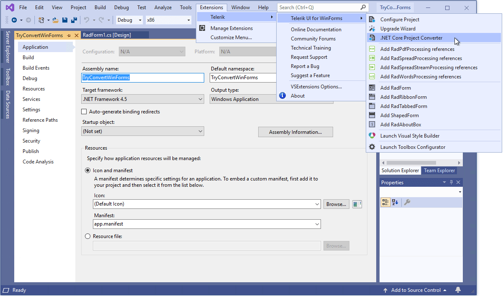  

	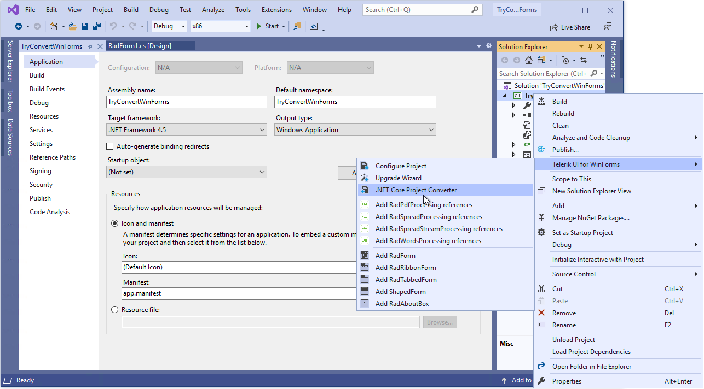 

4. Run the converter and follow the wizard:

	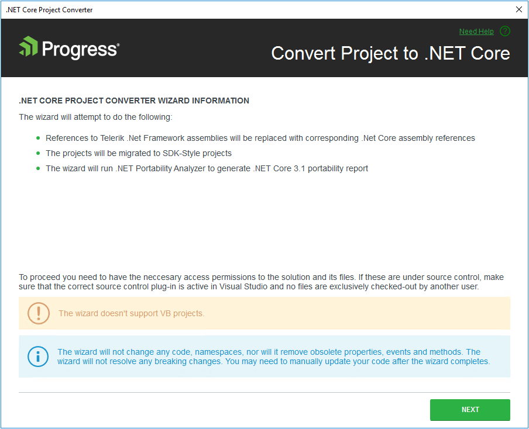

	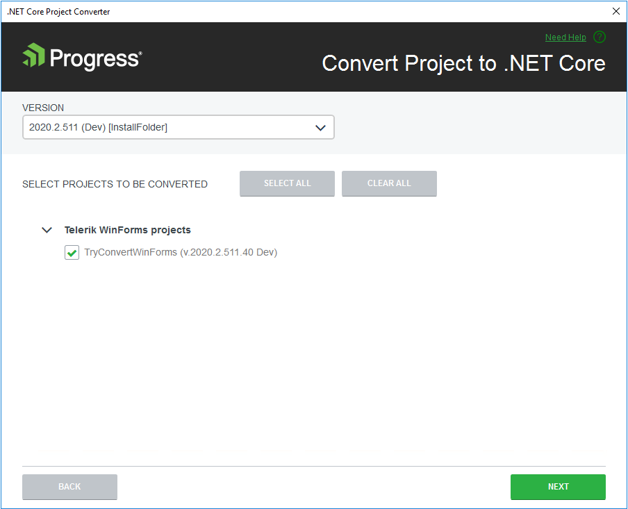

	

	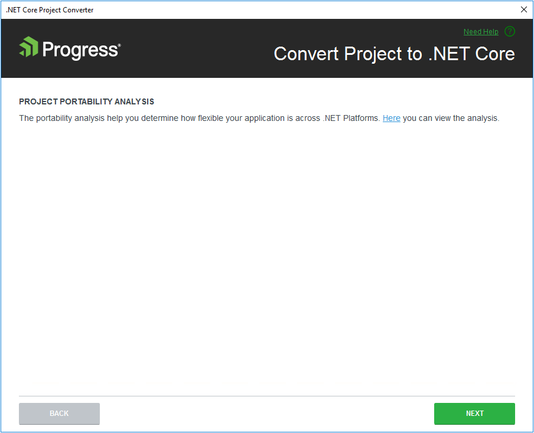

	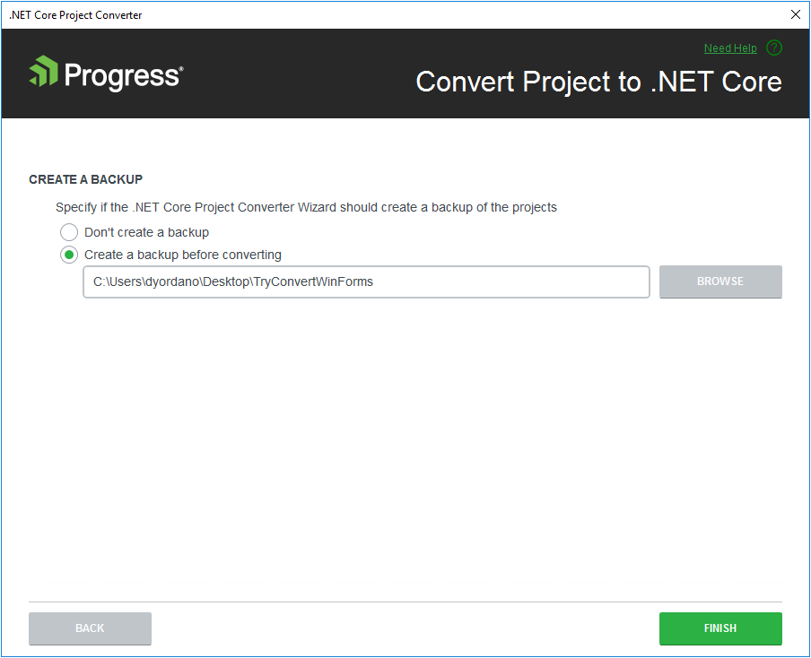

	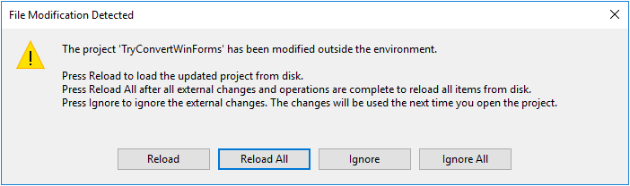

	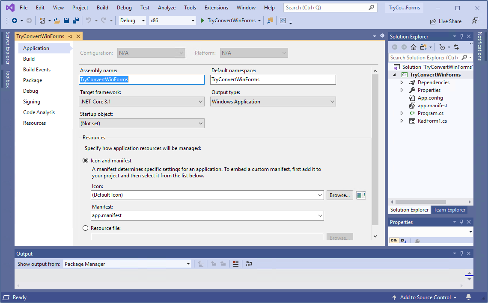

5. Now, the project can be run using .NET Core 3.1:

	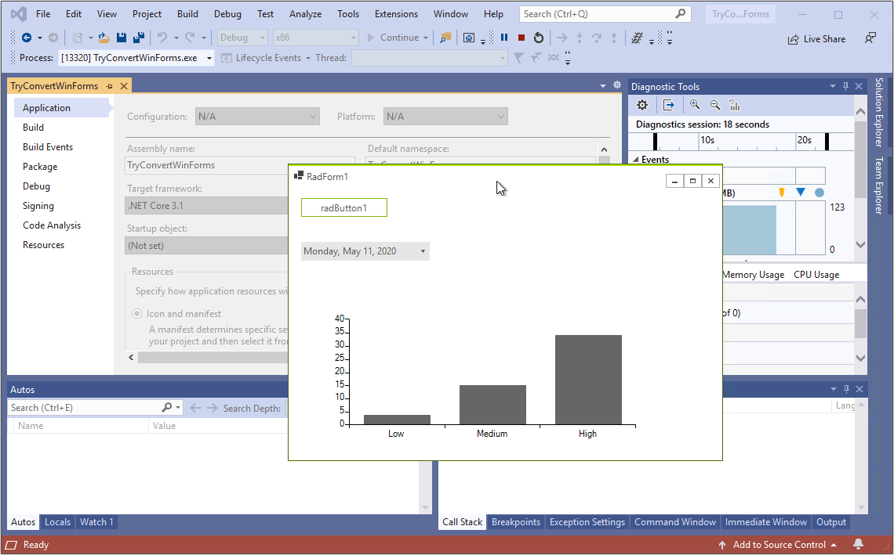

6. There is a backup folder containing the initial project:

	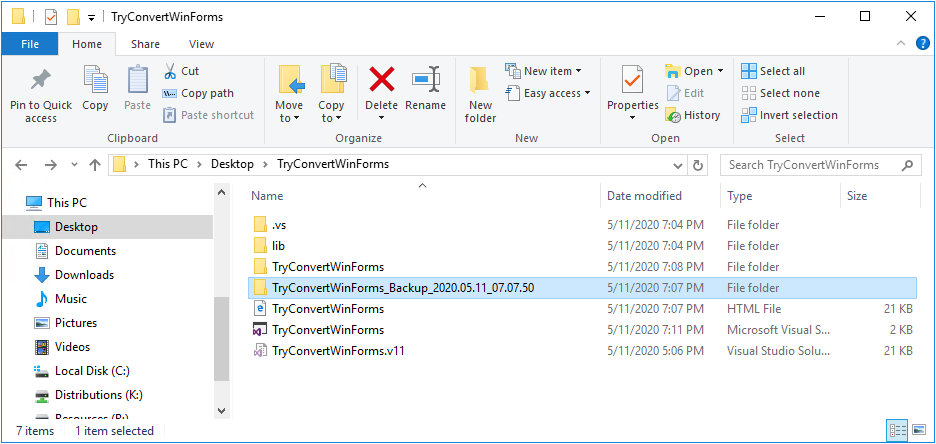

## See Also

* [Download Product Files]() 
* [How to Migrate a WinForms .NET Framework Project to .NET Core]()
