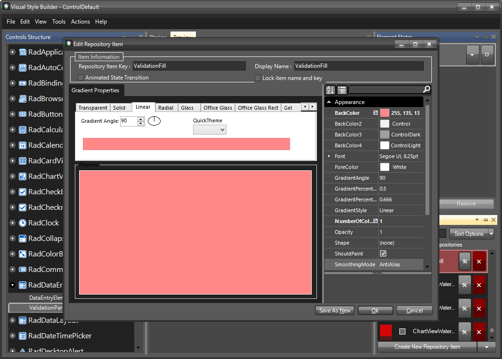

# Themes

This help article will demonstrate a step by step tutorial how to customize the ControlDefault theme for __RadDataEntry__

1. Open [Visual Style Builder] ()
2. Export the built-in themes in a specific folder by selecting `File` >> `Export Built-in Themes`.
3. Load a desired theme from the just exported files by selecting `File` >> `Open Package`.
4. Expand RadDataEntry and select the `ValidationPanel`. Then select the fill element in the `Elemnts` window:
    

5. Open the `Edit Repository Item` dialog:
   

6. Change the BackColor:
   
