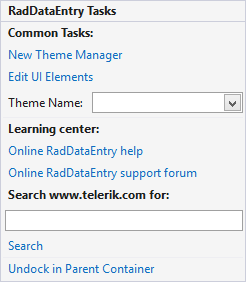

# Smart Tag

>caption Figure 1: RadDataEntry Smart Tag

* __Common Tasks__

    * __New Theme Manager__: Adds a new __RadThemeManager__ component to the form.

    * __Edit UI elements__: Opens a dialog that displays the *Element Hierarchy Editor*. This editor lets you browse all the elements in the control.

    * __Theme Name__: Select a theme name from the drop down list of themes available for that control. Selecting a theme allows you to change all aspects of the controls visual style at one time.

* __Learning Center__: Navigate to the Telerik help, code library projects or support forum.

* __Search__: Search the Telerik site for a given string.

* __Dock in Parent Container:__ This option allows you to easily dock the RadDataEnty. 

# See Also

* [Element Hierarchy Editor]()
* [Structure]()
* [Getting Started]()
* [Properties, events and attributes]()
* [Validation]()
* [Themes]()
* [Change the editor to RadDropDownList]()