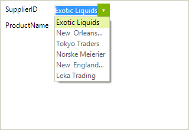

# Change the editor to a bound RadDropDownList

This article will walk you through the process of changing the default editor to a bound drop down list, where the current value corresponds to a value within the drop down list data source. The case where the corresponding values are nullable is also handled. 



## 

1\. First you can subscribe to the __BindingCreating__, __BindingCreated__ and __EditorInitializing__ events of __RadDataEntry__ (please note that this should be done before the data entry control is being data bound). 

{{source=..\SamplesCS\DataEntryAndBindingNavigator\DataEntryHowTo\ChangeEditorToDropDownList.cs region=subscribe}} 
{{source=..\SamplesVB\DataEntryAndBindingNavigator\DataEntryHowTo\ChangeEditorToDropDownList.vb region=subscribe}} 

````C#
radDataEntry1.EditorInitializing += radDataEntry1_EditorInitializing;
radDataEntry1.BindingCreating += radDataEntry1_BindingCreating;
radDataEntry1.BindingCreated += radDataEntry1_BindingCreated;
        
radDataEntry1.DataSource = productsBinding;

````
````VB.NET
AddHandler radDataEntry1.EditorInitializing, AddressOf radDataEntry1_EditorInitializing
AddHandler radDataEntry1.BindingCreating, AddressOf radDataEntry1_BindingCreating
AddHandler radDataEntry1.BindingCreated, AddressOf radDataEntry1_BindingCreated
radDataEntry1.DataSource = productsBinding

````

{{endregion}} 

2\. In the __EditorInitializing__ event handler, you will be able to change the automatically generated editor with RadDropDownList. In addition, you should set it up as needed. In this case we will set the __DataSource__, __DisplayMember__ and  __ValueMenber__ properties. 


{{source=..\SamplesCS\DataEntryAndBindingNavigator\DataEntryHowTo\ChangeEditorToDropDownList.cs region=editor}} 
{{source=..\SamplesVB\DataEntryAndBindingNavigator\DataEntryHowTo\ChangeEditorToDropDownList.vb region=editor}} 

````C#
RadDropDownList radDropDownList1;
void radDataEntry1_EditorInitializing(object sender, Telerik.WinControls.UI.EditorInitializingEventArgs e)
{
    if (e.Property.Name == "SupplierID")
    {
        radDropDownList1 = new RadDropDownList();
        radDropDownList1.DataSource = suplierList;
        radDropDownList1.ValueMember = "SupplierID";
        radDropDownList1.DisplayMember = "CompanyName";
        e.Editor = radDropDownList1;
    }
}

````
````VB.NET
Private radDropDownList1 As RadDropDownList
Private Sub radDataEntry1_EditorInitializing(sender As Object, e As Telerik.WinControls.UI.EditorInitializingEventArgs)
    If e.[Property].Name = "SupplierID" Then
        radDropDownList1 = New RadDropDownList()
        radDropDownList1.DataSource = suplierList
        radDropDownList1.ValueMember = "SupplierID"
        radDropDownList1.DisplayMember = "CompanyName"
        e.Editor = radDropDownList1
    End If
End Sub

````

{{endregion}} 


3\. In order the values to be synchronized correctly, the bound property should be set in the __BindingCreating__ event handler. In this case it should be set to the __SelectedValue__ property.
             

{{source=..\SamplesCS\DataEntryAndBindingNavigator\DataEntryHowTo\ChangeEditorToDropDownList.cs region=creating}} 
{{source=..\SamplesVB\DataEntryAndBindingNavigator\DataEntryHowTo\ChangeEditorToDropDownList.vb region=creating}} 

````C#
void radDataEntry1_BindingCreating(object sender, Telerik.WinControls.UI.BindingCreatingEventArgs e)
{
    if (e.DataMember == "SupplierID")
    {
        e.PropertyName = "SelectedValue";
    }
}

````
````VB.NET
Private Sub radDataEntry1_BindingCreating(sender As Object, e As Telerik.WinControls.UI.BindingCreatingEventArgs)
    If e.DataMember = "SupplierID" Then
        e.PropertyName = "SelectedValue"
    End If
End Sub

````

{{endregion}} 

4\. When the data source is using nullable values in order the user to be able to change the current value via the drop down list, the result value should be manually parsed. This can be done in the binding's __Parse__ event. You can subscribe to this event in the __BindingCreated__ event handler (in order this event to fire the formatting should be enabled). 

{{source=..\SamplesCS\DataEntryAndBindingNavigator\DataEntryHowTo\ChangeEditorToDropDownList.cs region=created}} 
{{source=..\SamplesVB\DataEntryAndBindingNavigator\DataEntryHowTo\ChangeEditorToDropDownList.vb region=created}} 

````C#
void radDataEntry1_BindingCreated(object sender, BindingCreatedEventArgs e)
{
    if (e.DataMember == "SupplierID")
    {
        e.Binding.FormattingEnabled = true;
        e.Binding.Parse += new ConvertEventHandler(Binding_Parse);
    }
}
       
private void Binding_Parse(object sender, ConvertEventArgs e)
{
    int tmpvalue;
    int? result = int.TryParse(e.Value.ToString(), out tmpvalue) ? tmpvalue : (int?)null;
    e.Value = result;
}

````
````VB.NET
Private Sub radDataEntry1_BindingCreated(sender As Object, e As BindingCreatedEventArgs)
    If e.DataMember = "SupplierID" Then
        e.Binding.FormattingEnabled = True
        AddHandler e.Binding.Parse, AddressOf Binding_Parse
    End If
End Sub
Private Sub Binding_Parse(sender As Object, e As ConvertEventArgs)
    Dim tmpvalue As Integer
    Dim result As System.Nullable(Of Integer) = If(Integer.TryParse(e.Value.ToString(), tmpvalue), tmpvalue, DirectCast(Nothing, System.Nullable(Of Integer)))
    e.Value = result
End Sub

````

{{endregion}} 
 
To make the example complete you can use the following classes.
        
{{source=..\SamplesCS\DataEntryAndBindingNavigator\DataEntryHowTo\ChangeEditorToDropDownList.cs region=data}} 
{{source=..\SamplesVB\DataEntryAndBindingNavigator\DataEntryHowTo\ChangeEditorToDropDownList.vb region=data}} 

````C#
public class Product
{
    private int? _supplierID;
    private string _productName;
    public Product(int? supplierID, string productName)
    {
        this._supplierID = supplierID;
        this._productName = productName;
    }
    public int? SupplierID
    {
        get
        {
            return this._supplierID;
        }
        set
        {
            this._supplierID = value;
        }
    }
    public string ProductName
    {
        get
        {
            return this._productName;
        }
        set
        {
            this._productName = value;
        }
    }
}
public partial class Supplier
{
    private int? _supplierID;
    private string _companyName;
    public Supplier(int? supplierID, string companyName)
    {
        this._supplierID = supplierID;
        this._companyName = companyName;
    }
    public int? SupplierID
    {
        get
        {
            return this._supplierID;
        }
        set
        {
            this._supplierID = value;
        }
    }
    public string CompanyName
    {
        get
        {
            return this._companyName;
        }
        set
        {
            this._companyName = value;
        }
    }
}

````
````VB.NET
Public Class Product
    Private _supplierID As System.Nullable(Of Integer)
    Private _productName As String
    Public Sub New(supplierID As System.Nullable(Of Integer), productName As String)
        Me._supplierID = supplierID
        Me._productName = productName
    End Sub
    Public Property SupplierID() As System.Nullable(Of Integer)
        Get
            Return Me._supplierID
        End Get
        Set(value As System.Nullable(Of Integer))
            Me._supplierID = value
        End Set
    End Property
    Public Property ProductName() As String
        Get
            Return Me._productName
        End Get
        Set(value As String)
            Me._productName = value
        End Set
    End Property
End Class
Partial Public Class Supplier
    Private _supplierID As System.Nullable(Of Integer)
    Private _companyName As String
    Public Sub New(supplierID As System.Nullable(Of Integer), companyName As String)
        Me._supplierID = supplierID
        Me._companyName = companyName
    End Sub
    Public Property SupplierID() As System.Nullable(Of Integer)
        Get
            Return Me._supplierID
        End Get
        Set(value As System.Nullable(Of Integer))
            Me._supplierID = value
        End Set
    End Property
    Public Property CompanyName() As String
        Get
            Return Me._companyName
        End Get
        Set(value As String)
            Me._companyName = value
        End Set
    End Property
End Class

````

{{endregion}} 

 

You can initialize the data sources in the Form’s constructor.
        
{{source=..\SamplesCS\DataEntryAndBindingNavigator\DataEntryHowTo\ChangeEditorToDropDownList.cs region=init}} 
{{source=..\SamplesVB\DataEntryAndBindingNavigator\DataEntryHowTo\ChangeEditorToDropDownList.vb region=init}} 

````C#
List<Product> productList;
List<Supplier> suplierList;
BindingSource productsBinding;
public ChangeEditorToDropDownList()
{
    InitializeComponent();
    productList = new List<Product>();
    suplierList = new List<Supplier>();
    productList.Add(new Product(1, "Chai"));
    productList.Add(new Product(2, "Chang"));
    productList.Add(new Product(3, "Aniseed Syrup"));
    productList.Add(new Product(4, "Chef Anton's Gumbo Mix"));
    productList.Add(new Product(5, "Tofu"));
    productList.Add(new Product(null, "Sir Rodney's Marmalade"));
    productList.Add(new Product(6, "Boston Crab Meat"));
    productList.Add(new Product(5, "Chartreuse verte"));
    productList.Add(new Product(2, "Ravioli Angelo"));
    productList.Add(new Product(4, "Perth Pasties"));
    suplierList.Add(new Supplier(1, "Exotic Liquids"));
    suplierList.Add(new Supplier(2, "New Orleans Cajun Delights"));
    suplierList.Add(new Supplier(3, "Tokyo Traders"));
    suplierList.Add(new Supplier(4, "Norske Meierier"));
    suplierList.Add(new Supplier(5, "New England Seafood Cannery"));
    suplierList.Add(new Supplier(6, "Leka Trading"));
    productsBinding = new BindingSource();
    productsBinding.DataSource = productList;
}

````
````VB.NET
Private productList As List(Of Product)
Private suplierList As List(Of Supplier)
Private productsBinding As BindingSource
Public Sub New()
    InitializeComponent()
    productList = New List(Of Product)()
    suplierList = New List(Of Supplier)()
    productList.Add(New Product(1, "Chai"))
    productList.Add(New Product(2, "Chang"))
    productList.Add(New Product(3, "Aniseed Syrup"))
    productList.Add(New Product(4, "Chef Anton's Gumbo Mix"))
    productList.Add(New Product(5, "Tofu"))
    productList.Add(New Product(Nothing, "Sir Rodney's Marmalade"))
    productList.Add(New Product(6, "Boston Crab Meat"))
    productList.Add(New Product(5, "Chartreuse verte"))
    productList.Add(New Product(2, "Ravioli Angelo"))
    productList.Add(New Product(4, "Perth Pasties"))
    suplierList.Add(New Supplier(1, "Exotic Liquids"))
    suplierList.Add(New Supplier(2, "New Orleans Cajun Delights"))
    suplierList.Add(New Supplier(3, "Tokyo Traders"))
    suplierList.Add(New Supplier(4, "Norske Meierier"))
    suplierList.Add(New Supplier(5, "New England Seafood Cannery"))
    suplierList.Add(New Supplier(6, "Leka Trading"))
    productsBinding = New BindingSource()
    productsBinding.DataSource = productList
End Sub

````

{{endregion}} 

# See Also

 * [Structure]()
 * [Getting Started]()
 * [Properties, events and attributes]()
 * [Validation]()
 * [Themes]()

