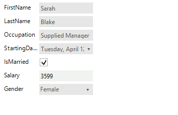
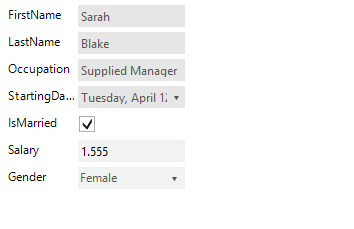

# Change auto generated editor 

## 

By default __RadDataEntry__ generates several different editors according to the data type of the property that it should edit.
          The following table demonstrates the default editors that __RadDataEntry__ can create.
        
<table><tr><td>enum</td><td>RadDropDownList</td></tr><tr><td>DateTime</td><td>RadDateTimePicker</td></tr><tr><td>Boolean</td><td>RadCheckBox</td></tr><tr><td>Color</td><td>RadColorBox</td></tr><tr><td>Image</td><td>PictureBox</td></tr><tr><td>string</td><td>RadTextBox</td></tr></table>

In the following example it will be demonstrated how to change default editor with the custom one.
        

1. For the purpose of this tutorial, we will create a new class Employee with a couple of exposed properties.
             By binding __RadDataEntry__ to object from this type we will generate several items.
            

#### __[C#] __

{{source=..\SamplesCS\DataEntryAndBindingNavigator\RadDataEntryGettingStarted.cs region=empl1}}
	        private class Employee
	        {
	            public string FirstName
	            {
	                get;
	                set;
	            }
	            public string LastName
	            {
	                get;
	                set;
	            }
	            public string Occupation
	            {
	                get;
	                set;
	            }
	            public DateTime StartingDate
	            {
	                get;
	                set;
	            }
	            public bool IsMarried
	            {
	                get;
	                set;
	            }
	
	            public int Salary
	            {
	                get;
	                set;
	            }
	            public Gender Gender
	            {
	                get;
	                set;
	            }
	        }
	        private enum Gender
	        {
	            Female,
	            Male
	        }
	{{endregion}}

#### __[VB.NET] __

{{source=..\SamplesVB\DataEntryAndBindingNavigator\RadDataEntryGettingStarted.vb region=empl1}}
	        Private Class Employee
	            Public Property FirstName() As String
	                Get
	                    Return m_FirstName
	                End Get
	                Set(value As String)
	                    m_FirstName = Value
	                End Set
	            End Property
	            Private m_FirstName As String
	            Public Property LastName() As String
	                Get
	                    Return m_LastName
	                End Get
	                Set(value As String)
	                    m_LastName = Value
	                End Set
	            End Property
	            Private m_LastName As String
	            Public Property Occupation() As String
	                Get
	                    Return m_Occupation
	                End Get
	                Set(value As String)
	                    m_Occupation = Value
	                End Set
	            End Property
	            Private m_Occupation As String
	            Public Property StartingDate() As DateTime
	                Get
	                    Return m_StartingDate
	                End Get
	                Set(value As DateTime)
	                    m_StartingDate = Value
	                End Set
	            End Property
	            Private m_StartingDate As DateTime
	            Public Property IsMarried() As Boolean
	                Get
	                    Return m_IsMarried
	                End Get
	                Set(value As Boolean)
	                    m_IsMarried = Value
	                End Set
	            End Property
	            Private m_IsMarried As Boolean
	
	            Public Property Salary() As Integer
	                Get
	                    Return m_Salary
	                End Get
	                Set(value As Integer)
	                    m_Salary = Value
	                End Set
	            End Property
	            Private m_Salary As Integer
	            Public Property Gender() As Gender
	                Get
	                    Return m_Gender
	                End Get
	                Set(value As Gender)
	                    m_Gender = Value
	                End Set
	            End Property
	            Private m_Gender As Gender
	        End Class
	        Private Enum Gender
	            Female
	            Male
	        End Enum
	{{endregion}}

#### __[C#] __

{{source=..\SamplesCS\DataEntryAndBindingNavigator\RadDataEntryGettingStarted.cs region=bind1}}
	            this.radDataEntry1.DataSource = new Employee() 
	            { 
	                FirstName = "Sarah",
	                LastName = "Blake",
	                Occupation = "Supplied Manager", 
	                StartingDate = new DateTime(2005, 04, 12),
	                IsMarried = true, 
	                Salary = 3500, Gender = Gender.Female 
	            };
	{{endregion}}

#### __[VB.NET] __

{{source=..\SamplesVB\DataEntryAndBindingNavigator\RadDataEntryGettingStarted.vb region=bind1}}
	            Me.radDataEntry1.DataSource = New Employee() With { _
	              .FirstName = "Sarah", _
	              .LastName = "Blake", _
	              .Occupation = "Supplied Manager", _
	              .StartingDate = New DateTime(2005, 4, 12), _
	              .IsMarried = True, _
	              .Salary = 3500, _
	              .Gender = Gender.Female _
	             }
	{{endregion}}

1. To change the default __RadTextBox__ editor of the “Salary” property with __RadMaskedEditBox__ 
              we will subscribe to *EditorInitializing* event of __RadDataEntry__.
          

#### __[C#] __

{{source=..\SamplesCS\DataEntryAndBindingNavigator\RadDataEntryHowTo.cs region=EditorInitializing}}
	        void radDataEntry1_EditorInitializing(object sender, Telerik.WinControls.UI.EditorInitializingEventArgs e)
	        {
	            if (e.Property.Name == "Salary")
	            {
	                RadMaskedEditBox radMaskedEditBox = new RadMaskedEditBox();
	                radMaskedEditBox.MaskType = MaskType.Numeric;
	                radMaskedEditBox.MaskedEditBoxElement.StretchVertically = true;
	
	                e.Editor = radMaskedEditBox;
	            }
	        }
	{{endregion}}

#### __[VB.NET] __

{{source=..\SamplesVB\DataEntryAndBindingNavigator\RadDataEntryHowTo.vb region=EditorInitializing}}
	        Private Sub radDataEntry1_EditorInitializing(sender As Object, e As Telerik.WinControls.UI.EditorInitializingEventArgs)
	            If e.[Property].Name = "Salary" Then
	                Dim radMaskedEditBox As New RadMaskedEditBox()
	                radMaskedEditBox.MaskType = MaskType.Numeric
	                radMaskedEditBox.MaskedEditBoxElement.StretchVertically = True
	
	                e.Editor = radMaskedEditBox
	            End If
	        End Sub
	{{endregion}}

1. To achieve working binding for this new editor we should subscribe to the *BindingCreated* event where we will
              subscribe to the *Parse* event of the Binding object. You can read more about *Format*
              and *Parse* events of Binding object and why we should use them
              [
                here
                ](
                http://msdn.microsoft.com/en-us/library/system.windows.forms.binding_events%28v=vs.110%29.aspx
              ).
          

#### __[C#] __

{{source=..\SamplesCS\DataEntryAndBindingNavigator\RadDataEntryHowTo.cs region=BindingCreated}}
	        void radDataEntry1_BindingCreated(object sender, BindingCreatedEventArgs e)
	        {
	            if (e.DataMember == "Salary")
	            {
	                e.Binding.Parse += new ConvertEventHandler(Binding_Parse);
	            }
	        }
	
	        void Binding_Parse(object sender, ConvertEventArgs e)
	        {
	            int salary = int.Parse(e.Value.ToString(), NumberStyles.Currency);
	            e.Value = salary;
	        }
	
	{{endregion}}

#### __[VB.NET] __

{{source=..\SamplesVB\DataEntryAndBindingNavigator\RadDataEntryHowTo.vb region=BindingCreated}}
	        Private Sub radDataEntry1_BindingCreated(sender As Object, e As BindingCreatedEventArgs)
	            If e.DataMember = "Salary" Then
	                AddHandler e.Binding.Parse, AddressOf Binding_Parse
	            End If
	        End Sub
	
	        Private Sub Binding_Parse(sender As Object, e As ConvertEventArgs)
	            Dim salary As Integer = Integer.Parse(e.Value.ToString(), NumberStyles.Currency)
	            e.Value = salary
	        End Sub
	
	{{endregion}}

