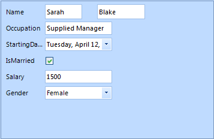

# Programmatically arrange items 

## 

Items in __RadDataEntry__ can be arranged both at design time and run time. At design time users can use the designer to arrange
          the items according to their needs by drag and drop or by setting the desired properties of the items.
          However at run time there is no designer that can be used to arrange them, so to achieve the desired layout
          the user should use the exposed events or to access the controls from the __Controls__ collection and to change
          their location, size and etc. The following example will demonstrate how to use the control events to arrange the generated items.
        

1. For the purpose of this tutorial, we will create a new class Employee with a couple of exposed properties.
             By binding __RadDataEntry__ to object from this type we will generate several items.
            

#### __[C#] __

{{region empl1}}
	        private class Employee
	        {
	            public string FirstName
	            {
	                get;
	                set;
	            }
	            public string LastName
	            {
	                get;
	                set;
	            }
	            public string Occupation
	            {
	                get;
	                set;
	            }
	            public DateTime StartingDate
	            {
	                get;
	                set;
	            }
	            public bool IsMarried
	            {
	                get;
	                set;
	            }
	
	            public int Salary
	            {
	                get;
	                set;
	            }
	            public Gender Gender
	            {
	                get;
	                set;
	            }
	        }
	        private enum Gender
	        {
	            Female,
	            Male
	        }
	{{endregion}}

#### __[VB.NET] __

{{region empl1}}
	        Private Class Employee
	            Public Property FirstName() As String
	                Get
	                    Return m_FirstName
	                End Get
	                Set(value As String)
	                    m_FirstName = Value
	                End Set
	            End Property
	            Private m_FirstName As String
	            Public Property LastName() As String
	                Get
	                    Return m_LastName
	                End Get
	                Set(value As String)
	                    m_LastName = Value
	                End Set
	            End Property
	            Private m_LastName As String
	            Public Property Occupation() As String
	                Get
	                    Return m_Occupation
	                End Get
	                Set(value As String)
	                    m_Occupation = Value
	                End Set
	            End Property
	            Private m_Occupation As String
	            Public Property StartingDate() As DateTime
	                Get
	                    Return m_StartingDate
	                End Get
	                Set(value As DateTime)
	                    m_StartingDate = Value
	                End Set
	            End Property
	            Private m_StartingDate As DateTime
	            Public Property IsMarried() As Boolean
	                Get
	                    Return m_IsMarried
	                End Get
	                Set(value As Boolean)
	                    m_IsMarried = Value
	                End Set
	            End Property
	            Private m_IsMarried As Boolean
	
	            Public Property Salary() As Integer
	                Get
	                    Return m_Salary
	                End Get
	                Set(value As Integer)
	                    m_Salary = Value
	                End Set
	            End Property
	            Private m_Salary As Integer
	            Public Property Gender() As Gender
	                Get
	                    Return m_Gender
	                End Get
	                Set(value As Gender)
	                    m_Gender = Value
	                End Set
	            End Property
	            Private m_Gender As Gender
	        End Class
	        Private Enum Gender
	            Female
	            Male
	        End Enum
	#End Region
	
	        Public Sub New()
	            InitializeComponent()
	
	            '#Region "bind1"
	            Me.radDataEntry1.DataSource = New Employee() With { _
	              .FirstName = "Sarah", _
	              .LastName = "Blake", _
	              .Occupation = "Supplied Manager", _
	              .StartingDate = New DateTime(2005, 4, 12), _
	              .IsMarried = True, _
	              .Salary = 3500, _
	              .Gender = Gender.Female _
	             }
	            '#End Region
	        End Sub
	    End Class
	End Namespace

#### __[C#] __

{{region bind1}}
	            this.radDataEntry1.DataSource = new Employee() 
	            { 
	                FirstName = "Sarah",
	                LastName = "Blake",
	                Occupation = "Supplied Manager", 
	                StartingDate = new DateTime(2005, 04, 12),
	                IsMarried = true, 
	                Salary = 3500, Gender = Gender.Female 
	            };
	{{endregion}}

#### __[VB.NET] __

{{region bind1}}
	            Me.radDataEntry1.DataSource = New Employee() With { _
	              .FirstName = "Sarah", _
	              .LastName = "Blake", _
	              .Occupation = "Supplied Manager", _
	              .StartingDate = New DateTime(2005, 4, 12), _
	              .IsMarried = True, _
	              .Salary = 3500, _
	              .Gender = Gender.Female _
	             }
	            '#End Region
	        End Sub
	    End Class
	End Namespace

1. To arrange the items we will subscribe to the *ItemInitialized* event of __RadDataEntry__.
             This event is triggered when an item is initialized, so it is suitable to introduce changes.
            

#### __[C#] __

{{region ItemInitialized}}
	        void radDataEntry1_ItemInitialized(object sender, Telerik.WinControls.UI.ItemInitializedEventArgs e)
	        {
	            if (e.Panel.Controls[1].Text == "FirstName")
	            {
	                e.Panel.Size = new Size(150, 25);
	                e.Panel.Controls[1].Text = "Name";
	            }
	            else if (e.Panel.Controls[1].Text == "LastName")
	            {
	                e.Panel.Size = new Size(100, 25);
	                e.Panel.Controls[1].Visible = false;
	                e.Panel.Location = new Point(160, radDataEntry1.ItemSpace);
	            }
	            else
	            {
	                e.Panel.Location = new Point(e.Panel.Location.X, e.Panel.Location.Y - 25);
	            }
	        }
	{{endregion}}

#### __[VB.NET] __

{{region ItemInitialized}}
	        Private Sub radDataEntry1_ItemInitialized(sender As Object, e As Telerik.WinControls.UI.ItemInitializedEventArgs)
	            If e.Panel.Controls(1).Text = "FirstName" Then
	                e.Panel.Size = New Size(150, 25)
	                e.Panel.Controls(1).Text = "Name"
	            ElseIf e.Panel.Controls(1).Text = "LastName" Then
	                e.Panel.Size = New Size(100, 25)
	                e.Panel.Controls(1).Visible = False
	                e.Panel.Location = New Point(160, radDataEntry1.ItemSpace)
	            Else
	                e.Panel.Location = New Point(e.Panel.Location.X, e.Panel.Location.Y - 25)
	            End If
	        End Sub
	#End Region
	    End Class
	End Namespace

