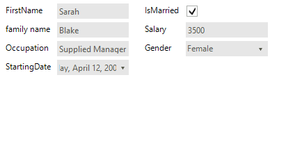
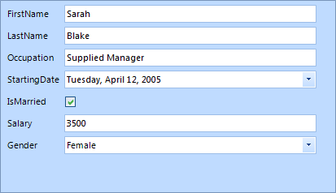
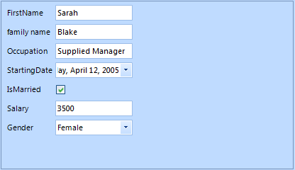
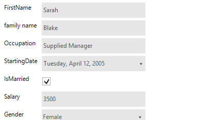
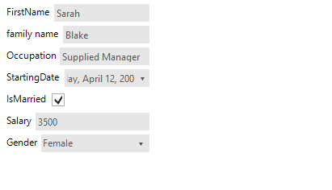
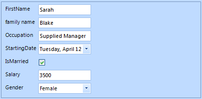

# Properties, events and attributes

## Properties:

The main purpose of __RadDataEntry__ is to generate editors according to the object properties and to create simple data bindings for them.
          For this reason, most of the control properties will take effect only if they are set __before setting the DataSource.__

* The most important property of __RadDataEntry__ is __DataSource__. Through this property user can set the business
              object or a collection of objects that should be editing. When this property is set __RadDataEntry__ generates editors for each public property which does not have
              its __Browsable__ attribute set to *false.*

#### __[C#] __

{{region bind1}}
	            this.radDataEntry1.DataSource = new Employee() 
	            { 
	                FirstName = "Sarah",
	                LastName = "Blake",
	                Occupation = "Supplied Manager", 
	                StartingDate = new DateTime(2005, 04, 12),
	                IsMarried = true, 
	                Salary = 3500, Gender = Gender.Female 
	            };
	{{endregion}}

#### __[VB.NET] __

{{region bind1}}
	            Me.radDataEntry1.DataSource = New Employee() With { _
	              .FirstName = "Sarah", _
	              .LastName = "Blake", _
	              .Occupation = "Supplied Manager", _
	              .StartingDate = New DateTime(2005, 4, 12), _
	              .IsMarried = True, _
	              .Salary = 3500, _
	              .Gender = Gender.Female _
	             }
	            '#End Region
	        End Sub
	    End Class
	End Namespace

* The __ColumnCount__ property controls the amount of columns that __RadDataEntry__ will use to arrange generated controls. Default value is 1
            

#### __[C#] __

{{region NumberOfColumns}}
	            this.radDataEntry1.ColumnCount = 2;
	{{endregion}}

#### __[VB.NET] __

{{region NumberOfColumns}}
	            Me.radDataEntry1.ColumnCount = 2
	            '#End Region
	        End Sub
	    End Class
	End Namespace

* The __FitToParentWidth__ property controls whether the generated editors should fit their width to width of the __RadDataEntry__.
              Default Value is *false*.
            

#### __[C#] __

{{region FitToParentWidth}}
	            this.radDataEntry1.FitToParentWidth = true;
	{{endregion}}

#### __[VB.NET] __

{{region FitToParentWidth}}
	            Me.radDataEntry1.FitToParentWidth = True
	            '#End Region
	        End Sub
	
	        Private Sub SetNumberOfColumns()
	            '#Region "NumberOfColumns"
	            Me.radDataEntry1.ColumnCount = 2
	            '#End Region
	        End Sub
	    End Class
	End Namespace

* The __ShowValidationPanel__ property controls the visibility of validation panel.
              Please note that this property will change the visibility of panel if only there are controls inside it. By default this panel is disabled.
            

#### __[C#] __

{{region ShowValidationPanel}}
	
	            this.radDataEntry1.ShowValidationPanel = true;
	
	            RadLabel label = new RadLabel();
	            label.Name = "First Name";
	            label.Text = "<html><size=10><b>First Name : </b>First Name should be between 2 and 15 chars long.";
	            label.Dock = DockStyle.Top;
	            label.AutoSize = false;
	            label.BackColor = Color.Transparent;
	            this.radDataEntry1.ValidationPanel.PanelContainer.Controls.Add(label);
	
	{{endregion}}

#### __[VB.NET] __

{{region ShowValidationPanel}}
	
	            Me.radDataEntry1.ShowValidationPanel = True
	
	            Dim label As New RadLabel()
	            label.Name = "First Name"
	            label.Text = "<html><size=10><b>First Name : </b>First Name should be between 2 and 15 chars long."
	            label.Dock = DockStyle.Top
	            label.AutoSize = False
	            label.BackColor = Color.Transparent
	            Me.radDataEntry1.ValidationPanel.PanelContainer.Controls.Add(label)
	
	            '#End Region
	        End Sub
	
	        Private Sub SetFitToParentWidth()
	            '#Region "FitToParentWidth"
	            Me.radDataEntry1.FitToParentWidth = True
	            '#End Region
	        End Sub
	
	        Private Sub SetNumberOfColumns()
	            '#Region "NumberOfColumns"
	            Me.radDataEntry1.ColumnCount = 2
	            '#End Region
	        End Sub
	    End Class
	End Namespace

* The __FlowDirection__ controls the direction the editors will be generated when the 
              __ColumnCount__ property has value bigger than 1.
            

#### __[C#] __

{{region FillingOrder1}}
	            this.radDataEntry1.ColumnCount = 2;
	            this.radDataEntry1.FlowDirection = FlowDirection.TopDown;
	{{endregion}}

#### __[VB.NET] __

{{region FillingOrder1}}
	            Me.radDataEntry1.ColumnCount = 2
	            Me.radDataEntry1.FlowDirection = FlowDirection.TopDown
	            '#End Region
	        End Sub
	
	        Private Sub SetFillingOrder2()
	            '#Region "FillingOrder2"
	            Me.radDataEntry1.ColumnCount = 2
	            Me.radDataEntry1.FlowDirection = FlowDirection.LeftToRight
	            '#End Region
	        End Sub
	
	        Private Sub SetShowValidationPanel()
	            '#Region "ShowValidationPanel"
	
	            Me.radDataEntry1.ShowValidationPanel = True
	
	            Dim label As New RadLabel()
	            label.Name = "First Name"
	            label.Text = "<html><size=10><b>First Name : </b>First Name should be between 2 and 15 chars long."
	            label.Dock = DockStyle.Top
	            label.AutoSize = False
	            label.BackColor = Color.Transparent
	            Me.radDataEntry1.ValidationPanel.PanelContainer.Controls.Add(label)
	
	            '#End Region
	        End Sub
	
	        Private Sub SetFitToParentWidth()
	            '#Region "FitToParentWidth"
	            Me.radDataEntry1.FitToParentWidth = True
	            '#End Region
	        End Sub
	
	        Private Sub SetNumberOfColumns()
	            '#Region "NumberOfColumns"
	            Me.radDataEntry1.ColumnCount = 2
	            '#End Region
	        End Sub
	    End Class
	End Namespace

* The __ItemSpace__ property controls the space that between the generated items. Default value is 5 pixels.
            

#### __[C#] __

{{region ItemSpace}}
	            this.radDataEntry1.ItemSpace = 10;
	{{endregion}}

#### __[VB.NET] __

{{region ItemSpace}}
	            Me.radDataEntry1.ItemSpace = 10
	            '#End Region
	        End Sub
	
	        Private Sub SetFillingOrder()
	            'SetFillingOrder1();
	            SetFillingOrder2()
	        End Sub
	
	        Private Sub SetFillingOrder1()
	            '#Region "FillingOrder1"
	            Me.radDataEntry1.ColumnCount = 2
	            Me.radDataEntry1.FlowDirection = FlowDirection.TopDown
	            '#End Region
	        End Sub
	
	        Private Sub SetFillingOrder2()
	            '#Region "FillingOrder2"
	            Me.radDataEntry1.ColumnCount = 2
	            Me.radDataEntry1.FlowDirection = FlowDirection.LeftToRight
	            '#End Region
	        End Sub
	
	        Private Sub SetShowValidationPanel()
	            '#Region "ShowValidationPanel"
	
	            Me.radDataEntry1.ShowValidationPanel = True
	
	            Dim label As New RadLabel()
	            label.Name = "First Name"
	            label.Text = "<html><size=10><b>First Name : </b>First Name should be between 2 and 15 chars long."
	            label.Dock = DockStyle.Top
	            label.AutoSize = False
	            label.BackColor = Color.Transparent
	            Me.radDataEntry1.ValidationPanel.PanelContainer.Controls.Add(label)
	
	            '#End Region
	        End Sub
	
	        Private Sub SetFitToParentWidth()
	            '#Region "FitToParentWidth"
	            Me.radDataEntry1.FitToParentWidth = True
	            '#End Region
	        End Sub
	
	        Private Sub SetNumberOfColumns()
	            '#Region "NumberOfColumns"
	            Me.radDataEntry1.ColumnCount = 2
	            '#End Region
	        End Sub
	    End Class
	End Namespace

* The __ItemDefaultSize__ property sets the size that generated items should have if __FitToParentWidth__ property has value *false*.
              When property the __FitToParentWidth__ has value *true* the width of items are calculated according the width of the __RadDataEntry__ control and the number of the columns.
              In this case the width defined with __ItemDefaultSize__ is ignored.
            

#### __[C#] __

{{region ItemDefaultSize}}
	            this.radDataEntry1.ItemDefaultSize = new Size(300, 30);
	{{endregion}}

#### __[VB.NET] __

{{region ItemDefaultSize}}
	            Me.radDataEntry1.ItemDefaultSize = New Size(300, 30)
	            '#End Region
	
	        End Sub
	
	        Private Sub SetItemSpace()
	            '#Region "ItemSpace"
	            Me.radDataEntry1.ItemSpace = 10
	            '#End Region
	        End Sub
	
	        Private Sub SetFillingOrder()
	            'SetFillingOrder1();
	            SetFillingOrder2()
	        End Sub
	
	        Private Sub SetFillingOrder1()
	            '#Region "FillingOrder1"
	            Me.radDataEntry1.ColumnCount = 2
	            Me.radDataEntry1.FlowDirection = FlowDirection.TopDown
	            '#End Region
	        End Sub
	
	        Private Sub SetFillingOrder2()
	            '#Region "FillingOrder2"
	            Me.radDataEntry1.ColumnCount = 2
	            Me.radDataEntry1.FlowDirection = FlowDirection.LeftToRight
	            '#End Region
	        End Sub
	
	        Private Sub SetShowValidationPanel()
	            '#Region "ShowValidationPanel"
	
	            Me.radDataEntry1.ShowValidationPanel = True
	
	            Dim label As New RadLabel()
	            label.Name = "First Name"
	            label.Text = "<html><size=10><b>First Name : </b>First Name should be between 2 and 15 chars long."
	            label.Dock = DockStyle.Top
	            label.AutoSize = False
	            label.BackColor = Color.Transparent
	            Me.radDataEntry1.ValidationPanel.PanelContainer.Controls.Add(label)
	
	            '#End Region
	        End Sub
	
	        Private Sub SetFitToParentWidth()
	            '#Region "FitToParentWidth"
	            Me.radDataEntry1.FitToParentWidth = True
	            '#End Region
	        End Sub
	
	        Private Sub SetNumberOfColumns()
	            '#Region "NumberOfColumns"
	            Me.radDataEntry1.ColumnCount = 2
	            '#End Region
	        End Sub
	    End Class
	End Namespace

* In __RadDataEntry__ control there is logic that arranges the labels of the editors in one column according to the longest text.
              This logic can be controlled by the __AutoSizeLabels__ property. By default the property value is false and the labels width will equals the longest label width.
              If you set this property to true, the labels will be sized according to their content, as shown on the following figure:
            

#### __[C#] __

{{region ResizeLabels}}
	            this.radDataEntry1.AutoSizeLabels = false;
	{{endregion}}

#### __[VB.NET] __

{{region ResizeLabels}}
	            Me.radDataEntry1.AutoSizeLabels = False
	            '#End Region
	        End Sub
	
	        Private Sub SetItemDefaultSize()
	
	            '#Region "ItemDefaultSize"
	            Me.radDataEntry1.ItemDefaultSize = New Size(300, 30)
	            '#End Region
	
	        End Sub
	
	        Private Sub SetItemSpace()
	            '#Region "ItemSpace"
	            Me.radDataEntry1.ItemSpace = 10
	            '#End Region
	        End Sub
	
	        Private Sub SetFillingOrder()
	            'SetFillingOrder1();
	            SetFillingOrder2()
	        End Sub
	
	        Private Sub SetFillingOrder1()
	            '#Region "FillingOrder1"
	            Me.radDataEntry1.ColumnCount = 2
	            Me.radDataEntry1.FlowDirection = FlowDirection.TopDown
	            '#End Region
	        End Sub
	
	        Private Sub SetFillingOrder2()
	            '#Region "FillingOrder2"
	            Me.radDataEntry1.ColumnCount = 2
	            Me.radDataEntry1.FlowDirection = FlowDirection.LeftToRight
	            '#End Region
	        End Sub
	
	        Private Sub SetShowValidationPanel()
	            '#Region "ShowValidationPanel"
	
	            Me.radDataEntry1.ShowValidationPanel = True
	
	            Dim label As New RadLabel()
	            label.Name = "First Name"
	            label.Text = "<html><size=10><b>First Name : </b>First Name should be between 2 and 15 chars long."
	            label.Dock = DockStyle.Top
	            label.AutoSize = False
	            label.BackColor = Color.Transparent
	            Me.radDataEntry1.ValidationPanel.PanelContainer.Controls.Add(label)
	
	            '#End Region
	        End Sub
	
	        Private Sub SetFitToParentWidth()
	            '#Region "FitToParentWidth"
	            Me.radDataEntry1.FitToParentWidth = True
	            '#End Region
	        End Sub
	
	        Private Sub SetNumberOfColumns()
	            '#Region "NumberOfColumns"
	            Me.radDataEntry1.ColumnCount = 2
	            '#End Region
	        End Sub
	    End Class
	End Namespace

## Events:

There are several events that you will find useful in the context of __RadDataEntry__:
        

__EditorInitializing__ - Occurs when editor is being initialized. This event is cancelable. In this event you can change the default editors with custom ones.
        

__EditorInitialized__  - Occurs when the editor is Initialized.
        

__BindingCreating__ - Occurs when a binding object for an editor is about to be created. This event is cancelable.
        

__BindingCreated__ - Occurs when binding object is created.
        

__ItemInitializing__ – this event is firing when the panel that contains the label, editor and validation label is about to be Initialized. This event is cancelable.
        

__ItemInitialized__ - occurs the item is already Initialized.
        

__ItemValidating__ – this event is fired when any of the generated editors fires its Validating event.
        

__ItemValidated__ – this event is fired when any of the generated editors fires its Validated event.
        

## Attributes:

__RadDataEntry__ has support for several attributes that can be used to change the behavior of the control.
        

With the __Browsable__ attribute users can easily control which properties should be displayed
        

#### __[C#] __

{{region Browsable}}
	            [Browsable(false)]
	            public string PhoneNumber
	            {
	                get;
	                set;
	            }
	{{endregion}}

#### __[VB.NET] __

{{region Browsable}}
	            <Browsable(False)> _
	            Public Property PhoneNumber() As String
	                Get
	                    Return m_PhoneNumber
	                End Get
	                Set(value As String)
	                    m_PhoneNumber = Value
	                End Set
	            End Property
	            Private m_PhoneNumber As String
	#End Region
	
	#Region "DisplayName"
	            <DisplayName("family name")> _
	            Public Property LastName() As String
	                Get
	                    Return m_LastName
	                End Get
	                Set(value As String)
	                    m_LastName = Value
	                End Set
	            End Property
	            Private m_LastName As String
	#End Region
	
	            Public Property Occupation() As String
	                Get
	                    Return m_Occupation
	                End Get
	                Set(value As String)
	                    m_Occupation = Value
	                End Set
	            End Property
	            Private m_Occupation As String
	            Public Property StartingDate() As DateTime
	                Get
	                    Return m_StartingDate
	                End Get
	                Set(value As DateTime)
	                    m_StartingDate = Value
	                End Set
	            End Property
	            Private m_StartingDate As DateTime
	            Public Property IsMarried() As Boolean
	                Get
	                    Return m_IsMarried
	                End Get
	                Set(value As Boolean)
	                    m_IsMarried = Value
	                End Set
	            End Property
	            Private m_IsMarried As Boolean
	#Region "RadRange"
	            <RadRange(1500, 2000)> _
	            Public Property Salary() As Integer
	                Get
	                    Return m_Salary
	                End Get
	                Set(value As Integer)
	                    m_Salary = Value
	                End Set
	            End Property
	            Private m_Salary As Integer
	#End Region
	            Public Property Gender() As Gender
	                Get
	                    Return m_Gender
	                End Get
	                Set(value As Gender)
	                    m_Gender = Value
	                End Set
	            End Property
	            Private m_Gender As Gender
	        End Class
	        Private Enum Gender
	            Female
	            Male
	        End Enum
	        Public Sub New()
	            InitializeComponent()
	        End Sub
	
	        Private Sub RadDataEntryProgram_Load(sender As Object, e As EventArgs) Handles Me.Load
	
	            'SetNumberOfColumns();
	
	            'SetFitToParentWidth();
	
	            'SetShowValidationPanel();
	
	            'SetFillingOrder();
	
	            'SetItemSpace();
	
	            'SetItemDefaultSize();
	
	            'SetResizeLabels();
	
	            Me.radDataEntry1.DataSource = New Employee() With { _
	              .FirstName = "Sarah", _
	              .LastName = "Blake", _
	              .Occupation = "Supplied Manager", _
	              .StartingDate = New DateTime(2005, 4, 12), _
	              .IsMarried = True, _
	              .Salary = 3500, _
	              .Gender = Gender.Female _
	            }
	        End Sub
	
	        Private Sub SetResizeLabels()
	            '#Region "ResizeLabels"
	            Me.radDataEntry1.AutoSizeLabels = False
	            '#End Region
	        End Sub
	
	        Private Sub SetItemDefaultSize()
	
	            '#Region "ItemDefaultSize"
	            Me.radDataEntry1.ItemDefaultSize = New Size(300, 30)
	            '#End Region
	
	        End Sub
	
	        Private Sub SetItemSpace()
	            '#Region "ItemSpace"
	            Me.radDataEntry1.ItemSpace = 10
	            '#End Region
	        End Sub
	
	        Private Sub SetFillingOrder()
	            'SetFillingOrder1();
	            SetFillingOrder2()
	        End Sub
	
	        Private Sub SetFillingOrder1()
	            '#Region "FillingOrder1"
	            Me.radDataEntry1.ColumnCount = 2
	            Me.radDataEntry1.FlowDirection = FlowDirection.TopDown
	            '#End Region
	        End Sub
	
	        Private Sub SetFillingOrder2()
	            '#Region "FillingOrder2"
	            Me.radDataEntry1.ColumnCount = 2
	            Me.radDataEntry1.FlowDirection = FlowDirection.LeftToRight
	            '#End Region
	        End Sub
	
	        Private Sub SetShowValidationPanel()
	            '#Region "ShowValidationPanel"
	
	            Me.radDataEntry1.ShowValidationPanel = True
	
	            Dim label As New RadLabel()
	            label.Name = "First Name"
	            label.Text = "<html><size=10><b>First Name : </b>First Name should be between 2 and 15 chars long."
	            label.Dock = DockStyle.Top
	            label.AutoSize = False
	            label.BackColor = Color.Transparent
	            Me.radDataEntry1.ValidationPanel.PanelContainer.Controls.Add(label)
	
	            '#End Region
	        End Sub
	
	        Private Sub SetFitToParentWidth()
	            '#Region "FitToParentWidth"
	            Me.radDataEntry1.FitToParentWidth = True
	            '#End Region
	        End Sub
	
	        Private Sub SetNumberOfColumns()
	            '#Region "NumberOfColumns"
	            Me.radDataEntry1.ColumnCount = 2
	            '#End Region
	        End Sub
	    End Class
	End Namespace

The __DisplayName__ attribute defines what text should be displayed in the label that is associated with the editor.
        

#### __[C#] __

{{region DisplayName}}
	            //[DisplayName("family name")]
	            public string LastName
	            {
	                get;
	                set;
	            }
	{{endregion}}

#### __[VB.NET] __

{{region DisplayName}}
	            <DisplayName("family name")> _
	            Public Property LastName() As String
	                Get
	                    Return m_LastName
	                End Get
	                Set(value As String)
	                    m_LastName = Value
	                End Set
	            End Property
	            Private m_LastName As String
	#End Region
	
	            Public Property Occupation() As String
	                Get
	                    Return m_Occupation
	                End Get
	                Set(value As String)
	                    m_Occupation = Value
	                End Set
	            End Property
	            Private m_Occupation As String
	            Public Property StartingDate() As DateTime
	                Get
	                    Return m_StartingDate
	                End Get
	                Set(value As DateTime)
	                    m_StartingDate = Value
	                End Set
	            End Property
	            Private m_StartingDate As DateTime
	            Public Property IsMarried() As Boolean
	                Get
	                    Return m_IsMarried
	                End Get
	                Set(value As Boolean)
	                    m_IsMarried = Value
	                End Set
	            End Property
	            Private m_IsMarried As Boolean
	#Region "RadRange"
	            <RadRange(1500, 2000)> _
	            Public Property Salary() As Integer
	                Get
	                    Return m_Salary
	                End Get
	                Set(value As Integer)
	                    m_Salary = Value
	                End Set
	            End Property
	            Private m_Salary As Integer
	#End Region
	            Public Property Gender() As Gender
	                Get
	                    Return m_Gender
	                End Get
	                Set(value As Gender)
	                    m_Gender = Value
	                End Set
	            End Property
	            Private m_Gender As Gender
	        End Class
	        Private Enum Gender
	            Female
	            Male
	        End Enum
	        Public Sub New()
	            InitializeComponent()
	        End Sub
	
	        Private Sub RadDataEntryProgram_Load(sender As Object, e As EventArgs) Handles Me.Load
	
	            'SetNumberOfColumns();
	
	            'SetFitToParentWidth();
	
	            'SetShowValidationPanel();
	
	            'SetFillingOrder();
	
	            'SetItemSpace();
	
	            'SetItemDefaultSize();
	
	            'SetResizeLabels();
	
	            Me.radDataEntry1.DataSource = New Employee() With { _
	              .FirstName = "Sarah", _
	              .LastName = "Blake", _
	              .Occupation = "Supplied Manager", _
	              .StartingDate = New DateTime(2005, 4, 12), _
	              .IsMarried = True, _
	              .Salary = 3500, _
	              .Gender = Gender.Female _
	            }
	        End Sub
	
	        Private Sub SetResizeLabels()
	            '#Region "ResizeLabels"
	            Me.radDataEntry1.AutoSizeLabels = False
	            '#End Region
	        End Sub
	
	        Private Sub SetItemDefaultSize()
	
	            '#Region "ItemDefaultSize"
	            Me.radDataEntry1.ItemDefaultSize = New Size(300, 30)
	            '#End Region
	
	        End Sub
	
	        Private Sub SetItemSpace()
	            '#Region "ItemSpace"
	            Me.radDataEntry1.ItemSpace = 10
	            '#End Region
	        End Sub
	
	        Private Sub SetFillingOrder()
	            'SetFillingOrder1();
	            SetFillingOrder2()
	        End Sub
	
	        Private Sub SetFillingOrder1()
	            '#Region "FillingOrder1"
	            Me.radDataEntry1.ColumnCount = 2
	            Me.radDataEntry1.FlowDirection = FlowDirection.TopDown
	            '#End Region
	        End Sub
	
	        Private Sub SetFillingOrder2()
	            '#Region "FillingOrder2"
	            Me.radDataEntry1.ColumnCount = 2
	            Me.radDataEntry1.FlowDirection = FlowDirection.LeftToRight
	            '#End Region
	        End Sub
	
	        Private Sub SetShowValidationPanel()
	            '#Region "ShowValidationPanel"
	
	            Me.radDataEntry1.ShowValidationPanel = True
	
	            Dim label As New RadLabel()
	            label.Name = "First Name"
	            label.Text = "<html><size=10><b>First Name : </b>First Name should be between 2 and 15 chars long."
	            label.Dock = DockStyle.Top
	            label.AutoSize = False
	            label.BackColor = Color.Transparent
	            Me.radDataEntry1.ValidationPanel.PanelContainer.Controls.Add(label)
	
	            '#End Region
	        End Sub
	
	        Private Sub SetFitToParentWidth()
	            '#Region "FitToParentWidth"
	            Me.radDataEntry1.FitToParentWidth = True
	            '#End Region
	        End Sub
	
	        Private Sub SetNumberOfColumns()
	            '#Region "NumberOfColumns"
	            Me.radDataEntry1.ColumnCount = 2
	            '#End Region
	        End Sub
	    End Class
	End Namespace

With __RadRangeAttribute__ attribute users can define range that can be used into validation process. This attribute is provided in validation events.
        

#### __[C#] __

{{region RadRange}}
	            [RadRange(1500,2000)]
	            public int Salary
	            {
	                get;
	                set;
	            }
	{{endregion}}

#### __[VB.NET] __

{{region RadRange}}
	            <RadRange(1500, 2000)> _
	            Public Property Salary() As Integer
	                Get
	                    Return m_Salary
	                End Get
	                Set(value As Integer)
	                    m_Salary = Value
	                End Set
	            End Property
	            Private m_Salary As Integer
	#End Region
	            Public Property Gender() As Gender
	                Get
	                    Return m_Gender
	                End Get
	                Set(value As Gender)
	                    m_Gender = Value
	                End Set
	            End Property
	            Private m_Gender As Gender
	        End Class
	        Private Enum Gender
	            Female
	            Male
	        End Enum
	        Public Sub New()
	            InitializeComponent()
	        End Sub
	
	        Private Sub RadDataEntryProgram_Load(sender As Object, e As EventArgs) Handles Me.Load
	
	            'SetNumberOfColumns();
	
	            'SetFitToParentWidth();
	
	            'SetShowValidationPanel();
	
	            'SetFillingOrder();
	
	            'SetItemSpace();
	
	            'SetItemDefaultSize();
	
	            'SetResizeLabels();
	
	            Me.radDataEntry1.DataSource = New Employee() With { _
	              .FirstName = "Sarah", _
	              .LastName = "Blake", _
	              .Occupation = "Supplied Manager", _
	              .StartingDate = New DateTime(2005, 4, 12), _
	              .IsMarried = True, _
	              .Salary = 3500, _
	              .Gender = Gender.Female _
	            }
	        End Sub
	
	        Private Sub SetResizeLabels()
	            '#Region "ResizeLabels"
	            Me.radDataEntry1.AutoSizeLabels = False
	            '#End Region
	        End Sub
	
	        Private Sub SetItemDefaultSize()
	
	            '#Region "ItemDefaultSize"
	            Me.radDataEntry1.ItemDefaultSize = New Size(300, 30)
	            '#End Region
	
	        End Sub
	
	        Private Sub SetItemSpace()
	            '#Region "ItemSpace"
	            Me.radDataEntry1.ItemSpace = 10
	            '#End Region
	        End Sub
	
	        Private Sub SetFillingOrder()
	            'SetFillingOrder1();
	            SetFillingOrder2()
	        End Sub
	
	        Private Sub SetFillingOrder1()
	            '#Region "FillingOrder1"
	            Me.radDataEntry1.ColumnCount = 2
	            Me.radDataEntry1.FlowDirection = FlowDirection.TopDown
	            '#End Region
	        End Sub
	
	        Private Sub SetFillingOrder2()
	            '#Region "FillingOrder2"
	            Me.radDataEntry1.ColumnCount = 2
	            Me.radDataEntry1.FlowDirection = FlowDirection.LeftToRight
	            '#End Region
	        End Sub
	
	        Private Sub SetShowValidationPanel()
	            '#Region "ShowValidationPanel"
	
	            Me.radDataEntry1.ShowValidationPanel = True
	
	            Dim label As New RadLabel()
	            label.Name = "First Name"
	            label.Text = "<html><size=10><b>First Name : </b>First Name should be between 2 and 15 chars long."
	            label.Dock = DockStyle.Top
	            label.AutoSize = False
	            label.BackColor = Color.Transparent
	            Me.radDataEntry1.ValidationPanel.PanelContainer.Controls.Add(label)
	
	            '#End Region
	        End Sub
	
	        Private Sub SetFitToParentWidth()
	            '#Region "FitToParentWidth"
	            Me.radDataEntry1.FitToParentWidth = True
	            '#End Region
	        End Sub
	
	        Private Sub SetNumberOfColumns()
	            '#Region "NumberOfColumns"
	            Me.radDataEntry1.ColumnCount = 2
	            '#End Region
	        End Sub
	    End Class
	End Namespace

