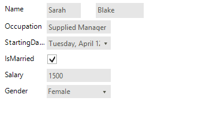
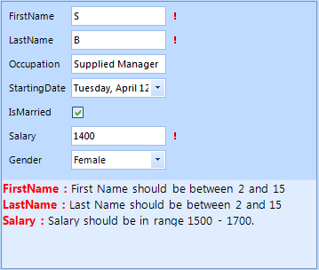

# Validation


For the need of validation process we made two events (__ItemValidating, ItemValidated__) that are firing when the __Validating__ and __Validated__ events occur in the editors. __RadDataEntry__ provides three different ways to show to the users that some editors do not match to validation criteria – Validation label, Error provider and Validation Panel. In the following tutorial we will demonstrate how use validation panel together with Error provider.
        

1\. For the purpose of this tutorial, we will create a new class Employee with a couple of exposed properties. By binding __RadDataEntry__ to object from this type we will generate several items: 

{{source=..\SamplesCS\DataEntryAndBindingNavigator\RadDataEntryGettingStarted.cs region=empl1}} 
{{source=..\SamplesVB\DataEntryAndBindingNavigator\RadDataEntryGettingStarted.vb region=empl1}} 

````C#
private class Employee
{
    public string FirstName
    {
        get;
        set;
    }
    public string LastName
    {
        get;
        set;
    }
    public string Occupation
    {
        get;
        set;
    }
    public DateTime StartingDate
    {
        get;
        set;
    }
    public bool IsMarried
    {
        get;
        set;
    }
    public int Salary
    {
        get;
        set;
    }
    public Gender Gender
    {
        get;
        set;
    }
}
private enum Gender
{
    Female,
    Male
}

````
````VB.NET
Private Class Employee
    Public Property FirstName() As String
        Get
            Return m_FirstName
        End Get
        Set(value As String)
            m_FirstName = Value
        End Set
    End Property
    Private m_FirstName As String
    Public Property LastName() As String
        Get
            Return m_LastName
        End Get
        Set(value As String)
            m_LastName = Value
        End Set
    End Property
    Private m_LastName As String
    Public Property Occupation() As String
        Get
            Return m_Occupation
        End Get
        Set(value As String)
            m_Occupation = Value
        End Set
    End Property
    Private m_Occupation As String
    Public Property StartingDate() As DateTime
        Get
            Return m_StartingDate
        End Get
        Set(value As DateTime)
            m_StartingDate = Value
        End Set
    End Property
    Private m_StartingDate As DateTime
    Public Property IsMarried() As Boolean
        Get
            Return m_IsMarried
        End Get
        Set(value As Boolean)
            m_IsMarried = Value
        End Set
    End Property
    Private m_IsMarried As Boolean
    Public Property Salary() As Integer
        Get
            Return m_Salary
        End Get
        Set(value As Integer)
            m_Salary = Value
        End Set
    End Property
    Private m_Salary As Integer
    Public Property Gender() As Gender
        Get
            Return m_Gender
        End Get
        Set(value As Gender)
            m_Gender = Value
        End Set
    End Property
    Private m_Gender As Gender
End Class
Private Enum Gender
    Female
    Male
End Enum

````

{{endregion}} 
 

{{source=..\SamplesCS\DataEntryAndBindingNavigator\RadDataEntryGettingStarted.cs region=bind1}} 
{{source=..\SamplesVB\DataEntryAndBindingNavigator\RadDataEntryGettingStarted.vb region=bind1}} 

````C#
this.radDataEntry1.DataSource = new Employee() 
{ 
    FirstName = "Sarah",
    LastName = "Blake",
    Occupation = "Supplied Manager", 
    StartingDate = new DateTime(2005, 04, 12),
    IsMarried = true, 
    Salary = 3500, Gender = Gender.Female 
};

````
````VB.NET
Me.radDataEntry1.DataSource = New Employee() With { _
  .FirstName = "Sarah", _
  .LastName = "Blake", _
  .Occupation = "Supplied Manager", _
  .StartingDate = New DateTime(2005, 4, 12), _
  .IsMarried = True, _
  .Salary = 3500, _
  .Gender = Gender.Female _
 }

````

{{endregion}} 




2\. Set the __ShowValidationPanel__ property to true. This will display the panel below the editors:
            

{{source=..\SamplesCS\DataEntryAndBindingNavigator\RadDataEntryHowTo.cs region=ShowValidationPanel2}} 
{{source=..\SamplesVB\DataEntryAndBindingNavigator\RadDataEntryHowTo.vb region=ShowValidationPanel2}} 

````C#
this.radDataEntry1.ShowValidationPanel = true;

````
````VB.NET
Me.radDataEntry1.ShowValidationPanel = True

````

{{endregion}} 
 

3\. Subscribe to the __ItemValidated__ event of __RadDataEntry__:
            

{{source=..\SamplesCS\DataEntryAndBindingNavigator\RadDataEntryHowTo.cs region=ItemValidated}} 
{{source=..\SamplesVB\DataEntryAndBindingNavigator\RadDataEntryHowTo.vb region=ItemValidated}} 

````C#
void radDataEntry1_ItemValidated(object sender, ItemValidatedEventArgs e)
{
    Employee employee = this.radDataEntry1.CurrentObject as Employee;
    if (e.Label.Text == "FirstName")
    {
        if (employee.FirstName.Length < 2 || employee.FirstName.Length > 15)
        {
            e.ErrorProvider.SetError((sender as Control), "First Name should be between 2 and 15 chars long.");
            if (!this.radDataEntry1.ValidationPanel.PanelContainer.Controls.ContainsKey("FirstName"))
            {
                RadLabel label = new RadLabel();
                label.Name = "FirstName";
                label.Text = "<html><size=10><b><color= Red>FirstName : </b><color= Black>First Name should be between 2 and 15 chars long.";
                label.Dock = DockStyle.Top;
                label.AutoSize = false;
                label.BackColor = Color.Transparent;
                this.radDataEntry1.ValidationPanel.PanelContainer.Controls.Add(label);
            }
        }
        else
        {
            e.ErrorProvider.Clear();
            this.radDataEntry1.ValidationPanel.PanelContainer.Controls.RemoveByKey("FirstName");
        }
    }
    else if (e.Label.Text == "LastName")
    {
        if (employee.LastName.Length < 2 || employee.LastName.Length > 15)
        {
            e.ErrorProvider.SetError((sender as Control), "Last Name should be between 2 and 15 chars long.");
            if (!this.radDataEntry1.ValidationPanel.PanelContainer.Controls.ContainsKey("LastName"))
            {
                RadLabel label = new RadLabel();
                label.Name = "LastName";
                label.Text = "<html><size=10><b><color= Red>LastName : </b><color= Black>Last Name should be between 2 and 15 chars long.";
                label.Dock = DockStyle.Top;
                label.AutoSize = false;
                label.BackColor = Color.Transparent;
                this.radDataEntry1.ValidationPanel.PanelContainer.Controls.Add(label);
            }
        }
        else
        {
            e.ErrorProvider.Clear();
            this.radDataEntry1.ValidationPanel.PanelContainer.Controls.RemoveByKey("LastName");
        }
    }
    else if (e.Label.Text == "Salary")
    {
        if (employee.Salary < 1500 || employee.Salary > 1700)
        {
            e.ErrorProvider.SetError((sender as Control), "Salary should be in range 1500 - 1700.");
            if (!this.radDataEntry1.ValidationPanel.PanelContainer.Controls.ContainsKey("Salary"))
            {
                RadLabel label = new RadLabel();
                label.Name = "Salary";
                label.Text = "<html><size=10><b><color= Red>Salary : </b><color= Black>Salary should be in range 1500 - 1700.";
                label.Dock = DockStyle.Top;
                label.AutoSize = false;
                label.BackColor = Color.Transparent;
                this.radDataEntry1.ValidationPanel.PanelContainer.Controls.Add(label);
            }
        }
        else
        {
            e.ErrorProvider.Clear();
            this.radDataEntry1.ValidationPanel.PanelContainer.Controls.RemoveByKey("Salary");
        }
    }
}

````
````VB.NET
Private Sub radDataEntry1_ItemValidated(sender As Object, e As ItemValidatedEventArgs)
    Dim employee As Employee = TryCast(Me.radDataEntry1.CurrentObject, Employee)
    If e.Label.Text = "FirstName" Then
        If employee.FirstName.Length < 2 OrElse employee.FirstName.Length > 15 Then
            e.ErrorProvider.SetError(TryCast(sender, Control), "First Name should be between 2 and 15 chars long.")
            If Not Me.radDataEntry1.ValidationPanel.PanelContainer.Controls.ContainsKey("FirstName") Then
                Dim label As New RadLabel()
                label.Name = "FirstName"
                label.Text = "<html><size=10><b><color= Red>FirstName : </b><color= Black>First Name should be between 2 and 15 chars long."
                label.Dock = DockStyle.Top
                label.AutoSize = False
                label.BackColor = Color.Transparent
                Me.radDataEntry1.ValidationPanel.PanelContainer.Controls.Add(label)
            End If
        Else
            e.ErrorProvider.Clear()
            Me.radDataEntry1.ValidationPanel.PanelContainer.Controls.RemoveByKey("FirstName")
        End If
    ElseIf e.Label.Text = "LastName" Then
        If employee.LastName.Length < 2 OrElse employee.LastName.Length > 15 Then
            e.ErrorProvider.SetError(TryCast(sender, Control), "Last Name should be between 2 and 15 chars long.")
            If Not Me.radDataEntry1.ValidationPanel.PanelContainer.Controls.ContainsKey("LastName") Then
                Dim label As New RadLabel()
                label.Name = "LastName"
                label.Text = "<html><size=10><b><color= Red>LastName : </b><color= Black>Last Name should be between 2 and 15 chars long."
                label.Dock = DockStyle.Top
                label.AutoSize = False
                label.BackColor = Color.Transparent
                Me.radDataEntry1.ValidationPanel.PanelContainer.Controls.Add(label)
            End If
        Else
            e.ErrorProvider.Clear()
            Me.radDataEntry1.ValidationPanel.PanelContainer.Controls.RemoveByKey("LastName")
        End If
    ElseIf e.Label.Text = "Salary" Then
        If employee.Salary < 1500 OrElse employee.Salary > 1700 Then
            e.ErrorProvider.SetError(TryCast(sender, Control), "Salary should be in range 1500 - 1700.")
            If Not Me.radDataEntry1.ValidationPanel.PanelContainer.Controls.ContainsKey("Salary") Then
                Dim label As New RadLabel()
                label.Name = "Salary"
                label.Text = "<html><size=10><b><color= Red>Salary : </b><color= Black>Salary should be in range 1500 - 1700."
                label.Dock = DockStyle.Top
                label.AutoSize = False
                label.BackColor = Color.Transparent
                Me.radDataEntry1.ValidationPanel.PanelContainer.Controls.Add(label)
            End If
        Else
            e.ErrorProvider.Clear()
            Me.radDataEntry1.ValidationPanel.PanelContainer.Controls.RemoveByKey("Salary")
        End If
    End If
End Sub

````

{{endregion}} 




In this tutorial we also used and Error provider to show error icon next to the editors.  You can read more about Microsoft Error provider here - [ErrorProvider Class](http://msdn.microsoft.com/en-us/library/system.windows.forms.errorprovider%28v=vs.110%29.aspx)

# See Also

 * [Structure]()
 * [Getting Started]()
 * [Properties, events and attributes]()
 * [Themes]()
 * [Change the editor to RadDropDownList]()