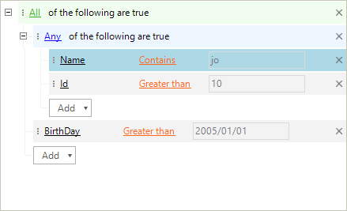
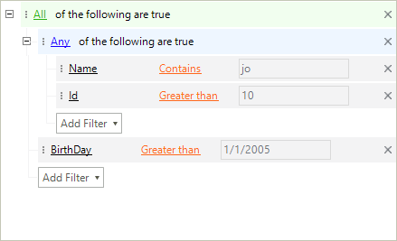

# Formatting Nodes

__RadDataFilter__ is a virtualized control reusing its visual elements. It exposes a __NodeFormatting__ event with which its nodes can be easily accessed and customized. The arguments of this event also return the associated data node providing information about the applied descriptor.

>tip The UI of __RadDataFilter__ is virtualized and its visual elements are reused. An '*else*' clause is needed for each '*if*' statement in the implementation of the __NodeFormatting__ event. Skipping this operation will lead to an incorrect styling.
>

## Formatting Group Nodes

Group nodes can be formatted to handle custom scenarios. The root node in the example below has its expander item hidden.

>caption Figure 1: Hidden Expander Item


#### Group Nodes

{{source=..\SamplesCS\DataFilter\DataFilterWorkingWithNodes.cs region=GroupNodes}} 
{{source=..\SamplesVB\DataFilter\DataFilterWorkingWithNodes.vb region=GroupNodes}}
````C#
private void radDataFilter1_NodeFormatting(object sender, TreeNodeFormattingEventArgs e)
{
    DataFilterGroupElement dataGroupFilterElement = e.NodeElement as DataFilterGroupElement;
    if (dataGroupFilterElement != null && dataGroupFilterElement.IsRootNode)
    {
        dataGroupFilterElement.ExpanderElement.Visibility = ElementVisibility.Collapsed;
    }
    else
    {
        e.NodeElement.ResetValue(LightVisualElement.VisibilityProperty, ValueResetFlags.Local);
    }
}

````
````VB.NET
Private Sub radDataFilter1_NodeFormatting(sender As Object, e As TreeNodeFormattingEventArgs)
    Dim dataGroupFilterElement As DataFilterGroupElement = TryCast(e.NodeElement, DataFilterGroupElement)
    If dataGroupFilterElement IsNot Nothing AndAlso dataGroupFilterElement.IsRootNode Then
        dataGroupFilterElement.ExpanderElement.Visibility = ElementVisibility.Collapsed
    Else
        e.NodeElement.ResetValue(LightVisualElement.VisibilityProperty, ValueResetFlags.Local)
    End If
End Sub

````


{{endregion}}

## Formatting Expression Nodes

The appearance of the expression nodes can also be modified to change their visual appearance. 

>caption Figure 2: Changed Back Color



#### Expression Nodes

{{source=..\SamplesCS\DataFilter\DataFilterWorkingWithNodes.cs region=ExpressionNodes}} 
{{source=..\SamplesVB\DataFilter\DataFilterWorkingWithNodes.vb region=ExpressionNodes}}
````C#
private void radDataFilter1_NodeFormatting1(object sender, TreeNodeFormattingEventArgs e)
{
    DataFilterCriteriaElement dataExpressionFilterElement = e.NodeElement as DataFilterCriteriaElement;
    if (dataExpressionFilterElement != null && dataExpressionFilterElement.CriteriaNode.Descriptor.PropertyName == "Name")
    {
        dataExpressionFilterElement.ContentElement.BackColor = Color.LightBlue;
    }
    else
    {
        e.NodeElement.ResetValue(LightVisualElement.BackColorProperty, ValueResetFlags.Local);
    }
}

````
````VB.NET
Private Sub radDataFilter1_NodeFormatting1(sender As Object, e As TreeNodeFormattingEventArgs)
    Dim dataExpressionFilterElement As DataFilterCriteriaElement = TryCast(e.NodeElement, DataFilterCriteriaElement)
    If dataExpressionFilterElement IsNot Nothing AndAlso dataExpressionFilterElement.CriteriaNode.Descriptor.PropertyName = "Name" Then
        dataExpressionFilterElement.ContentElement.BackColor = Color.LightBlue
    Else
        e.NodeElement.ResetValue(LightVisualElement.BackColorProperty, ValueResetFlags.Local)
    End If
End Sub

````


{{endregion}}

## Formatting Button Nodes

The button responsible for adding a new expression can also be customized in a formatting event.  

>caption Figure 3: Add Button Text



#### Button Nodes

{{source=..\SamplesCS\DataFilter\DataFilterWorkingWithNodes.cs region=AddButton}} 
{{source=..\SamplesVB\DataFilter\DataFilterWorkingWithNodes.vb region=AddButton}}
````C#
private void radDataFilter1_NodeFormatting2(object sender, TreeNodeFormattingEventArgs e)
{
    DataFilterAddNodeElement dataAddNodeElement = e.NodeElement as DataFilterAddNodeElement;
    if (dataAddNodeElement != null && dataAddNodeElement.DropDownButton.Text == "Add")
    {
        dataAddNodeElement.DropDownButton.Text = "Add Filter";
    }
    else
    {
        e.NodeElement.ResetValue(LightVisualElement.VisibilityProperty, ValueResetFlags.Local);
    }
}

````
````VB.NET
Private Sub radDataFilter1_NodeFormatting2(sender As Object, e As TreeNodeFormattingEventArgs)
    Dim dataAddNodeElement As DataFilterAddNodeElement = TryCast(e.NodeElement, DataFilterAddNodeElement)
    If dataAddNodeElement IsNot Nothing AndAlso dataAddNodeElement.DropDownButton.Text = "Add" Then
        dataAddNodeElement.DropDownButton.Text = "Add Filter"
    Else
        e.NodeElement.ResetValue(LightVisualElement.VisibilityProperty, ValueResetFlags.Local)
    End If
End Sub

````


{{endregion}}

## Formatting Child Expression Elements

Each of the nodes holding the expressions has three editor elements which can be accessed in the __NodeFormatting__ and have their styles modified.

>caption Figure 3: Add Button Text


#### Child Expression Elements

{{source=..\SamplesCS\DataFilter\DataFilterWorkingWithNodes.cs region=ChildExpressionElements}} 
{{source=..\SamplesVB\DataFilter\DataFilterWorkingWithNodes.vb region=ChildExpressionElements}}
````C#
private void radDataFilter1_NodeFormatting3(object sender, TreeNodeFormattingEventArgs e)
{
    DataFilterCriteriaElement dataExpressionFilterElement = e.NodeElement as DataFilterCriteriaElement;
    if (dataExpressionFilterElement == null)
    {
        return;
    }
    if (dataExpressionFilterElement.CriteriaNode.Descriptor.PropertyName == "Id")
    {
        dataExpressionFilterElement.FieldElement.DrawFill = true;
        dataExpressionFilterElement.FieldElement.GradientStyle = GradientStyles.Solid;
        dataExpressionFilterElement.FieldElement.BackColor = Color.LightGreen;
        dataExpressionFilterElement.OperatorElement.ForeColor = Color.Red;
        dataExpressionFilterElement.ValueElement.DrawFill = true;
        dataExpressionFilterElement.ValueElement.GradientStyle = GradientStyles.Solid;
        dataExpressionFilterElement.ValueElement.BackColor = Color.LightBlue;
    }
    else
    {
        dataExpressionFilterElement.FieldElement.ResetValue(LightVisualElement.DrawFillProperty, ValueResetFlags.Local);
        dataExpressionFilterElement.FieldElement.ResetValue(LightVisualElement.GradientStyleProperty, ValueResetFlags.Local);
        dataExpressionFilterElement.FieldElement.ResetValue(LightVisualElement.BackColorProperty, ValueResetFlags.Local);
        dataExpressionFilterElement.OperatorElement.ResetValue(LightVisualElement.ForeColorProperty, ValueResetFlags.Local);
        dataExpressionFilterElement.ValueElement.ResetValue(LightVisualElement.DrawFillProperty, ValueResetFlags.Local);
        dataExpressionFilterElement.ValueElement.ResetValue(LightVisualElement.GradientStyleProperty, ValueResetFlags.Local);
        dataExpressionFilterElement.ValueElement.ResetValue(LightVisualElement.BackColorProperty, ValueResetFlags.Local);
    }
}

````
````VB.NET
Private Sub radDataFilter1_NodeFormatting3(sender As Object, e As TreeNodeFormattingEventArgs)
    Dim dataExpressionFilterElement As DataFilterCriteriaElement = TryCast(e.NodeElement, DataFilterCriteriaElement)
    If dataExpressionFilterElement Is Nothing Then
        Return
    End If
    If dataExpressionFilterElement.CriteriaNode.Descriptor.PropertyName = "Id" Then
        dataExpressionFilterElement.FieldElement.DrawFill = True
        dataExpressionFilterElement.FieldElement.GradientStyle = GradientStyles.Solid
        dataExpressionFilterElement.FieldElement.BackColor = Color.LightGreen
        dataExpressionFilterElement.OperatorElement.ForeColor = Color.Red
        dataExpressionFilterElement.ValueElement.DrawFill = True
        dataExpressionFilterElement.ValueElement.GradientStyle = GradientStyles.Solid
        dataExpressionFilterElement.ValueElement.BackColor = Color.LightBlue
    Else
        dataExpressionFilterElement.FieldElement.ResetValue(LightVisualElement.DrawFillProperty, ValueResetFlags.Local)
        dataExpressionFilterElement.FieldElement.ResetValue(LightVisualElement.GradientStyleProperty, ValueResetFlags.Local)
        dataExpressionFilterElement.FieldElement.ResetValue(LightVisualElement.BackColorProperty, ValueResetFlags.Local)
        dataExpressionFilterElement.OperatorElement.ResetValue(LightVisualElement.ForeColorProperty, ValueResetFlags.Local)
        dataExpressionFilterElement.ValueElement.ResetValue(LightVisualElement.DrawFillProperty, ValueResetFlags.Local)
        dataExpressionFilterElement.ValueElement.ResetValue(LightVisualElement.GradientStyleProperty, ValueResetFlags.Local)
        dataExpressionFilterElement.ValueElement.ResetValue(LightVisualElement.BackColorProperty, ValueResetFlags.Local)
    End If
End Sub

````


{{endregion}}


# See Also

* [Getting Started ]()
* [Unbound Mode]()	
* [Data Binding]()	
