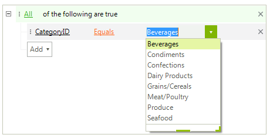

# Events

**RadDataFilter** provides several events for controlling the editing behavior. 

## EditorRequired

The **EditorRequired** event is fired when a specific filter node's element is about to be edited and an editor is required. In the **TreeNodeEditorRequiredEventArgs** you have information for the **EditorType** and the **Node** to be affected. 

The **Node** can be one of the following elements:

* **DataFilterCriteriaNode**: represents a simple filter condition.
* **DataFilterGroupNode**: represents a composite filter condition composed of several simple conditions.
* **DataFilterRootNode**: represents the root filter node in **RadDataFilter**.

The **sender** in the **EditorRequired** event can be one of the following elements in order to distinguish for which element the editor is required:

* **DataFilterFieldEditorElement**: represents the field name element.
* **DataFilterOperatorEditorElement**: represents the operator element.
* **DataFilterValueEditorElement**: represents the value element. 
* **DataFilterLogicalOperatorEditorElement**: represents the logical operator element.

This is the appropriate place to replace the default editor and specify what editor to be used.

## Editing

The RadDataFilter.**Editing** event occurs when initializing the active editor. If the event is canceled, no further action takes place.

## EditorInitialized

The **EditorInitialized** event is fired when the editor has already been initialized. Here is the appropriate place if you need to customize the editor.

The following code snippet demonstrates how to replace the default editor with a drop down editor when modifying the value element for the *CategoryID* filter node. It also shows how to allow typing in the editable part of the drop down and activates resizing and auto complete:

>caption Figure 1: Replace default editor with drop down



#### Replace and customize the default editor

{{source=..\SamplesCS\DataFilter\DataFilterEditing.cs region=CustomizeEditor}} 
{{source=..\SamplesVB\DataFilter\DataFilterEditing.vb region=CustomizeEditor}}

````C#
public DataFilterEditing()
{
    InitializeComponent();
    this.radDataFilter1.DataSource = this.productsBindingSource;
    this.radDataFilter1.EditorRequired += radDataFilter1_EditorRequired;
    this.radDataFilter1.EditorInitialized += radDataFilter1_EditorInitialized;
}
private void radDataFilter1_EditorInitialized(object sender, TreeNodeEditorInitializedEventArgs e)
{
    TreeViewDropDownListEditor editor = e.Editor as TreeViewDropDownListEditor;
    if (editor != null)
    {
        editor.DropDownStyle = Telerik.WinControls.RadDropDownStyle.DropDown;
        editor.DropDownSizingMode = SizingMode.UpDownAndRightBottom;
        BaseDropDownListEditorElement el = editor.EditorElement as BaseDropDownListEditorElement;
        el.AutoCompleteMode = AutoCompleteMode.Suggest;
    }
}
private void radDataFilter1_EditorRequired(object sender, TreeNodeEditorRequiredEventArgs e)
{
    DataFilterCriteriaNode filterNode = e.Node as DataFilterCriteriaNode;
    if (filterNode != null && filterNode.PropertyName == "CategoryID" && sender is DataFilterValueEditorElement)
    {
        TreeViewDropDownListEditor editor = new TreeViewDropDownListEditor();
        BaseDropDownListEditorElement el = editor.EditorElement as BaseDropDownListEditorElement;
        el.DataSource = this.categoriesBindingSource;
        el.ValueMember = "CategoryID";
        el.DisplayMember = "CategoryName";
        e.Editor = editor;
    }
}

````
````VB.NET
Public Sub New()
    InitializeComponent()
    Me.RadDataFilter1.DataSource = Me.ProductsBindingSource
    AddHandler Me.RadDataFilter1.EditorRequired, AddressOf radDataFilter1_EditorRequired
    AddHandler Me.RadDataFilter1.EditorInitialized, AddressOf radDataFilter1_EditorInitialized
End Sub
Private Sub radDataFilter1_EditorInitialized(sender As Object, e As TreeNodeEditorInitializedEventArgs)
    Dim editor As TreeViewDropDownListEditor = TryCast(e.Editor, TreeViewDropDownListEditor)
    If editor IsNot Nothing Then
        editor.DropDownStyle = Telerik.WinControls.RadDropDownStyle.DropDown
        editor.DropDownSizingMode = SizingMode.UpDownAndRightBottom
        Dim el As BaseDropDownListEditorElement = TryCast(editor.EditorElement, BaseDropDownListEditorElement)
        el.AutoCompleteMode = AutoCompleteMode.Suggest
    End If
End Sub
Private Sub radDataFilter1_EditorRequired(sender As Object, e As TreeNodeEditorRequiredEventArgs)
    Dim filterNode As DataFilterCriteriaNode = TryCast(e.Node, DataFilterCriteriaNode)
    If filterNode IsNot Nothing AndAlso filterNode.PropertyName = "CategoryID" AndAlso TypeOf sender Is DataFilterValueEditorElement Then
        Dim editor As New TreeViewDropDownListEditor()
        Dim el As BaseDropDownListEditorElement = TryCast(editor.EditorElement, BaseDropDownListEditorElement)
        el.DataSource = Me.categoriesBindingSource
        el.ValueMember = "CategoryID"
        el.DisplayMember = "CategoryName"
        e.Editor = editor
    End If
End Sub

```` 

{{endregion}}

## Edited

The RadDataFilter.**Edited** event occurs after the filter node is edited.

# See Also

* [Custom Editors]()	
* [Default Editors]()	