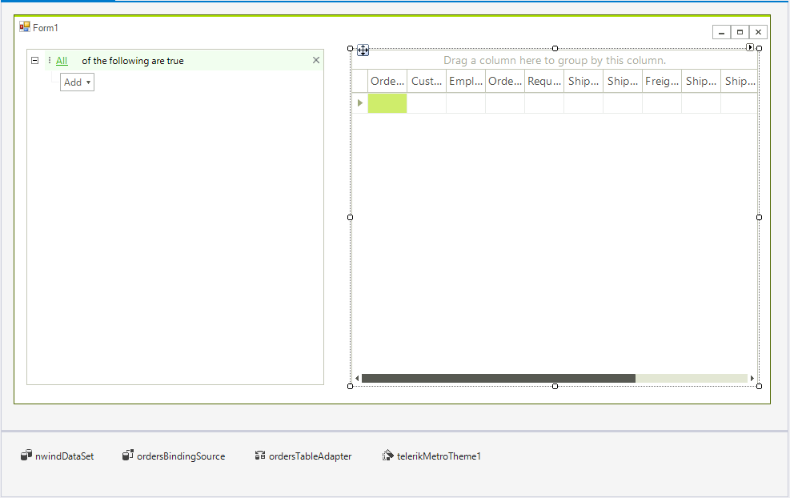
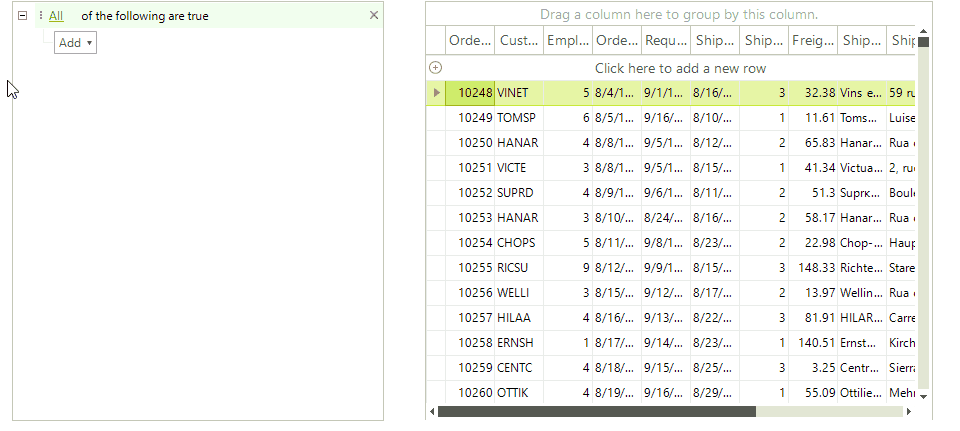

# Getting Started

__RadDataFilter__ is a control that allows you to filter your data. It allows you to create complex filter criteria within unlimited number of filter conditions combined by logical operators. This article will show you how to start using this control.

1. Add a __RadGridView__, a __RadDataFilter__ and the __TelerikMetro__ theme to a form. Set the theme of all controls to TelerikMetro.

2. Populate the grid using the Nwind database, use the __Orders__ table as a data Source. More information is available [here](). This way the binding source will be automatically created.

    At this point your form should look like this:
    
   


3. Open the Smart Tag of the RadDataFilter control and select the "ordersBindingSource".

    

4. By default the filter is not applied automatically and in order to synchronize the controls you need to apply the  filter. We will apply the filter when an item is applied and when removed. Since the RadDataFilter control is build on to of RadTreeView we can use the __NodeRemoved__ and the Edited events to synchronize the controls. The only action that needs to be performed is calling the __ApplyFilter__ method.

{{source=..\SamplesCS\DataFilter\DataFilterGettingStarted.cs region=Events}} 
{{source=..\SamplesVB\DataFilter\DataFilterGettingStarted.vb region=Events}}
````C#
private void RadDataFilter1_NodeRemoved(object sender, RadTreeViewEventArgs e)
{
    radDataFilter1.ApplyFilter();
}
private void RadDataFilter1_Edited(object sender, TreeNodeEditedEventArgs e)
{
    radDataFilter1.ApplyFilter();
}

````
````VB.NET
Private Sub RadDataFilter1_NodeRemoved(ByVal sender As Object, ByVal e As RadTreeViewEventArgs)
    RadDataFilter1.ApplyFilter()
End Sub
Private Sub RadDataFilter1_Edited(ByVal sender As Object, ByVal e As TreeNodeEditedEventArgs)
    RadDataFilter1.ApplyFilter()
End Sub

```` 


{{endregion}}


5. Start the application and add some filters.

    
