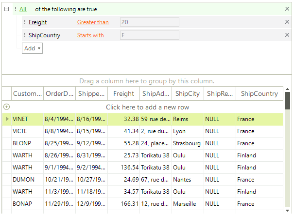

# RadDataFilter

Building complex filter expressions in a breeze with __RadDataFilter__. The control allows specifying expressions based on the data and collection type of the source fields. The intuitive UI of the control is designed to facilitate the end-user while empowering the developer to create related expressions with a few clicks.

### Key features:

* __Visual Expression Building:__  With the extremely intuitive UI, RadDataFilter is very user-friendly. Select your filter options with a simple point-and-click. The control allows specifying expressions based on the data and collection type of the source. You can build complex expressions on multiple fields with And/Or operators and myriad of filter functions.

* __Seamless Integration:__ RadDataFilter can communicate with any kind of collections (even a plain IEnumerable). The control can then be used with any ItemsControls (GridView, TreeView, ComboBox, etc.). This allows extreme flexibility and loose coupling.