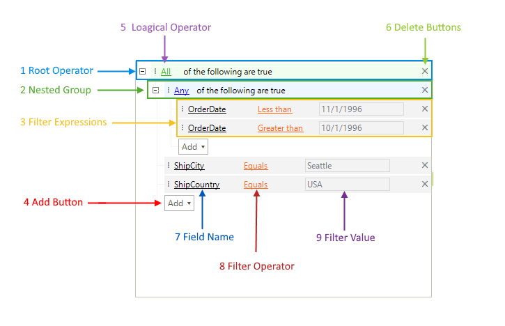

# Structure

RadDataFilter contains two types of items:

* __Group:__ This item can contain other groups or expression items and sets the relation between them. 
* __Expression:__ defines a single field filter criteria and can be added only to group nodes.

>caption Figure 1: RadDataFilter structure

1. __Root Operator Item:__ This is the main operator and it host all other group and expression items. This node cannot be removed by default. Pressing its delete button will clear all other items.
2. __Nested Group Item:__ The groups can hold any number of expression or group items. Can be inserted with the add button. 
3. __Filter Expression Item:__ The filter expressions allows you to define the entire filter criteria. Each item allows you to chose the __FieldName__ the __FilterOperator__ and the __FilterValue__.
4. __Add Button:__ This button is available on each level and allows you to add expression or group items.  
5. __Logical Operator:__ This operator defines how the expressions are related to each other in each group. 
6. __Delete Button:__ This button removes the current along with all underlying items.
7. __Field Name:__ Represents a list with all of the available members, which can serve as a filter criteria.
8. __Filter Operator:__ Represents a list with all of the available operators for the filter criteria.
9. __Filter Value:__ Represents an input box, where the users can enter their filter input. The built-in filter editors will help the users to achieve this fast and easily.

# Elements Hierarchy

