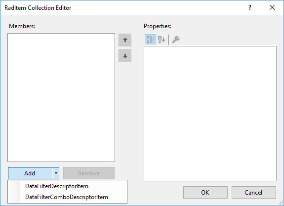

# Descriptor items

There are two item types that are currently supported:

* __DataFilterDescriptorItem:__ The default item that uses filter value editor according to the data type of the field.
* __DataFilterComboDescriptorItem:__ Uses a RadDropDownList for setting the filter value and allows the user to choose from a predefined set of values. 

## Common Properties

This section shows the common descriptor items properties.

|Property|Description|
|---|---|
|__DefaultValue__|This value will be used as filter value when a new descriptor is added.|
|__FilterOperators__|Gives you access to the list of the available filter operators.|
|__DefaultFilterOperator__|Set the filter operator of a newly added descriptor.|
|__DescriptorName__|Gets or sets the name of the descriptor|
|__DescriptorType__|Indicates the data type used for this descriptor.|

>caution The **DefaultFilterOperator** property accepts only valid operators for the specified type of the descriptor item. If an invalid operator is set, an exception will be thrown.

You can find in the table below all available filter operators for the common types:

|Type|Valid Operators|
|----|----|
|Numeric Types|Equals, Not equal to, Greater than, Less than, Greater than or equal to, Less than or equal to, Is null, Is not null|
|String|Contains, Does not contain, Starts with, Ends with, Equals, Not equal to, Is null, Is not null|
|DateTime|Equals, Not equal to, Greater than, Less than, Greater than or equal to, Less than or equal to, Is null, Is not null|
|Bool|Equals, Not equal to, Is null, Is not null|

The following article shows how you can manually add __DataFilterDescriptorItem__: [Unbound Mode]()


# DataFilterComboDescriptorItem

This item is auto-generated only if the data type of the underling field is of type "enum". If you want to use such item for a other data field you need to add it manually. This can be achieved at design time or by adding the item in the code. In both cases you need to specify the fooling properties:

* __DataSoure:__ The source for the items displayed in the RadDropDownList.
* __DisplayMemeber:__ The field whose values should be displayed in the RadDropDownList.
* __ValueMember:__ The field whose values should be used for the filter expression.

### Adding DataFilterComboDescriptorItem at design time

The *RadItem Collection Editor* that allows you to edit the items at design time can be shown either via the **Smart Tag** or by the **Descriptors** property in the *Properties* section in Visual Studio. It allows you add/remove/modify the items.  

>caption Figure 1: Adding DataFilterComboDescriptorItem at design time



### Adding DataFilterComboDescriptorItem programmatically

The following snippet shows how you can add __DataFilterComboDescriptorItem__ in the code:

{{source=..\SamplesCS\DataFilter\DataFilterEditing.cs region=AddComboItem}} 
{{source=..\SamplesVB\DataFilter\DataFilterEditing.vb region=AddComboItem}}
````C#
DataFilterComboDescriptorItem item1 = new DataFilterComboDescriptorItem();
item1.DescriptorName = "Item Type";
item1.DataSource = GetTable();
item1.ValueMember = "ID";
item1.DisplayMember = "Type";
item1.DropDownStyle = RadDropDownStyle.DropDown;
item1.AutoCompleteMode = AutoCompleteMode.Suggest;
radDataFilter1.Descriptors.Add(item1);

````
````VB.NET
Dim item1 As New DataFilterComboDescriptorItem()
item1.DescriptorName = "Item Type"
item1.DataSource = GetTable()
item1.ValueMember = "ID"
item1.DisplayMember = "Type"
item1.DropDownStyle = RadDropDownStyle.DropDown
item1.AutoCompleteMode = AutoCompleteMode.Suggest
RadDataFilter1.Descriptors.Add(item1)

````


{{endregion}}

When this is done you can add new expression item and choose from the list:

>caption Figure 2: DataFilterComboDescriptorItem at runtime.


# See Also

* [Data Binding]()