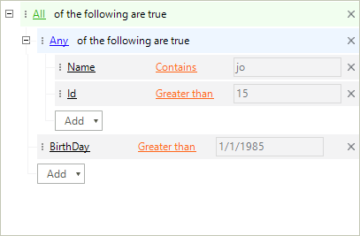

# Adding and Removing Filter Nodes

The property descriptors items represented as nodes in the control can be populated automatically or be generated by the developer. Detailed information is available in the *Populated with Data* section.

* [Unbound Mode]()
* [Data Binding]()

The tree holding the filter item elements can also be manipulated either by the control`s expression or by the adding or removing filter descriptors.

## Adding Descriptors

Additional descriptors can be added at run-time to handle a new business scenario. This approach is suitable to be employed when the control has been set up in *unbound mode*.

#### Add Descriptors

{{source=..\SamplesCS\DataFilter\DataFilterWorkingWithNodes.cs region=AddingDescriptors}} 
{{source=..\SamplesVB\DataFilter\DataFilterWorkingWithNodes.vb region=AddingDescriptors}}
````C#
DataFilterDescriptorItem idDescriptorItem = new DataFilterDescriptorItem
{
    DescriptorName = "Id",
    DescriptorType = typeof(int)
};
this.radDataFilter1.Descriptors.Add(idDescriptorItem);
DataFilterDescriptorItem nameDescriptorItem = new DataFilterDescriptorItem
{
    DescriptorName = "Name",
    DescriptorType = typeof(string)
};
this.radDataFilter1.Descriptors.Add(nameDescriptorItem);
DataFilterDescriptorItem bDayDescriptorItem = new DataFilterDescriptorItem
{
    DescriptorName = "BirthDay",
    DescriptorType = typeof(DateTime)
};
this.radDataFilter1.Descriptors.Add(bDayDescriptorItem);

````
````VB.NET
Dim idDescriptorItem As New DataFilterDescriptorItem() With {
    .DescriptorName = "Id",
     .DescriptorType = GetType(Integer)
}
Me.radDataFilter1.Descriptors.Add(idDescriptorItem)
Dim nameDescriptorItem As New DataFilterDescriptorItem() With {
     .DescriptorName = "Name",
     .DescriptorType = GetType(String)
}
Me.radDataFilter1.Descriptors.Add(nameDescriptorItem)
Dim bDayDescriptorItem As New DataFilterDescriptorItem() With {
     .DescriptorName = "BirthDay",
     .DescriptorType = GetType(DateTime)
}
Me.radDataFilter1.Descriptors.Add(bDayDescriptorItem)

````


{{endregion}}

## Removing Descriptors

Descriptor items can be removed by calling the __Remove__ method of the __Descriptors__ collection. Besides removing the logical descriptor item, all nodes having a filter by this item will also be removed.

#### Remove Descriptors

{{source=..\SamplesCS\DataFilter\DataFilterWorkingWithNodes.cs region=RemoveDescriptors}} 
{{source=..\SamplesVB\DataFilter\DataFilterWorkingWithNodes.vb region=RemoveDescriptors}}
````C#
this.radDataFilter1.Descriptors.RemoveAt(0);

````
````VB.NET
Me.radDataFilter1.Descriptors.RemoveAt(0)

````


{{endregion}}

## Working with Filter Nodes

Nodes can be added or removed at run-time to the tree either by changing the applied expression or by adding filter descriptors. 

>important The RadDataFilter.__Nodes__ collection should not be directly manipulated. The add and remove operations should be performed by setting an expression to the control or by using the Add/Remove API of the __RadDataFilterElement__.

>note The control has a single root note and it should not be deleted.

## Setting an Expression

A filter expression can be set depending on the available in the __Descriptors__ collection items.

#### Expression

{{source=..\SamplesCS\DataFilter\DataFilterWorkingWithNodes.cs region=SetExpression}} 
{{source=..\SamplesVB\DataFilter\DataFilterWorkingWithNodes.vb region=SetExpression}}
````C#
this.radDataFilter1.Expression = "([Name] LIKE '%jo%' OR [Id] > '10') AND [BirthDay] > '2005/01/01'";

````
````VB.NET
Me.radDataFilter1.Expression = "([Name] LIKE '%jo%' OR [Id] > '10') AND [BirthDay] > '2005/01/01'"

````


{{endregion}}


## Add Filter Descriptors

An alternative approach to setting the expression is to generate __FilterDescriptors__ and add them using the RadDataFilterElement.__AddChildNodes__ method.

#### Filter Descriptors

{{source=..\SamplesCS\DataFilter\DataFilterWorkingWithNodes.cs region=AddFilterDescriptors}} 
{{source=..\SamplesVB\DataFilter\DataFilterWorkingWithNodes.vb region=AddFilterDescriptors}}
````C#
CompositeFilterDescriptor compositeFilter = new CompositeFilterDescriptor
{
    LogicalOperator = FilterLogicalOperator.Or
};
FilterDescriptor childFilter1 = new FilterDescriptor
{
    PropertyName = "Name",
    Operator = FilterOperator.Contains,
    Value = "jo"
};
FilterDescriptor childFilter2 = new FilterDescriptor
{
    PropertyName = "Id",
    Operator = FilterOperator.IsGreaterThan,
    Value = 10
};
compositeFilter.FilterDescriptors.AddRange(new FilterDescriptor[] { childFilter1, childFilter2 });
FilterDescriptor filter = new FilterDescriptor
{
    PropertyName = "BirthDay",
    Operator = FilterOperator.IsGreaterThan,
    Value = "2005/01/01"
};
this.radDataFilter1.DataFilterElement.AddChildNodes(compositeFilter, this.radDataFilter1.DataFilterElement.Nodes[0]);
this.radDataFilter1.DataFilterElement.AddChildNodes(filter, this.radDataFilter1.DataFilterElement.Nodes[0]);

````
````VB.NET
Dim compositeFilter As New CompositeFilterDescriptor() With {
     .LogicalOperator = FilterLogicalOperator.[Or]
}
Dim childFilter1 As New FilterDescriptor() With {
     .PropertyName = "Name",
     .[Operator] = FilterOperator.Contains,
     .Value = "jo"
}
Dim childFilter2 As New FilterDescriptor() With {
     .PropertyName = "Id",
     .[Operator] = FilterOperator.IsGreaterThan,
     .Value = 10
}
compositeFilter.FilterDescriptors.AddRange(New FilterDescriptor() {childFilter1, childFilter2})
Dim filter As New FilterDescriptor() With {
     .PropertyName = "BirthDay",
     .[Operator] = FilterOperator.IsGreaterThan,
     .Value = "2005/01/01"
}
Me.radDataFilter1.DataFilterElement.AddChildNodes(compositeFilter, Me.radDataFilter1.DataFilterElement.Nodes(0))
Me.radDataFilter1.DataFilterElement.AddChildNodes(filter, Me.radDataFilter1.DataFilterElement.Nodes(0))

````


{{endregion}}

As seen below, the result using either approach is the same.

|Expression|Filter Descriptors|
|----|----|
|||

## Add Events

The __NodeAdding__ and __NodeAdded__ events are raised before and after the add operation

#### NodeAdding Event

{{source=..\SamplesCS\DataFilter\DataFilterWorkingWithNodes.cs region=NodeAddingEvent}} 
{{source=..\SamplesVB\DataFilter\DataFilterWorkingWithNodes.vb region=NodeAddingEvent}}
````C#
private void radDataFilter1_NodeAdding(object sender, RadTreeViewCancelEventArgs e)
{
    DataFilterCriteriaNode filterNode = e.Node as DataFilterCriteriaNode;
    if (filterNode != null && filterNode.PropertyName == "Name")
    {
        e.Cancel = true;
    }
}

````
````VB.NET
Private Sub radDataFilter1_NodeAdding(sender As Object, e As RadTreeViewCancelEventArgs)
    Dim filterNode As DataFilterCriteriaNode = TryCast(e.Node, DataFilterCriteriaNode)
    If filterNode IsNot Nothing AndAlso filterNode.PropertyName = "Name" Then
        e.Cancel = True
    End If
End Sub

````


{{endregion}}

#### NodeAdded Event

{{source=..\SamplesCS\DataFilter\DataFilterWorkingWithNodes.cs region=NodeAdded}} 
{{source=..\SamplesVB\DataFilter\DataFilterWorkingWithNodes.vb region=NodeAdded}}
````C#
private void radDataFilter1_NodeAdded(object sender, RadTreeViewEventArgs e)
{
    DataFilterCriteriaNode filterNode = e.Node as DataFilterCriteriaNode;
    if (filterNode != null)
    {
        RadMessageBox.Show(filterNode.ToString());
    }
}

````
````VB.NET
Private Sub radDataFilter1_NodeAdded(sender As Object, e As RadTreeViewEventArgs)
    Dim filterNode As DataFilterCriteriaNode = TryCast(e.Node, DataFilterCriteriaNode)
    If filterNode IsNot Nothing Then
        RadMessageBox.Show(filterNode.ToString())
    End If
End Sub

````


{{endregion}}

## Remove Filter Descriptors

The __RadDataFilterElement__ class exposes a __RemoveChildNode__ method which removes a particular __DataFilterCriteriaNode__

{{source=..\SamplesCS\DataFilter\DataFilterWorkingWithNodes.cs region=RemoveFilterDescriptors}} 
{{source=..\SamplesVB\DataFilter\DataFilterWorkingWithNodes.vb region=RemoveFilterDescriptors}}
````C#
Predicate<RadTreeNode> match = new Predicate<RadTreeNode>(delegate(RadTreeNode node)
{
    return node is DataFilterCriteriaNode;
});
RadTreeNode[] criteriaNodes = this.radDataFilter1.FindNodes(match);
this.radDataFilter1.DataFilterElement.RemoveChildNode(criteriaNodes[0]);

````
````VB.NET
Dim match As New Predicate(Of RadTreeNode)(Function(node As RadTreeNode) TypeOf node Is DataFilterCriteriaNode)
Dim criteriaNodes As RadTreeNode() = Me.radDataFilter1.FindNodes(match)
Me.radDataFilter1.DataFilterElement.RemoveChildNode(criteriaNodes(0))

````


{{endregion}}

## Remove Events

The __NodeRemoving__ and __NodeRemoved__ events are raised before and after the remove operation.

#### NodeRemoving Event

{{source=..\SamplesCS\DataFilter\DataFilterWorkingWithNodes.cs region=NodeRemoving}} 
{{source=..\SamplesVB\DataFilter\DataFilterWorkingWithNodes.vb region=NodeRemoving}}
````C#
private void radDataFilter1_NodeRemoving(object sender, RadTreeViewCancelEventArgs e)
{
    DataFilterCriteriaNode filterNode = e.Node as DataFilterCriteriaNode;
    if (filterNode != null)
    {
        e.Cancel = true;
    }
}

````
````VB.NET
Private Sub radDataFilter1_NodeRemoving(sender As Object, e As RadTreeViewCancelEventArgs)
    Dim filterNode As DataFilterCriteriaNode = TryCast(e.Node, DataFilterCriteriaNode)
    If filterNode IsNot Nothing Then
        e.Cancel = True
    End If
End Sub

````


{{endregion}}

#### NodeRemoved Event

{{source=..\SamplesCS\DataFilter\DataFilterWorkingWithNodes.cs region=NodeRemoved}} 
{{source=..\SamplesVB\DataFilter\DataFilterWorkingWithNodes.vb region=NodeRemoved}}
````C#
private void radDataFilter1_NodeRemoved(object sender, RadTreeViewEventArgs e)
{
    DataFilterCriteriaNode filterNode = e.Node as DataFilterCriteriaNode;
    if (filterNode != null)
    {
        RadMessageBox.Show(filterNode.ToString());
    }
}

````
````VB.NET
Private Sub radDataFilter1_NodeRemoved(sender As Object, e As RadTreeViewEventArgs)
    Dim filterNode As DataFilterCriteriaNode = TryCast(e.Node, DataFilterCriteriaNode)
    If filterNode IsNot Nothing Then
        RadMessageBox.Show(filterNode.ToString())
    End If
End Sub

````


{{endregion}}

# See Also

* [Unbound Mode]()	
* [Getting Started ]()