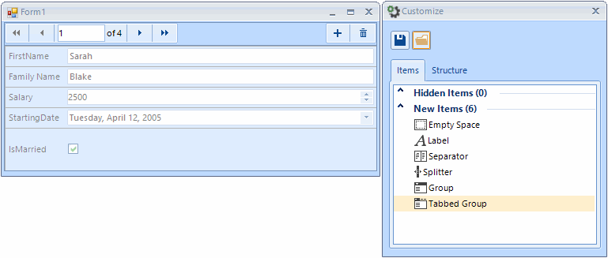
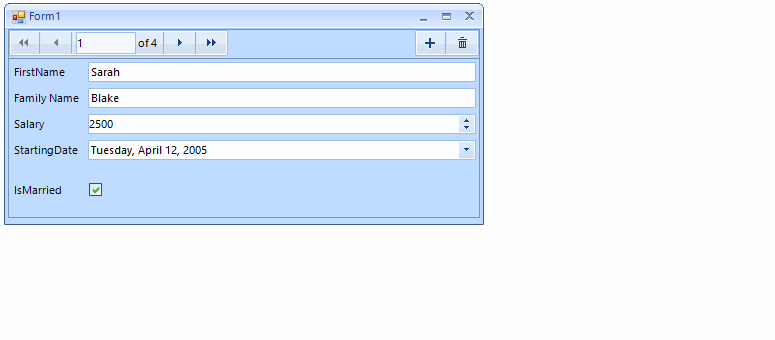
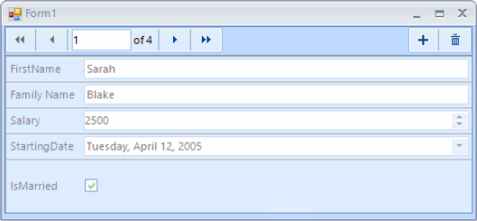

# Customize Layout Mode

RadDataLayout's __Customize__ dialog enables a complete transformation of the control`s layout at runtime.

## Customize Dialog

The customize dialog can be opened from the default context menu of __RadDataLayout__.
        
>caption Figure 1: Customize Dialog

## Perform Changes

The __Items__ tab contain the available elements which can be added to the control in order to change its layout. The __Structure__ tab displays all items as part of the control`s element tree, for complex layout, this tab will provide easy navigation.
        
>caption Figure 2: Changes at Runtime

## The DragOverlay

The __DragOverlay__ is a separate control which is shown when the customize dialog is opened. It contains snapshot of the form’s layout and is used for items arranging. There is a __DragOvelay__ property which is allowing you to access this control. It allows you to access the drag and drop service as well.

>caption Figure 3: DragOverlay

