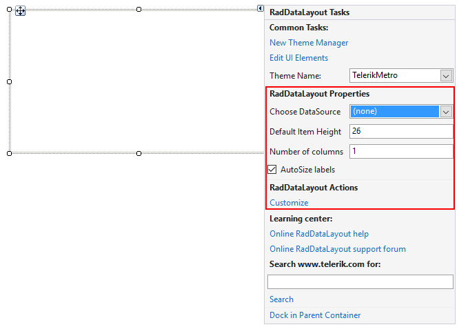
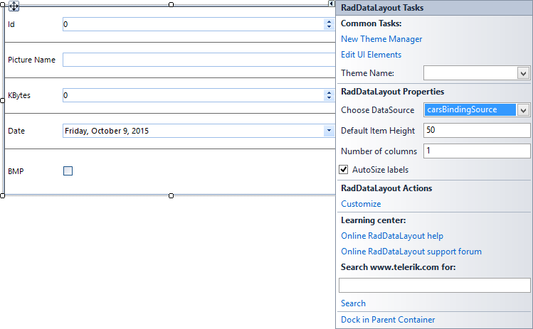
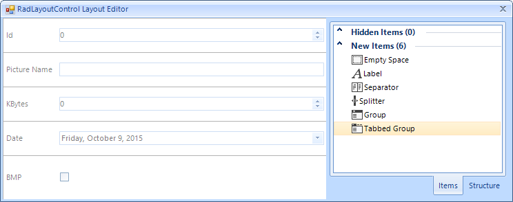
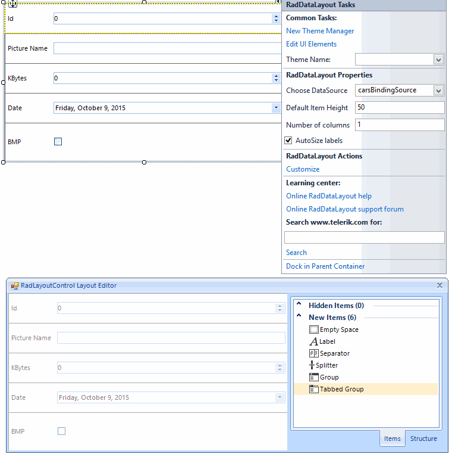
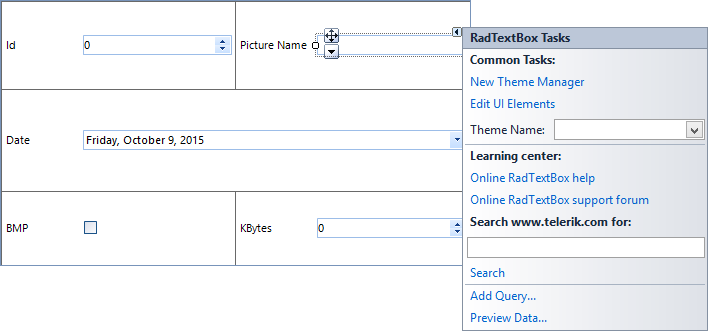

# Design Time

__RadDataLayout__ control hosts a __RadLayoutControl__ allowing the user to build complex layouts at desing-time as well as at run-time. Information on how __RadLayoutControl__ can be customized in the designer is available here: [RadLayoutControl Design Time]()

## Smart Tag

The smart tag allows you to open the layout editor, change the theme and open the on-line resources. You can dock the control in its parent container as well. The following section describes the layout editor.
        
>caption Figure 1: Smart Tag.

## Design Time Data Binding

For the purpose of this example we will bind our data layout control to the Cars table of the Northwind database. After specifying the data source, the control will build the editors according to the properties of the data bound object.
        
>caption Figure 2: Data Binding.

## Layout Editor

This editor allows us to rearrange the generated editors. Additional elements can be dragged from the __Items__ tab in the layout panel. You can hide existing items with the default context menu as well. The __Structure__ tab shows the current layout structure and allows easier item selection. You can start drag and drop operation from this tab to the layout panel.
        
>caption Figure 3: The design time Layout Editor.

## Arrange Controls 

At design time you will be able to add and arrange any underlying controls you want.
        
>caption Figure 4: Arrange Controls.

## Selection Glyph

The selection glyph is an arrow that is shown when a control in the layout panel is selected. It allows you to select the underlying host item and change its properties at design time.
        
>caption Figure 5: Selection Glyph.

# See Also

 * [Getting Started]()

 * [Properties, Events and Attributes]()

 * [Validation]()