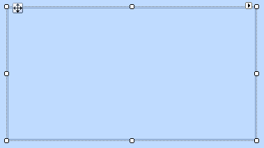
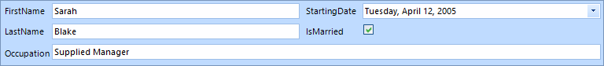
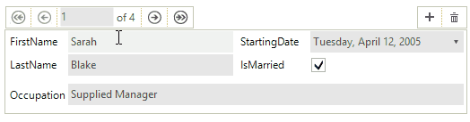

# Getting Started

This example demonstrates binding __RadDataLayout__ to a single object or a collection of objects. For the purpose of the tutorial we will also use a __RadBindingNavigator__.

## Binding RadDataLayout to a single object

1\. Place a __RadDataLayout__ control on a form.
            
>caption Figure 1: RadDataLayout Control



2\. Let`s define the layout of our data control.

{{source=..\SamplesCS\DataLayout\GettingStartedForm.cs region=DefineLayout}} 
{{source=..\SamplesVB\DataLayout\GettingStartedForm.vb region=DefineLayout}} 

````C#
this.radDataLayout1.ItemDefaultHeight = 26;
this.radDataLayout1.ColumnCount = 2;
this.radDataLayout1.FlowDirection = FlowDirection.TopDown;
this.radDataLayout1.AutoSizeLabels = true;

````
````VB.NET
Me.RadDataLayout1.ItemDefaultHeight = 26
Me.RadDataLayout1.ColumnCount = 2
Me.RadDataLayout1.FlowDirection = FlowDirection.TopDown
Me.RadDataLayout1.AutoSizeLabels = True

````

{{endregion}}

3\. A sample *Employee* class exposing several properties is going to be our model.

{{source=..\SamplesCS\DataLayout\GettingStartedForm.cs region=EmployeeModel}} 
{{source=..\SamplesVB\DataLayout\GettingStartedForm.vb region=EmployeeModel}} 

````C#
public class Employee
{
    public string FirstName { get; set; }
    public string LastName { get; set; }
    public string Occupation { get; set; }
    public DateTime StartingDate { get; set; }
    public bool IsMarried { get; set; }
}

````
````VB.NET
Public Class EmployeeModel
    Public Property FirstName() As String
        Get
            Return m_FirstName
        End Get
        Set(value As String)
            m_FirstName = value
        End Set
    End Property
    Private m_FirstName As String
    Public Property LastName() As String
        Get
            Return m_LastName
        End Get
        Set(value As String)
            m_LastName = value
        End Set
    End Property
    Private m_LastName As String
    Public Property Occupation() As String
        Get
            Return m_Occupation
        End Get
        Set(value As String)
            m_Occupation = value
        End Set
    End Property
    Private m_Occupation As String
    Public Property StartingDate() As DateTime
        Get
            Return m_StartingDate
        End Get
        Set(value As DateTime)
            m_StartingDate = value
        End Set
    End Property
    Private m_StartingDate As DateTime
    Public Property IsMarried() As Boolean
        Get
            Return m_IsMarried
        End Get
        Set(value As Boolean)
            m_IsMarried = value
        End Set
    End Property
    Private m_IsMarried As Boolean
End Class

````

{{endregion}}

4\. Once the `Employee` class is defined, you may use it to create an object of this type and bind it to the __RadDataLayout__ control:

{{source=..\SamplesCS\DataLayout\GettingStartedForm.cs region=BindSingleObject}} 
{{source=..\SamplesVB\DataLayout\GettingStartedForm.vb region=BindSingleObject}} 

````C#
this.radDataLayout1.DataSource = new Employee()
{
    FirstName = "Sarah",
    LastName = "Blake",
    Occupation = "Supplied Manager",
    StartingDate = new DateTime(2005, 04, 12),
    IsMarried = true
};

````
````VB.NET
Me.RadDataLayout1.DataSource = New EmployeeModel() With {
    .FirstName = "Sarah",
    .LastName = "Blake",
    .Occupation = "Supplied Manager",
    .StartingDate = New DateTime(2005, 4, 12),
    .IsMarried = True
}

````

{{endregion}}

5\. Press __F5__ to run the project and you should see the following:
            
>caption Figure 2: Bound to Single Object



## Binding RadDataLayout to multiple objects

Besides a __RadDataLayout__ we are also going to need a __RadBindingNavigator__ on our form. In order to connect the two controls we are going to use a `BindingSource` component.
        
>caption Figure 3: Added RadBindingNavigator


Compared to the previously shown example only the data binding is different. This time we are going to bind the __RadDataLayout__ control to a list of our model objects. The same list will also provide data to the `BindingSource` component.

{{source=..\SamplesCS\DataLayout\GettingStartedForm.cs region=BindMultipleObjects}} 
{{source=..\SamplesVB\DataLayout\GettingStartedForm.vb region=BindMultipleObjects}} 

````C#
List<Employee> employees = new List<Employee>();
employees.Add(new Employee()
{
    FirstName = "Sarah",
    LastName = "Blake",
    Occupation = "Supplied Manager",
    StartingDate = new DateTime(2005, 04, 12),
    IsMarried = true
});
employees.Add(new Employee()
{
    FirstName = "Jane",
    LastName = "Simpson",
    Occupation = "Security",
    StartingDate = new DateTime(2008, 12, 03),
    IsMarried = true
});
employees.Add(new Employee()
{
    FirstName = "John",
    LastName = "Peterson",
    Occupation = "Consultant",
    StartingDate = new DateTime(2005, 04, 12),
    IsMarried = false
});
employees.Add(new Employee()
{
    FirstName = "Peter",
    LastName = "Bush",
    Occupation = "Cashier",
    StartingDate = new DateTime(2005, 04, 12),
    IsMarried = true
});
this.bindingSource1.DataSource = employees;
this.radDataLayout1.DataSource = this.bindingSource1;
this.radBindingNavigator1.BindingSource = this.bindingSource1;

````
````VB.NET
Dim employees As New List(Of EmployeeModel)()
employees.Add(New EmployeeModel() With {
    .FirstName = "Sarah",
    .LastName = "Blake",
    .Occupation = "Supplied Manager",
    .StartingDate = New DateTime(2005, 4, 12),
    .IsMarried = True
})
employees.Add(New EmployeeModel() With {
    .FirstName = "Jane",
    .LastName = "Simpson",
    .Occupation = "Security",
    .StartingDate = New DateTime(2008, 12, 3),
    .IsMarried = True
})
employees.Add(New EmployeeModel() With {
    .FirstName = "John",
    .LastName = "Peterson",
    .Occupation = "Consultant",
    .StartingDate = New DateTime(2005, 4, 12),
    .IsMarried = False
})
employees.Add(New EmployeeModel() With {
    .FirstName = "Peter",
    .LastName = "Bush",
    .Occupation = "Cashier",
    .StartingDate = New DateTime(2005, 4, 12),
    .IsMarried = True
})
Me.BindingSource1.DataSource = employees
Me.RadDataLayout1.DataSource = Me.BindingSource1
Me.RadBindingNavigator1.BindingSource = Me.BindingSource1

````

{{endregion}}

Press __F5__ to run the project and you should see the following:
        
>caption Figure 4: Bound to Multiple Objects

