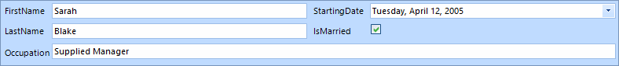

# Data Layout

The __RadDataLayout__ control provides means for displaying business objects entry data in a highly customizable layout. It adds to the already known features of [RadDataEntry]() options to easily modify its layout at design-time as well as at run-time.
        
>caption Figure 1: RadDataLayout.

__RadDataLayout__ generates different editors depending on the type of the properties coming from the data bound object.
         
* __RadTextBox__: Works with string properties

* __RadCheckBox__: Handles boolean values

* __RadDateTimePicker__: Responsible for dates

* __RadDropDownList__: Dipslays enum values

* __RadColorBox__: Handles color

* __PictureBox__: Edits images