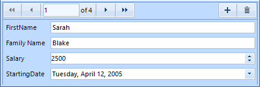

# Properties, Events and Attributes

__RadDataLayout__ exposes properties and events which are similar to the ones provided by the __RadDataEntry__ control.
      

## Properties

* __DataSource__: Through this property user can set the business object or a collection of objects that should be edited. When this property is set __RadDataLayout__ generates editors for each public property which does not have its __Browsable__ attribute set to *false.*

* __ColumnCount__: Controls the amount of columns that __RadDataLayout__ will use to arrange generated controls. Default value is one.

* __FlowDirection__: Defines the direction the editors will be generated.

* __ItemDefaultHeight__: Sets the height that generated items should have, the default value is *26*.

* __AutoSizeLabels__: By default the property value is false and the labels width will equals the longest label width. If you set this property to true, the labels will be sized according to their content.

* __ShowValidationPanel:__ Gets or sets a value indicating whether the validation panel should appear.

* __ItemDefaultHeight:__ sets the height that generated items should have.

## Events

There are several events that you will find useful in the context of __RadDataLayout__:

* __EditorInitializing:__ Occurs when editor is being initialized. In this event you can change the default editors with custom ones.

* __EditorInitialized:__ Raised when the editor is initialized.

* __BindingCreating:__ Occurs when a binding object for an editor is about to be created. This event is cancelable.

* __BindingCreated:__ Occurs when binding object is created.

* __ItemInitializing:__ This event is fired when the panel that contains the label, editor and validation label is about to be initialized. This event is cancelable.

* __ItemInitialized:__ Fires the item is already initialized.

* __ItemValidating:__ This event is raised when any of the generated editors fires its Validating event.

* __ItemValidated:__ Occurs when any of the generated editors fires its `Validated` event.

## Attributes

__RadDataLayout__ has support for several attributes that can be used to change the behavior of the control.

* __Browsable:__ Defines which properties should be displayed.

* __DisplayName:__ Determines what text should be displayed in the label that is associated with the editor.

* __RadRangeAttribute:__ Defines a range that can be used into validation process. This attribute is provided in validation events.
            
>caption Figure 1: Model With Attributes



{{source=..\SamplesCS\DataLayout\PropertiesEventsAttributesForm.cs region=ModelWithAttributes}} 
{{source=..\SamplesVB\DataLayout\PropertiesEventsAttributesForm.vb region=ModelWithAttributes}} 

````C#
public class Employee
{
    public string FirstName { get; set; }
    [DisplayName("Family Name")]
    public string LastName { get; set; }
    [Browsable(false)]
    public string Occupation { get; set; }
    [RadRange(2000, 3000)]
    public int Salary { get; set; }
    public DateTime StartingDate { get; set; }
}

````
````VB.NET
Public Class Employee
    Public Property FirstName() As String
        Get
            Return m_FirstName
        End Get
        Set(value As String)
            m_FirstName = value
        End Set
    End Property
    Private m_FirstName As String
    <DisplayName("Family Name")> _
    Public Property LastName() As String
        Get
            Return m_LastName
        End Get
        Set(value As String)
            m_LastName = value
        End Set
    End Property
    Private m_LastName As String
    <Browsable(False)> _
    Public Property Occupation() As String
        Get
            Return m_Occupation
        End Get
        Set(value As String)
            m_Occupation = value
        End Set
    End Property
    Private m_Occupation As String
    <RadRange(2000, 3000)> _
    Public Property Salary() As Integer
        Get
            Return m_Salary
        End Get
        Set(value As Integer)
            m_Salary = value
        End Set
    End Property
    Private m_Salary As Integer
    Public Property StartingDate() As DateTime
        Get
            Return m_StartingDate
        End Get
        Set(value As DateTime)
            m_StartingDate = value
        End Set
    End Property
    Private m_StartingDate As DateTime
End Class

````

{{endregion}}