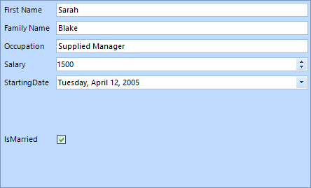
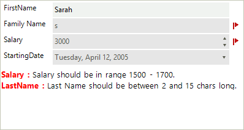

# Validation

For the need of the validation process we made two events (__ItemValidating, ItemValidated__) that are firing when the __Validating__ and __Validated__ events occur in the editors. __RadDataLayout__ provides three different ways to show to the users that some editors do not match the validation criteria – *Validation Label*, *Error Provider* and *Validation Panel*. In the following tutorial we will demonstrate how to use a validation panel together with Error provider.

1\. For the purpose of this tutorial, we will create a new class **Employee** with a couple of exposed properties. By binding __RadDataLayout__ to object from this type we will generate several items:

{{source=..\SamplesCS\DataLayout\DataLayoutValidation.cs region=DataLayoutEmployee}} 
{{source=..\SamplesVB\DataLayout\DataLayoutValidation.vb region=DataLayoutEmployee}} 

````C#
public class Employee
{
    [DisplayName("First Name")]
    public string FirstName { get; set; }
    [DisplayName("Family Name")]
    public string LastName { get; set; }
    public string Occupation { get; set; }
    public int Salary { get; set; }
    public DateTime StartingDate { get; set; }
    public bool IsMarried { get; set; }
}

````
````VB.NET
Public Class Employee
    <DisplayName("First Name")> _
    Public Property FirstName() As String
        Get
            Return m_FirstName
        End Get
        Set(value As String)
            m_FirstName = value
        End Set
    End Property
    Private m_FirstName As String
    <DisplayName("Family Name")> _
    Public Property LastName() As String
        Get
            Return m_LastName
        End Get
        Set(value As String)
            m_LastName = value
        End Set
    End Property
    Private m_LastName As String
    Public Property Occupation() As String
        Get
            Return m_Occupation
        End Get
        Set(value As String)
            m_Occupation = value
        End Set
    End Property
    Private m_Occupation As String
    Public Property Salary() As Integer
        Get
            Return m_Salary
        End Get
        Set(value As Integer)
            m_Salary = value
        End Set
    End Property
    Private m_Salary As Integer
    Public Property StartingDate() As DateTime
        Get
            Return m_StartingDate
        End Get
        Set(value As DateTime)
            m_StartingDate = value
        End Set
    End Property
    Private m_StartingDate As DateTime
    Public Property IsMarried() As Boolean
        Get
            Return m_IsMarried
        End Get
        Set(value As Boolean)
            m_IsMarried = value
        End Set
    End Property
    Private m_IsMarried As Boolean
End Class

````

{{endregion}} 

{{source=..\SamplesCS\DataLayout\DataLayoutValidation.cs region=DataLayoutBinding}} 
{{source=..\SamplesVB\DataLayout\DataLayoutValidation.vb region=DataLayoutBinding}} 

````C#
this.radDataLayout1.DataSource = new Employee()
{
    FirstName = "Sarah",
    LastName = "Blake",
    Occupation = "Supplied Manager",
    StartingDate = new DateTime(2005, 04, 12),
    Salary = 1500,
    IsMarried = true
};

````
````VB.NET
Me.RadDataLayout1.DataSource = New Employee() With {
    .FirstName = "Sarah",
    .LastName = "Blake",
    .Occupation = "Supplied Manager",
    .StartingDate = New DateTime(2005, 4, 12),
    .Salary = 1500,
    .IsMarried = True
}

````

{{endregion}} 

>caption Figure 1: RadDataLayout Initialized



2\. Set the __ShowValidationPanel__ property to *true*. This will display the panel below the editors:

{{source=..\SamplesCS\DataLayout\DataLayoutValidation.cs region=DataLayoutShowPanel}} 
{{source=..\SamplesVB\DataLayout\DataLayoutValidation.vb region=DataLayoutShowPanel}} 

````C#
this.radDataLayout1.ShowValidationPanel = true;

````
````VB.NET
Me.RadDataLayout1.ShowValidationPanel = True

````

{{endregion}}

3\. Set a padding to the __LayoutControlContainerElement__ so that the error icons are visible. A suitable place to perform this operation is the handler of the __BindingCreated__.

{{source=..\SamplesCS\DataLayout\DataLayoutValidation.cs region=DataLayoutSetPadding}} 
{{source=..\SamplesVB\DataLayout\DataLayoutValidation.vb region=DataLayoutSetPadding}} 

````C#
private void radDataLayout1_BindingCreated(object sender, Telerik.WinControls.UI.BindingCreatedEventArgs e)
{
    this.radDataLayout1.LayoutControl.ContainerElement.Padding = new Padding(0, 0, 20, 0);
}

````
````VB.NET
Private Sub RadDataLayout1_BindingCreated(sender As Object, e As BindingCreatedEventArgs)
    Me.RadDataLayout1.LayoutControl.ContainerElement.Padding = New Padding(0, 0, 20, 0)
End Sub

````

{{endregion}}

4\. Subscribe to the __ItemValidated__ event of __RadDataEntry__:

{{source=..\SamplesCS\DataLayout\DataLayoutValidation.cs region=DataLayoutItemValidated}} 
{{source=..\SamplesVB\DataLayout\DataLayoutValidation.vb region=DataLayoutItemValidated}} 

````C#
private void radDataLayout1_ItemValidated(object sender, Telerik.WinControls.UI.DataLayoutItemValidatedEventArgs e)
{
    Employee employee = this.radDataLayout1.CurrentObject as Employee;
    if (e.Item.Text == "First Name")
    {
        if (employee.FirstName.Length < 2 || employee.FirstName.Length > 15)
        {
            e.ErrorProvider.SetError((sender as Control), "First Name should be between 2 and 15 chars long.");
            if (!this.radDataLayout1.ValidationPanel.PanelContainer.Controls.ContainsKey("FirstName"))
            {
                RadLabel label = new RadLabel();
                label.Name = "FirstName";
                label.Text = "<html><size=10><b><color= Red>FirstName : </b><color= Black>First Name should be between 2 and 15 chars long.";
                label.Dock = DockStyle.Top;
                label.AutoSize = false;
                label.BackColor = Color.Transparent;
                this.radDataLayout1.ValidationPanel.PanelContainer.Controls.Add(label);
            }
        }
        else
        {
            e.ErrorProvider.Clear();
            this.radDataLayout1.ValidationPanel.PanelContainer.Controls.RemoveByKey("FirstName");
        }
    }
    else if (e.Item.Text == "Family Name")
    {
        if (employee.LastName.Length < 2 || employee.LastName.Length > 15)
        {
            e.ErrorProvider.SetError((sender as Control), "Last Name should be between 2 and 15 chars long.");
            if (!this.radDataLayout1.ValidationPanel.PanelContainer.Controls.ContainsKey("LastName"))
            {
                RadLabel label = new RadLabel();
                label.Name = "LastName";
                label.Text = "<html><size=10><b><color= Red>LastName : </b><color= Black>Last Name should be between 2 and 15 chars long.";
                label.Dock = DockStyle.Top;
                label.AutoSize = false;
                label.BackColor = Color.Transparent;
                this.radDataLayout1.ValidationPanel.PanelContainer.Controls.Add(label);
            }
        }
        else
        {
            e.ErrorProvider.Clear();
            this.radDataLayout1.ValidationPanel.PanelContainer.Controls.RemoveByKey("LastName");
        }
    }
    else if (e.Item.Text == "Salary")
    {
        if (employee.Salary < 1400 || employee.Salary > 1800)
        {
            e.ErrorProvider.SetError((sender as Control), "Salary should be in range 1500 - 1700.");
            if (!this.radDataLayout1.ValidationPanel.PanelContainer.Controls.ContainsKey("Salary"))
            {
                RadLabel label = new RadLabel();
                label.Name = "Salary";
                label.Text = "<html><size=10><b><color= Red>Salary : </b><color= Black>Salary should be in range 1500 - 1700.";
                label.Dock = DockStyle.Top;
                label.AutoSize = false;
                label.BackColor = Color.Transparent;
                this.radDataLayout1.ValidationPanel.PanelContainer.Controls.Add(label);
            }
        }
        else
        {
            e.ErrorProvider.Clear();
            this.radDataLayout1.ValidationPanel.PanelContainer.Controls.RemoveByKey("Salary");
        }
    }
}

````
````VB.NET
Private Sub radDataLayout1_ItemValidated(sender As Object, e As Telerik.WinControls.UI.DataLayoutItemValidatedEventArgs)
    Dim employee As Employee = TryCast(Me.RadDataLayout1.CurrentObject, Employee)
    If e.Item.Text = "First Name" Then
        If employee.FirstName.Length < 2 OrElse employee.FirstName.Length > 15 Then
            e.ErrorProvider.SetError(TryCast(sender, Control), "First Name should be between 2 and 15 chars long.")
            If Not Me.RadDataLayout1.ValidationPanel.PanelContainer.Controls.ContainsKey("FirstName") Then
                Dim label As New RadLabel()
                label.Name = "FirstName"
                label.Text = "<html><size=10><b><color= Red>FirstName : </b><color= Black>First Name should be between 2 and 15 chars long."
                label.Dock = DockStyle.Top
                label.AutoSize = False
                label.BackColor = Color.Transparent
                Me.RadDataLayout1.ValidationPanel.PanelContainer.Controls.Add(label)
            End If
        Else
            e.ErrorProvider.Clear()
            Me.RadDataLayout1.ValidationPanel.PanelContainer.Controls.RemoveByKey("FirstName")
        End If
    ElseIf e.Item.Text = "Family Name" Then
        If employee.LastName.Length < 2 OrElse employee.LastName.Length > 15 Then
            e.ErrorProvider.SetError(TryCast(sender, Control), "Last Name should be between 2 and 15 chars long.")
            If Not Me.RadDataLayout1.ValidationPanel.PanelContainer.Controls.ContainsKey("LastName") Then
                Dim label As New RadLabel()
                label.Name = "LastName"
                label.Text = "<html><size=10><b><color= Red>LastName : </b><color= Black>Last Name should be between 2 and 15 chars long."
                label.Dock = DockStyle.Top
                label.AutoSize = False
                label.BackColor = Color.Transparent
                Me.RadDataLayout1.ValidationPanel.PanelContainer.Controls.Add(label)
            End If
        Else
            e.ErrorProvider.Clear()
            Me.RadDataLayout1.ValidationPanel.PanelContainer.Controls.RemoveByKey("LastName")
        End If
    ElseIf e.Item.Text = "Salary" Then
        If employee.Salary < 1400 OrElse employee.Salary > 1800 Then
            e.ErrorProvider.SetError(TryCast(sender, Control), "Salary should be in range 1500 - 1700.")
            If Not Me.RadDataLayout1.ValidationPanel.PanelContainer.Controls.ContainsKey("Salary") Then
                Dim label As New RadLabel()
                label.Name = "Salary"
                label.Text = "<html><size=10><b><color= Red>Salary : </b><color= Black>Salary should be in range 1500 - 1700."
                label.Dock = DockStyle.Top
                label.AutoSize = False
                label.BackColor = Color.Transparent
                Me.RadDataLayout1.ValidationPanel.PanelContainer.Controls.Add(label)
            End If
        Else
            e.ErrorProvider.Clear()
            Me.RadDataLayout1.ValidationPanel.PanelContainer.Controls.RemoveByKey("Salary")
        End If
    End If
End Sub

````

{{endregion}} 

>caption Figure 2: Validaton Errors



In this tutorial we also used an error provider to show error icon next to the editors. You can read more about Microsoft Error provider here - [ErrorProvider Class](http://msdn.microsoft.com/en-us/library/system.windows.forms.errorprovider%28v=vs.110%29.aspx)

# See Also

 * [Structure]()
 * [Getting Started]()
 * [Properties, events and attributes]()
 * [Localization]()
 * [Change the editor to RadDropDownList]()
 * [Customizing Appearance ]()
