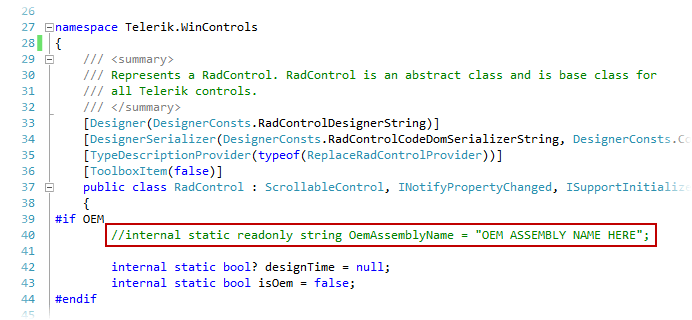
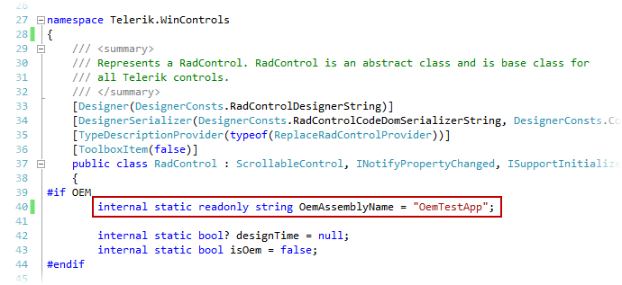
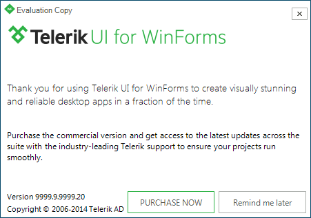
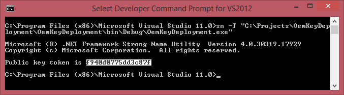
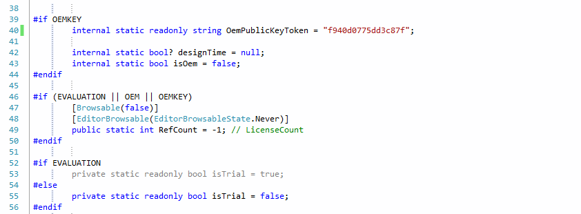

# Redistributing Telerik UI for for WinForms

The Telerik UI for for WinForms suite includes a limited run time royalty-free license to redistribute the controls in your own solutions subject to the License Agreement. You can use the components in the suite to build your own solutions, and redistribute your solutions to and your end users who are not required to purchase a license from Telerik to access your solution.

## Examples of Permitted Uses

* Windows Forms applications for internal company use.
            
* Commercial WinForms applications deployed to Your end users. __In this case, you may deploy the Telerik assemblies together with your application with the sole exception of the Telerik.WinControls.UI.Design.dll assembly. The Telerik.WinControls.UI.Design.dll assembly may not be deployed to end-users under any circumstance__.

* WinForms applications that offer a trial or free version of Your application. __If offering a free or trial version of Your Integrated Product, redistribution of the assemblies is not permitted. You are required to protect all Telerik assemblies by using one of the methods below (ILMerge to merge the Telerik WinForms assemblies with the executable file (this does not apply to the Document processing assemblies, see below) of your application OR build the Telerik.WinControls.dll assembly from source code using one of the approaches described below)__

## Examples of Uses that Require Discussion

* Products that expose the design-time functionality of the Telerik RadControls or the VisualStyleBuilder.
            
* Products that do not add significant functionality to the Telerik RadControls.
            
* Open source products.

For additional usage requirements, development restrictions and, defined term definitions, please refer to the WinForms [license agreement](). For uses that require additional review, please send e-mail to <a href="mailto:sales@telerik.com?subject=Redistributing Telerik UI for for WinForms">sales@telerik.com</a> to discuss your planned use of the controls.
        

## ILMerge Telerik WinForms assemblies

|RELATED VIDEOS||
|----|----|
|[ILMerge](http://www.telerik.com/videos/winforms/ilmerge)<br>This video demonstrates how to merge your application exe with the Telerik assemblies, so they cannot be reused. (Runtime: 1:57)||

When you deploy your application, you may prefer to do it as a single executable rather than an executable referencing many external assemblies. In this case, you need to ILMerge the assemblies with the executable. Here is a link to MSDN from where you can download the ILMerge executable: [Download ILMerge](http://www.microsoft.com/download/en/details.aspx?id=17630)

In order to use this approach you need to set the __ResolverTypesInCurrentAssembly__ property to *true* in the __static__ constructor of the first form that is created and loaded when your application starts:
        

>Please make sure that you set the ResolverTypesInCurrentAssembly property in the __static__ constructor of the form. This approach will not work if the property is set somewhere else.


{{source=..\SamplesCS\InstallationDeploymentAndDistribution\RedestributingTelerikRadControls.cs region=ResolveTypesInCurrentAssembly}}
{{source=..\SamplesVB\InstallationDeploymentAndDistribution\RedestributingTelerikRadControls.vb region=ResolveTypesInCurrentAssembly}}

````C#
static RedestributingTelerikRadControls()
{
    Telerik.WinControls.RadTypeResolver.Instance.ResolveTypesInCurrentAssembly = true;
}
public RedestributingTelerikRadControls()
{
    InitializeComponent();
}

````
````VB.NET
Shared Sub New()
    Telerik.WinControls.RadTypeResolver.Instance.ResolveTypesInCurrentAssembly = True
End Sub
Public Sub New()
    ' This call is required by the designer.
    InitializeComponent()
    ' Add any initialization after the InitializeComponent() call.
End Sub

````

{{endregion}}

Next, you should build your solution and then ILMerge the built application executable with the Telerik assemblies:

>If you try to run your solution (not just build it, but run the built executable) when the __ResolveTypesInCurrentAssembly__ is *true*, you will get an exception since the application executable is still not merged with the Telerik assemblies. Make sure that the application executable is ILMerged with the Telerik assemblies when the __ResolveTypesInCurrentAssembly__ is *true* and the executable is run.
          

1. Press the Start button and choose Run.
            

1. Type "cmd" (without the quotes).
            

1. In the command prompt navigate to the ILMerge tool directory. Usually, the directory is *C:\Program Files\Microsoft\ILMerge*, although this directory may vary depending on the Operation System version.
            

1. ILMerge the assemblies using the following command in the command prompt: 
            

>tip: This commands will work in case the application executable and the Telerik assemblies are contained in the ILMerge tool folder. In any other case, you will need to include the full path to the assemblies/executables. In addition, the Telerik assemblies that should be given as parameters, should be those referenced by your application.

    ilmerge /target:winexe /out:MergedApplicationExecutable.exe ApplicationExecutable.exe TelerikCommon.dll Telerik.WinControls.UI.dll Telerik.WinControls.dll
            


>If the referenced assemblies are .NET 4.0 assemblies, you need to specify the targetplatform also:
   
    ILMerge.exe /target:winexe /targetplatform:"v4, C:\Windows\Microsoft.NET\Framework\v4.0.30319"/out:MergedApplicationExecutable.exe AppliocationExecutable.exe Telerik.WinControls.dll Telerik.WinControls.UI.dll TelerikCommon.dll
            

The MergedApplicationExecutable.exe is now a stand-alone application executable that does not need any additional references to the Telerik assemblies.

## Building the Telerik Assemblies from Source Code - Using the OemAssemblyName

|RELATED VIDEOS||
|----|----|
|[Redistribute OEM](http://www.telerik.com/videos/winforms/redistribute-oem)<br>This video demonstrates how to build the Telerik assemblies, so they are locked to your application and cannot be reused outside of it. (Runtime: 5:49)||

This method requires modifications to the source files, which are distributed as part of the Subscription license. If you have purchased a Subscription license for Telerik UI for for WinForms, and would like to explore this method, the following information will allow you to do so.
        

Protecting Telerik UI for for WinForms requires the Telerik assemblies to be built from source code. The essential part of this approach is that you need to introduce a small modification to the Telerik.WinControls project. For brevity this document assumes that the source distribution ZIP file is extracted in C:\Telerik UI for for WinForms Source:
        
1. Open the following solution file: C:\Telerik UI for for WinForms Source\RadControlsVS2010.sln
            

1. In the properties for the Telerik.WinControls project, open the Build tab and add an OEM conditional compilation symbol, as shown below:
 
	Before:
             
 	

	After: 

	

	>tip: If you are building the .NET4.0 version of the assemblies, you need to use the Release40 build configuration. In this case, when you add the "OEM" symbol, you need to keep the existing NET4 symbol - "OEM; NET4".

1. Open C:\Telerik UI for for WinForms Source\RadControl\TPF\Control\RadControl.cs in a text editor (notepad, Visual Studio etc).
            

1. Uncomment the following line and change the string to you application’s assembly name:
    
    Before:
            
    

    After:                

    

1. Save RadControl.cs and rebuild the solution.

1. In your application replace the __existing__ references to Telerik UI for for WinForms assemblies with the ones built from source code __and rebuild your project so it will use the newly build assemblies__.
            

Once you finish these steps, and if you or someone else tries to use that assembly from another application the evaluation dialog will appear (randomly).



## Building the Telerik assemblies from Source Code - Using the OemPublicKeyToken

|RELATED VIDEOS||
|----|----|
|[Redistribute OEMKEY](http://www.telerik.com/videos/winforms/redistribute-oemkey)<br>This video demonstrates how to build the Telerik assemblies, so they are locked to your application public token key and cannot be reused outside of it. (Runtime: 7:19)||

This section demonstrates how to deploy a project with a public token key. We will assume that you have downloaded and extracted your source code distribution in C:\Telerik UI for for WinForms Source\RadControlsVS2010.sln:
        

1. Open the following solution file: C:\Telerik UI for for WinForms Source\RadControlsVS2010.sln
            

1. In the properties for the Telerik.WinControls project, open the Build tab and add an OEMKEY conditional compilation symbol, as shown below:
            
    Before:     

    

    After: 
    

1. Open C:\Telerik UI for for WinForms Source\RadControl\TPF\Control\ RadControl.cs in a text editor (notepad, Visual Studio etc).
            

1. Delete the value of the OemPublicKeyToken:
            
    Before:
    
    After:            
    

1. Open your project and go to *Properties*, then select the *Signing* tab.

1. Mark *Sign the Assembly checkbox* and create a new strong name key.

1. Build your project and copy the route to your executable file.
            

1. Open the Developer Command Prompt for your version of Visual Studio.
            

1. Execute the following command with a parameter the route to your assembly.
            

1. Copy the generated public key token.
            

1. Return to the RadControlsVS2010 solution, open the RadControl.cs file and set the OemPublicKeyToken to equal the value of the newly generated key token.
            

1. Build the solution.
            

1. In your application replace the existing references to Telerik UI for for WinForms assemblies with the ones built from source code and rebuild your project so it will use the newly build assemblies.
            

## Using the Telerik Document Processing Libraries in Your Solutions

In order to include the Telerik Document Processing libraries in your application, you should build the source code as described below. The source code of the Document Processing libraries is distributed together with the Telerik UI for for WinForms source code and installation and is available for downloading from the client accounts. For brevity this document assumes that the source distribution ZIP file is extracted in C:\DPL.
         		         
 		 
 __Instructions__

1\. Open `C:\DPL\Documents\Licensing\AssemblyProtection.cs` in a text editor (notepad, Visual Studio, etc.). In versions of the suite prior to R2 2016, the path is `C:\DPL\Documents\Core\Core\Licensing\AssemblyProtection.cs`.   
            

2\. Uncomment the following line:
            

Before:

{{source=..\SamplesCS\InstallationDeploymentAndDistribution\RedestributingTelerikRadControls.cs region=CommentedIsValid}}
{{source=..\SamplesVB\InstallationDeploymentAndDistribution\RedestributingTelerikRadControls.vb region=CommentedIsValid}}

````C#
public static bool IsValid()
{
    // Uncomment the following line
    // return ValidatePassPhrase();
    return true;
}

````
````VB.NET
Public Shared Function IsValid() As Boolean
    ' Uncomment the following line
    ' return ValidatePassPhrase();
    Return True
End Function

````

{{endregion}}


After:

{{source=..\SamplesCS\InstallationDeploymentAndDistribution\RedestributingTelerikRadControls2.cs region=UnCommentedIsValid}}
{{source=..\SamplesVB\InstallationDeploymentAndDistribution\RedestributingTelerikRadControls2.vb region=UnCommentedIsValid}}

````C#
public static bool IsValid()
{
    // Uncomment the following line
    return ValidatePassPhrase();
}

````
````VB.NET
Public Shared Function IsValid() As Boolean
    ' Uncomment the following line
    Return ValidatePassPhrase()
End Function

````

{{endregion}}

3\. Change the ApplicationName constant to match the name of your application:

Before:

{{source=..\SamplesCS\InstallationDeploymentAndDistribution\RedestributingTelerikRadControls.cs region=AppNameBefore}}
{{source=..\SamplesVB\InstallationDeploymentAndDistribution\RedestributingTelerikRadControls.vb region=AppNameBefore}}

````C#
internal const string ApplicationName = "MyApp";

````
````VB.NET
Friend Const ApplicationName As String = "MyApp"

````

{{endregion}}


After:

{{source=..\SamplesCS\InstallationDeploymentAndDistribution\RedestributingTelerikRadControls2.cs region=AppNameAfter}}
{{source=..\SamplesVB\InstallationDeploymentAndDistribution\RedestributingTelerikRadControls2.vb region=AppNameAfter}}

````C#
internal const string ApplicationName = "Sample Application Name v2.0 (tm)";

````
````VB.NET
Friend Const ApplicationName As String = "Sample Application Name v2.0 (tm)"

````	

{{endregion}}

4\. Save __AssemblyProtection.cs__ and rebuild.
            

5\. In your application replace the existing references to the Telerik assemblies with the ones built from the source code.

6\. If you run the application now you should get an exception with message “This version of Telerik UI for for WinForms is licensed only for use by Sample Application Name v2.0 (tm)”. Note that “Sample Application Name v2.0 (tm)” will be replaced with the value of the ApplicationName constant.
            

## Using the Images from the Suite in Your Solutions

When you install the suite together with the installation we deploy a few different kinds of images - some come with the controls, others with the examples, with themes, etc. Following you can find information on which images can be reused in your applications and how this can be done.
        

* Images displayed in the examples __may not__ be used/reused at all by our Licensees.
            

* Images and other resources provided in the core product __may not__ be used outside of the Telerik components.
            

* Images from one Telerik control __can be reused in another Telerik control__ as long as the customer has obtained licenses for both Telerik products.
            

## Telerik UI for for WinForms Assemblies

When deploying your application on customer machines, you should make sure that the following assemblies are included in the distribution, being merged with the application executable or being recompiled with the special symbol set:
        

__Assemblies that you should redistribute in all scenarios:__

* TelerikCommon.dll
            

* Telerik.WinControls.dll
            
__Assemblies that you need to redistribute depending on which controls you use in your application__

<table><th>Control Name</th><th>Assembly</th><tr><td>

<b>CustomShape</b></td><td>

Telerik.WinControls.dll</td></tr><tr><td>

<b>RadApplicationMenu</b></td><td>

Telerik.WinControls.UI.dll</td></tr><tr><td>

<b>RadBarcode</b></td><td>

Telerik.WinControls.UI.dll</td></tr><tr><td>

<b>RadBreadCrumb</b></td><td>

Telerik.WinControls.UI.dll</td></tr><tr><td>

<b>RadBulletGraph</b></td><td>

Telerik.WinControls.UI.dll</td></tr><tr><td>

<b>RadButton</b></td><td>

Telerik.WinControls.UI.dll</td></tr><tr><td>

<b>RadCalendar</b></td><td>

Telerik.WinControls.UI.dll</td></tr><tr><td>

<b>RadCarousel</b></td><td>

Telerik.WinControls.UI.dll</td></tr><tr><td>

<b>RadCheckBox</b></td><td>

Telerik.WinControls.UI.dll</td></tr><tr><td>

<b>RadCheckedListBox</b></td><td>

Telerik.WinControls.UI.dll</td></tr><tr><td>

<b>RadColorDialog</b></td><td>

Telerik.WinControls.dll</td></tr><tr><td>

<b>RadContextMenu</b></td><td>

Telerik.WinControls.UI.dll</td></tr><tr><td>

<b>RadContextMenuManager</b></td><td>

Telerik.WinControls.UI.dll</td></tr><tr><td>

<b>RadChart</b></td><td>

Telerik.WinControls.RadChart.dll</td></tr><tr><td>

<b>RadDataFilter</b></td><td>

Telerik.WinControls.UI.dll</td></tr><tr><td>

<b>RadDateTimePicker</b></td><td>

Telerik.WinControls.UI.dll</td></tr><tr><td>

<b>RadDiagram</b></td><td>

Telerik.WinControls.RadDiagram.dll</td></tr><tr><td>

<b>RadDock</b></td><td>

Telerik.WinControls.RadDock.dll</td></tr><tr><td>

<b>RadDropDownButton</b></td><td>

Telerik.WinControls.UI.dll</td></tr><tr><td>

<b>RadForm</b></td><td>

Telerik.WinControls.UI.dll</td></tr><tr><td>

<b>RadGridView</b></td><td>

Telerik.WinControls.GridView.dll</td></tr><tr><td>

<b>RadHScrollBar</b></td><td>

Telerik.WinControls.UI.dll</td></tr><tr><td>

<b>RadLabel</b></td><td>

Telerik.WinControls.UI.dll</td></tr><tr><td>

<b>RadLinearGauge</b></td><td>

Telerik.WinControls.UI.dll</td></tr><tr><td>

<b>RadMaskedEditBox</b></td><td>

Telerik.WinControls.UI.dll</td></tr><tr><td>

<b>RadMenu</b></td><td>

Telerik.WinControls.UI.dll</td></tr><tr><td>

<b>RadMultiColumnComboBox</b></td><td>

Telerik.WinControls.GridView.dll</td></tr><tr><td>

<b>RadProgressBar</b></td><td>

Telerik.WinControls.UI.dll</td></tr><tr><td>

<b>RadRadioButton</b></td><td>

Telerik.WinControls.UI.dll</td></tr><tr><td>

<b>RadRepeatButton</b></td><td>

Telerik.WinControls.UI.dll</td></tr><tr><td>

<b>RadRibbonBar</b></td><td>

Telerik.WinControls.UI.dll</td></tr><tr><td>

<b>RadRibbonForm</b></td><td>

Telerik.WinControls.UI.dll</td></tr><tr><td>

<b>RadRotator</b></td><td>

Telerik.WinControls.UI.dll</td></tr><tr><td>

<b>RadScheduler</b></td><td>

Telerik.WinControls.Scheduler.dll</td></tr><tr><td>

<b>RadSpinEditor</b></td><td>

Telerik.WinControls.UI.dll</td></tr><tr><td>

<b>RadSplitButton</b></td><td>

Telerik.WinControls.UI.dll</td></tr><tr><td>

<b>RadStatusStrip</b></td><td>

Telerik.WinControls.UI.dll</td></tr><tr><td>

<b>RadTextBox</b></td><td>

Telerik.WinControls.UI.dll</td></tr><tr><td>

<b>RadThemeManager</b></td><td>

Telerik.WinControls.dll</td></tr><tr><td>

<b>RadTitleBar</b></td><td>

Telerik.WinControls.UI.dll</td></tr><tr><td>

<b>RadToggleButton</b></td><td>

Telerik.WinControls.UI.dll</td></tr><tr><td>

<b>RadTrackBar</b></td><td>

Telerik.WinControls.UI.dll</td></tr><tr><td>

<b>RadVScrollBar</b></td><td>

Telerik.WinControls.UI.dll</td></tr><tr><td>

<b>RadWaitingBar</b></td><td>

Telerik.WinControls.UI.dll</td></tr><tr><td>

<b>RadRating</b></td><td>

Telerik.WinControls.UI.dll</td></tr><tr><td>

<b>ShapedForm</b></td><td>

Telerik.WinControls.UI.dll</td></tr><tr><td>

<b>SchedulerBindingDataSource</b></td><td>

Telerik.WinControls.Scheduler.dll</td></tr><tr><td>

<b>RadShortcuts</b></td><td>

Telerik.WinControls.dll</td></tr><tr><td>

<b>AquaTheme</b></td><td>

Telerik.WinControls.Themes.Aqua.dll</td></tr><tr><td>

<b>FluentTheme</b></td><td>

Telerik.WinControls.Themes.Fluent.dll</td></tr><tr><td>

<b>FluentDarkTheme</b></td><td>

Telerik.WinControls.Themes.FluentDark.dll</td></tr><tr><td>

<b>CrystalTheme</b></td><td>

Telerik.WinControls.Themes.Crystal.dll</td></tr><tr><td>

<b>DesertTheme</b></td><td>

Telerik.WinControls.Themes.Desert.dll</td></tr><tr><td>

<b>Office2007Black</b></td><td>

Telerik.WinControls.Themes.Office2007Black.dll</td></tr><tr><td>

<b>Office2007Silver</b></td><td>

Telerik.WinControls.Themes.Office2007Silver.dll</td></tr><tr><td>

<b>TelerikMetroTheme</b></td><td>

Telerik.WinControls.Themes.TelerikMetro.dll</td></tr><tr><td>

<b>BreezeTheme</b></td><td>

Telerik.WinControls.Themes.Breeze.dll</td></tr><tr><td>

<b>HighContrastBlackTheme</b></td><td>

Telerik.WinControls.Themes.HighContrastBlack.dll</td></tr><tr><td>

<b>Office2010Black</b></td><td>

Telerik.WinControls.Themes.Office2010BlackTheme.dll</td></tr><tr><td>

<b>Office2010Blue</b></td><td>

Telerik.WinControls.Themes.Office2010BlueTheme.dll</td></tr><tr><td>

<b>Office2010Silver</b></td><td>

Telerik.WinControls.Themes.Office2010SilverTheme.dll</td></tr><tr><td>

<b>Office2010Black</b></td><td>

Telerik.WinControls.Themes.Office2010BlackTheme.dll</td></tr><tr><td>

<b>Windows7</b></td><td>

Telerik.WinControls.Themes.Windows7.dll</td></tr><tr><td>

<b>RadMarkupDialog</b></td><td>

Telerik.WinControls.UI.RadMarkupDialog.dll</td></tr><tr><td>

<b>RadDropDownList</b></td><td>

Telerik.WinControls.UI.dll</td></tr><tr><td>

<b>RadListControl</b></td><td>

Telerik.WinControls.UI.dll</td></tr><tr><td>

<b>RadListView</b></td><td>

Telerik.WinControls.UI.dll</td></tr><tr><td>

<b>RadTreeView</b></td><td>

Telerik.WinControls.UI.dll</td></tr><tr><td>

<b>RadDesktopAlert</b></td><td>

Telerik.WinControls.UI.dll</td></tr><tr><td>

<b>RadSeparator</b></td><td>

Telerik.WinControls.UI.dll</td></tr><tr><td>

<b>RadWizard</b></td><td>

Telerik.WinControls.UI.dll</td></tr><tr><td>

<b>RadPageView</b></td><td>

Telerik.WinControls.UI.dll</td></tr><tr><td>

<b>RadSplitContainer</b></td><td>

Telerik.WinControls.UI.dll</td></tr><tr><td>

<b>RadGroupBox</b></td><td>

Telerik.WinControls.UI.dll</td></tr><tr><td>

<b>RadPanel</b></td><td>

Telerik.WinControls.UI.dll</td></tr><tr><td>

<b>RadScrollablePanel</b></td><td>

Telerik.WinControls.UI.dll</td></tr><tr><td>

<b>RadRichTextBox</b></td><td>

Telerik.WinControls.RichTextBox.dll</td></tr><tr><td>

<b>RadRichTextEditor</b></td><td>

Telerik.WinControls.RichTextEditor.dll</td></tr><tr><td>

<b>RadSpellChecker</b></td><td>

Telerik.WinControls.SpellChecker.dll</td></tr><tr><td>

<b>RadPropertyGrid</b></td><td>

Telerik.WinControls.UI.dll</td></tr><tr><td>

<b>RadRangeSelector</b></td><td>

Telerik.WinControls.UI.dll</td></tr><tr><td>

<b>RadReminder</b></td><td>

Telerik.WinControls.Scheduler.dll</td></tr><tr><td>

<b>RadSchedulerReminder</b></td><td>

Telerik.WinControls.Scheduler.dll</td></tr><tr><td>

<b>RadSchedulerNavigator</b></td><td>

Telerik.WinControls.Scheduler.dll</td></tr><tr><td>

<b>RadCommandBar</b></td><td>

Telerik.WinControls.UI.dll</td></tr><tr><td>

<b>RadMessageBox</b></td><td>

Telerik.WinControls.UI.dll</td></tr><tr><td>

<b>RadAutoCompleteBox</b></td><td>

Telerik.WinControls.UI.dll</td></tr><tr><td>

<b>RadTextBoxControl</b></td><td>

Telerik.WinControls.UI.dll</td></tr><tr><td>

<b>RadChartView</b></td><td>

Telerik.WinControls.ChartView.dll</td></tr><tr><td>

<b>RadPivotGrid</b></td><td>

Telerik.WinControls.RadPivotGrid.dll</td></tr><tr><td>

<b>RadFieldList</b></td><td>

Telerik.WinControls.RadPivotGrid.dll</td></tr><tr><td>

<b>RadPdfViewer</b></td><td>

Telerik.WinControls.PdfViewer.dll</td></tr><tr><td>

<b>RadGanttView</b></td><td>

Telerik.WinControls.UI.dll</td></tr><tr><td>

<b>RadBindingNavigator</b></td><td>

Telerik.WinControls.UI.dll</td></tr><tr><td>

<b>RadCollapsiblePanel</b></td><td>

Telerik.WinControls.UI.dll</td></tr><tr><td>

<b>RadDataEntry</b></td><td>

Telerik.WinControls.UI.dll</td></tr><tr><td>

<b>RadRadialGauge</b></td><td>

Telerik.WinControls.UI.dll</td></tr><tr><td>

<b>RadCheckedDropDownList</b></td><td>

Telerik.WinControls.UI.dll</td></tr><tr><td>

<b>Office2013Dark</b></td><td>

Telerik.WinControls.Themes.Office2013Dark.dll</td></tr><tr><td>

<b>Office2013Light</b></td><td>

Telerik.WinControls.Themes.Office2013Light.dll</td></tr><tr><td>

<b>TelerikMetroBlue</b></td><td>

Telerik.WinControls.Themes.TelerikMetroBlue.dll</td></tr><tr><td>

<b>TelerikMetroTouch</b></td><td>

Telerik.WinControls.Themes.TelerikMetroTouch.dll</td></tr><tr><td>
<b>Material</b></td><td>
Telerik.WinControls.Themes.Material.dll</td></tr><tr><td>
<b>MaterialPink</b></td><td>
Telerik.WinControls.Themes.MaterialPink.dll</td></tr><tr><td>
<b>MaterialTeal</b></td><td>
Telerik.WinControls.Themes.MaterialTeal.dll</td></tr><tr><td>
<b>MaterialBlueGray</b></td><td>
Telerik.WinControls.Themes.MaterialBlueGray.dll</td></tr><tr><td>
<b>VisualStudio2012Dark</b></td><td>

Telerik.WinControls.Themes.VisualStudio2012Dark.dll</td></tr><tr><td>

<b>VisualStudio2012Light</b></td><td>

Telerik.WinControls.Themes.VisualStudio2012Light.dll</td></tr><tr><td>

<b>Windows8</b></td><td>

Telerik.WinControls.Themes.Windows8.dll</td></tr>
<tr><td><b>RadToggleSwitch</b></td><td>Telerik.WinControls.UI.dll</td></tr>
<tr><td><b>RadLayoutControl</b></td><td>Telerik.WinControls.UI.dll</td></tr>
<tr><td><b>RadPopupEditor</b></td><td>Telerik.WinControls.UI.dll</td></tr>
<tr><td><b>RadDataLayout</b></td><td>Telerik.WinControls.UI.dll</td></tr>
<tr><td><b>RadVirtualGrid</b></td><td>Telerik.WinControls.GridView.dll</td></tr>

<tr><td><b>RadPanorama</b></td><td>Telerik.WinControls.UI.dll</td></tr>
<tr><td><b>RadBrowseEditor</b></td><td>Telerik.WinControls.UI.dll</td></tr>
<tr><td><b>RadCalculatorDropDown</b></td><td>Telerik.WinControls.UI.dll</td></tr>
<tr><td><b>RadColorBox</b></td><td>Telerik.WinControls.UI.dll</td></tr>
<tr><td><b>RadTimePicker</b></td><td>Telerik.WinControls.UI.dll</td></tr>
<tr><td><b>RadClock</b></td><td>Telerik.WinControls.UI.dll</td></tr>
<tr><td><b>RadPdfViewerNavigator</b></td><td>Telerik.WinControls.PdfViewer.dll</td></tr>
<tr><td><b>RadCardView</b></td><td>Telerik.WinControls.UI.dll</td></tr>
<tr><td><b>RadMap</b></td><td>Telerik.WinControls.RadMap.dll</td></tr>
<tr><td><b>RadSpreadsheet</b></td><td>Telerik.WinControls.RadSpreadsheet.dll</td></tr>
</table>

You can find all these assemblies in the __/bin__ folder of your installation.
        
