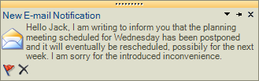

# DesktopAlert
 
## 

| RELATED VIDEOS |  |
| ------ | ------ |
|[Getting Started with RadDesktopAlert](http://tv.telerik.com/watch/winforms/getting-started-with-raddesktopalert)In this video, you will learn how to get started with RadDesktopAlert.||

RadDesktopAlert component displays a small pop-up window on the screen to notify the user that a specific event has occurred in the application. The component exposes a convenient API for modifying its behavior, appearance and also can be easily styled in the Visual Style Builder. RadDesktopAlert supports multi-monitor environments via DesktopAlertManager. DesktopAlertManager takes care for the proper positioning of multiple RadDesktopAlert instances on the screen estate so that it is optimally used. RadDesktopAlert can be easily integrated in a Windows Forms application. It is available as a component in the Telerik UI for WinForms suite and can be dragged and dropped on a Windows Forms from the Visual Studio Toolbox.

