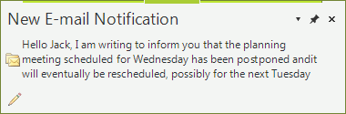

# GettingStarted


## 


| RELATED VIDEOS |  |
| ------ | ------ |
|[Getting Started with RadDesktopAlert](http://tv.telerik.com/watch/winforms/getting-started-with-raddesktopalert) In this video, you will learn how to get started with RadDesktopAlert.| |

1. Create a new Windows Forms application in Visual Studio and open the designer of the default form.

1. Open the Visual Studio’s Toolbox, find the RadDesktopAlert component and add it to your form by using a drag-and-drop operation. The RadDesktopAlert will appear in the component tray of the Form designer and will be available for customization via the Visual Studio’s property grid.

1. Add a button to the form and create a handler for its Click event. In the event handler write the following code:   
     	
	#### Setting up RadDesktopAlert 

	{{source=..\SamplesCS\DesktopAlert\DesktopAlert1.cs region=showingAlert}} 
	{{source=..\SamplesVB\DesktopAlert\DesktopAlert1.vb region=showingAlert}} 

	````C#
        void radButton1_Click(object sender, EventArgs e)
        {
           // this.radDesktopAlert1.ContentImage = envelopeImage;
            this.radDesktopAlert1.CaptionText = "New E-mail Notification";
            this.radDesktopAlert1.ContentText = "Hello Jack, I am writing to inform you " +
                "that the planning meeting scheduled for Wednesday has been postponed and" +
                "it will eventually be rescheduled, possibly for the next Tuesday";
            this.radDesktopAlert1.Show();
        }
	````
	````VB.NET
    Private Sub radButton1_Click(ByVal sender As Object, ByVal e As EventArgs)
        Me.radDesktopAlert1.ContentImage = envelopeImage
        Me.radDesktopAlert1.CaptionText = "New E-mail Notification"
        Me.radDesktopAlert1.ContentText = "Hello Jack, I am writing to inform you " & "that the planning meeting scheduled for Wednesday has been postponed and" & "it will eventually be rescheduled, possibly for the next Tuesday"
        Me.radDesktopAlert1.Show()
    End Sub
    '
	````

	{{endregion}} 

 
	This this way you will display an alert window at the bottom right part of the screen just the same way Microsoft Outlook does.

	>note You can also set caption text, content text etc. by using the Property Grid in the Visual Studio designer.
	>
	
	By default, the desktop alert will remain visible for 10 seconds. The __AutoClose__ property determines whether RadDesktopAlert will disappear after the period of time defined by the __AutoCloseDelay__ property.

	The RadDesktopAlert is initially shown with opacity set to 80% whereas it is changed to 100% when the mouse enters its bounds. The alert can also be moved over the screen by using the grip at its upper part as shown on the picture below. At the upper right part of the desktop alert there are three buttons which allow for closing it, pinning it to the screen and displaying a list of options. You can also add custom buttons to the alert by using the __ButtonItems__ collection.

	

	To understand how to fully utilize the RadDesktopAlert, take a look at the Customizing RadDesktopAlert help article.
		


