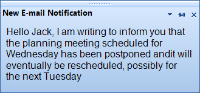

# Properties

|Property|Description|
|----|----|
|__RightToLeft__|Gets or sets a value indicating whether control's elements are aligned to support locales using right-to-left fonts.|
|__PlaySound__|Gets or sets a Boolean value determining whether a sound is played when the alert's pop up is shown.|
|__SoundToPlay__|Gets or sets the sound played when the alert's pop up is shown.|
|__Opacity__|Gets or sets the initial opacity of the alert's pop up.|
|__ShowOptionsButton__|Gets or sets a Boolean value determining whether the options button is shown.|
|__ShowPinButton__|Gets or sets a Boolean value determining whether the pin button is shown.|
|__ShowCloseButton__|Gets or sets a Boolean value determining whether the close button is shown.|
|__IsPinned__|Gets or sets a Boolean value determining whether the alert's pop up will be pinned on the screen. If pinned, the alert's pop up will not be automatically closed upon mouse click outside its bounds or if the __AutoClose__ property is set to *true*.|
|__CanMove__|Gets or sets a Boolean value determining whether the pop up can be moved by dragging the caption grip.|
|__PopupAnimation__|Gets or sets a Boolean value determining whether the alert's pop up will be animated.|
|__PopupAnimationDirection__|Gets or sets a value determining the direction of the alert's pop up animation.|
|__PopupAnimationFrames__|Gets or sets the count of the alert's drop-down animation frames.|
|__PopupAnimationEasing__|Gets or sets the type of the drop-down animation easing.|
|__FadeAnimationType__|Gets or sets a value from the __FadeAnimationType__ enumerator that determines the type of fade animation performed when the alert's pop up is opened/closed|
|__FadeAnimationSpeed__|Gets or sets the interval in milliseconds between two animation frames.|
|__FadeAnimationFrames__|Gets or sets the count of animation frames for the fade animation.|
|__AutoClose__|Gets or sets a Boolean value determining whether the alert's pop up is automatically closed.|
|__AutoCloseDelay__|Gets or sets the amount of time in seconds after which the alert will be automatically closed.|
|__ScreenPosition__|Gets or sets the position of the alert pop up on the working area of the active screen.|
|__FixedSize__|Gets or sets the fixed size for the alert's pop up. If the value is Size.Empty, the size of the pop up is dynamically adjusted according to its content.|
|__ContentImage__|Gets or sets the content image of the alert.|
|__ContentText__|Gets or sets the alert's content text. This text can be HTML formatted for better appearance.|
|__CaptionText__|Gets or sets the alert's caption text.|
|__ButtonItems__|Gets the collection that holds the button items added to the alert.|
|__OptionItems__|Gets the collection that holds the option items added to the alert's options button.|
|__Popup__|Gets an instance of the __DesktopAlertPopup__ that represents the pop up of the desktop alert.|

>note Since R1 2017 **RadDesktopAlert** supports auto sizing. Hence, if the **AutoSize** property is set to *true* and the alert's content requires more space, **RadDesktopAlert** will be automatically resized to fit the text.

 

# Methods

|Method|Description|
|----|----|
|__Show__|Displays the alert pop up on the screen at the specified location.|
|__Hide__|Hides the alert pop up from the screen.|
|__ResetLocationModifier__|Resets the explicit location modifier. In other words, if the user has modified the location of the alert's pop up, the __DesktopAlertManager__ will not consider it when rearranging the visible alerts. This method will reset the explicit location modifier and thus the __DesktopAlertManager__ will continue managing the location of the alert according to its location settings.|

# Events

|Event|Description|
|----|----|
|__Opening__|Fires when the alert's pop up is about to be opened. The opening action can be canceled by modifying the arguments of this event.|
|__Opened__|Fires when the alert's pop up was opened.|
|__Closing__|Fires when the alert's pop up is about to be closed. The closing action can be canceled by modifying the arguments of this event.|
|__Closed__|Fires when the alert's pop up was closed.|

# See Also 
* [Properties](http://docs.telerik.com/devtools/winforms/api/html/Properties_T_Telerik_WinControls_UI_RadDesktopAlert.htm)
* [Methods](http://docs.telerik.com/devtools/winforms/api/html/Methods_T_Telerik_WinControls_UI_RadDesktopAlert.htm)
* [Events](http://docs.telerik.com/devtools/winforms/api/html/Events_T_Telerik_WinControls_UI_RadDesktopAlert.htm)

