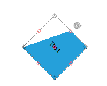

# Rotation

__RadDiagram__ gives you the ability to rotate shapes by dragging their Rotation Thumb
        or by changing their __RotationAngle__ property.

## Enable/Disable rotation

By default, the __RadDiagram__ is enabled for rotation manipulation.
        In order to disable this functionality, you can set __IsRotationEnabled__ to *False*.

#### __[C#] __

{{region EnableRotation}}
	            
	            this.radDiagram1.IsRotationEnabled = false;
	
	{{endregion}}

#### __[VB.NET] __

{{region EnableRotation}}
	
	        Me.RadDiagram1.IsRotationEnabled = False
	
	        '#End Region
	
	        '#Region "RotationAngle"
	
	        Dim sourceShape As New RadDiagramShape() With { _
	            .ShapeText = "Text", _
	            .InternalElementColor = System.Drawing.Color.LightBlue, _
	            .ElementShape = New TabVsShape() _
	        }
	        sourceShape.RotationAngle = 45
	        '#End Region
	
	        '#Region "EnableResizing"
	        Me.RadDiagram1.IsResizingEnabled = False
	        '#End Region
	
	        ' #Region "ResizeShape"
	
	        Dim resizedShape As New RadDiagramShape() With { _
	            .ShapeText = "", _
	            .ElementShape = New RoundRectShape(5), _
	            .InternalElementColor = System.Drawing.Color.LightBlue _
	        }
	        resizedShape.Width = 300
	        resizedShape.Height = 100
	        resizedShape.Position = New Telerik.Windows.Diagrams.Core.Point(10, 10)
	        RadDiagram1.Items.Add(resizedShape)
	
	        '#End Region
	
	        '#Region "IsSelected"
	
	        Dim shape1 As New RadDiagramShape() With { _
	            .ShapeText = "", _
	            .IsSelected = True, _
	            .ElementShape = New RoundRectShape(5), _
	            .InternalElementColor = System.Drawing.Color.LightBlue _
	        }
	        shape1.Position = New Telerik.Windows.Diagrams.Core.Point(10, 10)
	        RadDiagram1.AddShape(shape1)
	
	        Dim shape2 As New RadDiagramShape() With { _
	            .ShapeText = "", _
	            .ElementShape = New RoundRectShape(5), _
	            .InternalElementColor = System.Drawing.Color.LightGreen _
	        }
	        shape2.Position = New Telerik.Windows.Diagrams.Core.Point(180, 10)
	        RadDiagram1.AddShape(shape2)
	
	        '#End Region
	
	        '#Region "ClipboardCommands"
	        Me.RadDiagram1.SelectedItem = shape1
	        Me.RadDiagram1.DiagramElement.TryExecuteCommand(DiagramCommands.Copy, "")
	        Me.RadDiagram2.DiagramElement.TryExecuteCommand(DiagramCommands.Paste, "")
	        Me.RadDiagram1.SelectedItem = shape2
	        Me.RadDiagram1.DiagramElement.TryExecuteCommand(DiagramCommands.Cut, "")
	        Me.RadDiagram2.DiagramElement.TryExecuteCommand(DiagramCommands.Paste, "")
	        '#End Region
	
	        '#Region "RemoveItems"
	        Me.RadDiagram1.Items.RemoveAt(2)
	        Me.RadDiagram1.Items.Remove(shape1)
	        '#End Region
	
	        '#Region "DeleteCommands"
	
	        Me.RadDiagram1.SelectedItem = shape1
	        Me.RadDiagram1.DiagramElement.TryExecuteCommand(DiagramCommands.Delete, "")
	
	        '#End Region
	
	    End Sub
	
	    Public Sub Dummy()
	        '#Region "MultipleSelection"
	
	        Dim shape1 As New RadDiagramShape() With { _
	            .ShapeText = "", _
	            .IsSelected = True, _
	            .ElementShape = New RoundRectShape(5), _
	            .InternalElementColor = System.Drawing.Color.LightBlue _
	        }
	        shape1.Position = New Telerik.Windows.Diagrams.Core.Point(10, 10)
	        RadDiagram1.AddShape(shape1)
	
	        Dim shape2 As New RadDiagramShape() With { _
	            .ShapeText = "", _
	            .IsSelected = True, _
	            .ElementShape = New RoundRectShape(5), _
	            .InternalElementColor = System.Drawing.Color.LightGreen _
	        }
	        shape2.Position = New Telerik.Windows.Diagrams.Core.Point(180, 10)
	        RadDiagram1.AddShape(shape2)
	
	        '#End Region
	
	        '#Region "SelectedIndex"
	
	        Me.RadDiagram1.SelectedIndex = 1
	        '#End Region
	
	        '#Region "SelectAllCommand"
	        Me.RadDiagram1.DiagramElement.TryExecuteCommand(DiagramCommands.SelectAll, "")
	
	        '#End Region
	
	
	    End Sub
	
	    Public Sub Dummy2()
	        '#Region "ZOrder"
	
	        Dim shape1 As New RadDiagramShape() With { _
	            .ShapeText = "shape1", _
	            .ZIndex = 3, _
	            .ElementShape = New EllipseShape(), _
	            .InternalElementColor = System.Drawing.Color.LightBlue _
	        }
	        shape1.Position = New Telerik.Windows.Diagrams.Core.Point(100, 10)
	        RadDiagram1.AddShape(shape1)
	
	        Dim shape2 As New RadDiagramShape() With { _
	            .ShapeText = "shape2", _
	            .ZIndex = 2, _
	            .ElementShape = New EllipseShape(), _
	            .InternalElementColor = System.Drawing.Color.LightGreen _
	        }
	        shape2.Position = New Telerik.Windows.Diagrams.Core.Point(150, 60)
	        RadDiagram1.AddShape(shape2)
	
	        Dim shape3 As New RadDiagramShape() With { _
	            .ShapeText = "shape3", _
	            .ZIndex = 1, _
	            .ElementShape = New EllipseShape(), _
	            .InternalElementColor = System.Drawing.Color.LightCoral _
	        }
	        shape3.Position = New Telerik.Windows.Diagrams.Core.Point(60, 60)
	        radDiagram1.AddShape(shape3)
	
	        '#End Region
	    End Sub
	
	    Public Sub Dummy3()
	        '#Region "CommandZIndex"
	
	        Dim shape1 As New RadDiagramShape() With { _
	            .ShapeText = "shape1", _
	            .ZIndex = 1, _
	            .ElementShape = New EllipseShape(), _
	            .InternalElementColor = System.Drawing.Color.LightBlue _
	        }
	        shape1.Position = New Telerik.Windows.Diagrams.Core.Point(100, 10)
	        radDiagram1.AddShape(shape1)
	
	        Dim shape2 As New RadDiagramShape() With { _
	            .ShapeText = "shape2", _
	            .ZIndex = 2, _
	            .ElementShape = New EllipseShape(), _
	            .InternalElementColor = System.Drawing.Color.LightGreen _
	        }
	        shape2.Position = New Telerik.Windows.Diagrams.Core.Point(150, 80)
	        RadDiagram1.AddShape(shape2)
	
	        Dim shape3 As New RadDiagramShape() With { _
	            .ShapeText = "shape3", _
	            .ZIndex = 3, _
	            .ElementShape = New EllipseShape(), _
	            .InternalElementColor = System.Drawing.Color.LightCoral _
	        }
	        shape3.Position = New Telerik.Windows.Diagrams.Core.Point(60, 80)
	        RadDiagram1.AddShape(shape3)
	
	        Dim connection1 As New RadDiagramConnection() With { _
	            .Name = "aaaa" _
	        }
	        connection1.Source = shape1
	        connection1.Target = shape2
	        connection1.ZIndex = 2
	        connection1.SourceConnectorPosition = "Right"
	        connection1.TargetConnectorPosition = "Right"
	
	        RadDiagram1.Items.Add(connection1)
	
	        Dim connection2 As New RadDiagramConnection() With { _
	            .Name = "bbbb" _
	        }
	        connection2.Source = shape1
	        connection2.Target = shape3
	        connection2.ZIndex = 1
	        connection2.SourceConnectorPosition = "Left"
	        connection2.TargetConnectorPosition = "Left"
	        radDiagram1.Items.Add(connection2)
	
	        '#End Region
	        
	        '#Region "BringToFront"
	
	        Me.RadDiagram1.SelectedItem = shape1
	        Me.RadDiagram1.DiagramElement.TryExecuteCommand(DiagramCommands.BringToFront, "")
	
	        '#End Region
	
	        '#Region "SendToBack"
	
	        Me.RadDiagram1.SelectedItem = shape3
	        Me.RadDiagram1.DiagramElement.TryExecuteCommand(DiagramCommands.SendToBack, "")
	
	        '#End Region
	    End Sub
	End Class

## Rotation Angle

You can rotate shapes by using their __RotationAngle__ property: 

#### __[C#] __

{{region RotationAngle}}
	            
	            RadDiagramShape sourceShape = new RadDiagramShape()
	            {
	                ShapeText = "Text",
	                InternalElementColor = System.Drawing.Color.LightBlue,
	                ElementShape = new TabVsShape(),
	            };
	            sourceShape.RotationAngle = 45;
	    
	{{endregion}}

#### __[VB.NET] __

{{region RotationAngle}}
	
	        Dim sourceShape As New RadDiagramShape() With { _
	            .ShapeText = "Text", _
	            .InternalElementColor = System.Drawing.Color.LightBlue, _
	            .ElementShape = New TabVsShape() _
	        }
	        sourceShape.RotationAngle = 45
	        '#End Region
	
	        '#Region "EnableResizing"
	        Me.RadDiagram1.IsResizingEnabled = False
	        '#End Region
	
	        ' #Region "ResizeShape"
	
	        Dim resizedShape As New RadDiagramShape() With { _
	            .ShapeText = "", _
	            .ElementShape = New RoundRectShape(5), _
	            .InternalElementColor = System.Drawing.Color.LightBlue _
	        }
	        resizedShape.Width = 300
	        resizedShape.Height = 100
	        resizedShape.Position = New Telerik.Windows.Diagrams.Core.Point(10, 10)
	        RadDiagram1.Items.Add(resizedShape)
	
	        '#End Region
	
	        '#Region "IsSelected"
	
	        Dim shape1 As New RadDiagramShape() With { _
	            .ShapeText = "", _
	            .IsSelected = True, _
	            .ElementShape = New RoundRectShape(5), _
	            .InternalElementColor = System.Drawing.Color.LightBlue _
	        }
	        shape1.Position = New Telerik.Windows.Diagrams.Core.Point(10, 10)
	        RadDiagram1.AddShape(shape1)
	
	        Dim shape2 As New RadDiagramShape() With { _
	            .ShapeText = "", _
	            .ElementShape = New RoundRectShape(5), _
	            .InternalElementColor = System.Drawing.Color.LightGreen _
	        }
	        shape2.Position = New Telerik.Windows.Diagrams.Core.Point(180, 10)
	        RadDiagram1.AddShape(shape2)
	
	        '#End Region
	
	        '#Region "ClipboardCommands"
	        Me.RadDiagram1.SelectedItem = shape1
	        Me.RadDiagram1.DiagramElement.TryExecuteCommand(DiagramCommands.Copy, "")
	        Me.RadDiagram2.DiagramElement.TryExecuteCommand(DiagramCommands.Paste, "")
	        Me.RadDiagram1.SelectedItem = shape2
	        Me.RadDiagram1.DiagramElement.TryExecuteCommand(DiagramCommands.Cut, "")
	        Me.RadDiagram2.DiagramElement.TryExecuteCommand(DiagramCommands.Paste, "")
	        '#End Region
	
	        '#Region "RemoveItems"
	        Me.RadDiagram1.Items.RemoveAt(2)
	        Me.RadDiagram1.Items.Remove(shape1)
	        '#End Region
	
	        '#Region "DeleteCommands"
	
	        Me.RadDiagram1.SelectedItem = shape1
	        Me.RadDiagram1.DiagramElement.TryExecuteCommand(DiagramCommands.Delete, "")
	
	        '#End Region
	
	    End Sub
	
	    Public Sub Dummy()
	        '#Region "MultipleSelection"
	
	        Dim shape1 As New RadDiagramShape() With { _
	            .ShapeText = "", _
	            .IsSelected = True, _
	            .ElementShape = New RoundRectShape(5), _
	            .InternalElementColor = System.Drawing.Color.LightBlue _
	        }
	        shape1.Position = New Telerik.Windows.Diagrams.Core.Point(10, 10)
	        RadDiagram1.AddShape(shape1)
	
	        Dim shape2 As New RadDiagramShape() With { _
	            .ShapeText = "", _
	            .IsSelected = True, _
	            .ElementShape = New RoundRectShape(5), _
	            .InternalElementColor = System.Drawing.Color.LightGreen _
	        }
	        shape2.Position = New Telerik.Windows.Diagrams.Core.Point(180, 10)
	        RadDiagram1.AddShape(shape2)
	
	        '#End Region
	
	        '#Region "SelectedIndex"
	
	        Me.RadDiagram1.SelectedIndex = 1
	        '#End Region
	
	        '#Region "SelectAllCommand"
	        Me.RadDiagram1.DiagramElement.TryExecuteCommand(DiagramCommands.SelectAll, "")
	
	        '#End Region
	
	
	    End Sub
	
	    Public Sub Dummy2()
	        '#Region "ZOrder"
	
	        Dim shape1 As New RadDiagramShape() With { _
	            .ShapeText = "shape1", _
	            .ZIndex = 3, _
	            .ElementShape = New EllipseShape(), _
	            .InternalElementColor = System.Drawing.Color.LightBlue _
	        }
	        shape1.Position = New Telerik.Windows.Diagrams.Core.Point(100, 10)
	        RadDiagram1.AddShape(shape1)
	
	        Dim shape2 As New RadDiagramShape() With { _
	            .ShapeText = "shape2", _
	            .ZIndex = 2, _
	            .ElementShape = New EllipseShape(), _
	            .InternalElementColor = System.Drawing.Color.LightGreen _
	        }
	        shape2.Position = New Telerik.Windows.Diagrams.Core.Point(150, 60)
	        RadDiagram1.AddShape(shape2)
	
	        Dim shape3 As New RadDiagramShape() With { _
	            .ShapeText = "shape3", _
	            .ZIndex = 1, _
	            .ElementShape = New EllipseShape(), _
	            .InternalElementColor = System.Drawing.Color.LightCoral _
	        }
	        shape3.Position = New Telerik.Windows.Diagrams.Core.Point(60, 60)
	        radDiagram1.AddShape(shape3)
	
	        '#End Region
	    End Sub
	
	    Public Sub Dummy3()
	        '#Region "CommandZIndex"
	
	        Dim shape1 As New RadDiagramShape() With { _
	            .ShapeText = "shape1", _
	            .ZIndex = 1, _
	            .ElementShape = New EllipseShape(), _
	            .InternalElementColor = System.Drawing.Color.LightBlue _
	        }
	        shape1.Position = New Telerik.Windows.Diagrams.Core.Point(100, 10)
	        radDiagram1.AddShape(shape1)
	
	        Dim shape2 As New RadDiagramShape() With { _
	            .ShapeText = "shape2", _
	            .ZIndex = 2, _
	            .ElementShape = New EllipseShape(), _
	            .InternalElementColor = System.Drawing.Color.LightGreen _
	        }
	        shape2.Position = New Telerik.Windows.Diagrams.Core.Point(150, 80)
	        RadDiagram1.AddShape(shape2)
	
	        Dim shape3 As New RadDiagramShape() With { _
	            .ShapeText = "shape3", _
	            .ZIndex = 3, _
	            .ElementShape = New EllipseShape(), _
	            .InternalElementColor = System.Drawing.Color.LightCoral _
	        }
	        shape3.Position = New Telerik.Windows.Diagrams.Core.Point(60, 80)
	        RadDiagram1.AddShape(shape3)
	
	        Dim connection1 As New RadDiagramConnection() With { _
	            .Name = "aaaa" _
	        }
	        connection1.Source = shape1
	        connection1.Target = shape2
	        connection1.ZIndex = 2
	        connection1.SourceConnectorPosition = "Right"
	        connection1.TargetConnectorPosition = "Right"
	
	        RadDiagram1.Items.Add(connection1)
	
	        Dim connection2 As New RadDiagramConnection() With { _
	            .Name = "bbbb" _
	        }
	        connection2.Source = shape1
	        connection2.Target = shape3
	        connection2.ZIndex = 1
	        connection2.SourceConnectorPosition = "Left"
	        connection2.TargetConnectorPosition = "Left"
	        radDiagram1.Items.Add(connection2)
	
	        '#End Region
	        
	        '#Region "BringToFront"
	
	        Me.RadDiagram1.SelectedItem = shape1
	        Me.RadDiagram1.DiagramElement.TryExecuteCommand(DiagramCommands.BringToFront, "")
	
	        '#End Region
	
	        '#Region "SendToBack"
	
	        Me.RadDiagram1.SelectedItem = shape3
	        Me.RadDiagram1.DiagramElement.TryExecuteCommand(DiagramCommands.SendToBack, "")
	
	        '#End Region
	    End Sub
	End Class

