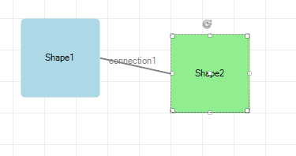

# Background Grid

You can control the background settings of the diagramming surface through the following properties:
        

* __IsBackgroundSurfaceVisible__: a boolean property that determines whether the background surface of the __RadDiagram__  should be displayed. Its default value is *true*. 

{{source=..\SamplesCS\Diagram\DiagramBackgroundGrid.cs region=IsBackgroundSurfaceVisible}} 
{{source=..\SamplesVB\Diagram\DiagramBackgroundGrid.vb region=IsBackgroundSurfaceVisible}} 

````C#
            
this.radDiagram1.DiagramElement.IsBackgroundSurfaceVisible = true;

````
````VB.NET
Me.RadDiagram1.DiagramElement.IsBackgroundSurfaceVisible = True

````

{{endregion}} 

 

| __IsBackgroundSurfaceVisible__ = *true* | __IsBackgroundSurfaceVisible__ = *false* |
|----|----|
|||

* __Background__: this property is of type *Brush* and it controls the fill of the __RadDiagram__ background.
            
{{source=..\SamplesCS\Diagram\DiagramBackgroundGrid.cs region=Background}} 
{{source=..\SamplesVB\Diagram\DiagramBackgroundGrid.vb region=Background}} 

````C#
        
this.radDiagram1.DiagramElement.BackgroundGrid.Background = new System.Drawing.SolidBrush(Color.LightYellow);

````
````VB.NET
Me.RadDiagram1.DiagramElement.BackgroundGrid.Background = New System.Drawing.SolidBrush(Color.LightYellow)

````

{{endregion}} 


>caption Figure. 1 Background


You can access the __BackgroundGrid__ properties:

* __CellSize__: this property is of type *Telerik.Windows.Diagrams.Core.Size* and it controls the size of the cells in the __RadDiagram__ surface. The default value of this property is a size of *20x20 * units.
            
>caption Figure. 2 CellSize



#### Set the CellSize 
 
{{source=..\SamplesCS\Diagram\DiagramBackgroundGrid.cs region=CellSize}} 
{{source=..\SamplesVB\Diagram\DiagramBackgroundGrid.vb region=CellSize}} 

````C#
            
this.radDiagram1.DiagramElement.BackgroundGrid.CellSize = new Telerik.Windows.Diagrams.Core.Size(40, 40);

````
````VB.NET
Me.RadDiagram1.DiagramElement.BackgroundGrid.CellSize = New Telerik.Windows.Diagrams.Core.Size(40, 40)

````

{{endregion}} 


* __LineStroke__: this property is of type *Brush* and it specifies how the cells outline is painted.
            
>caption Figure. 3 LineStroke

  

{{source=..\SamplesCS\Diagram\DiagramBackgroundGrid.cs region=LineStroke}} 
{{source=..\SamplesVB\Diagram\DiagramBackgroundGrid.vb region=LineStroke}} 

````C#
            
this.radDiagram1.DiagramElement.BackgroundGrid.LineStroke = new System.Drawing.SolidBrush(Color.Red);

````
````VB.NET
Me.RadDiagram1.DiagramElement.BackgroundGrid.LineStroke = New System.Drawing.SolidBrush(Color.Red)

````

{{endregion}} 
 
* __LineStrokeThickness__: this property is of type *double* and it gets or sets the thickness of the __RadDiagram__ background grid lines.
            
>caption Figure. 4 LineStrokeThickness

 

{{source=..\SamplesCS\Diagram\DiagramBackgroundGrid.cs region=LineStrokeThickness}} 
{{source=..\SamplesVB\Diagram\DiagramBackgroundGrid.vb region=LineStrokeThickness}} 

````C#
        
this.radDiagram1.DiagramElement.BackgroundGrid.LineStrokeThickness = 5;

````
````VB.NET
Me.RadDiagram1.DiagramElement.BackgroundGrid.LineStrokeThickness = 5

````

{{endregion}} 


