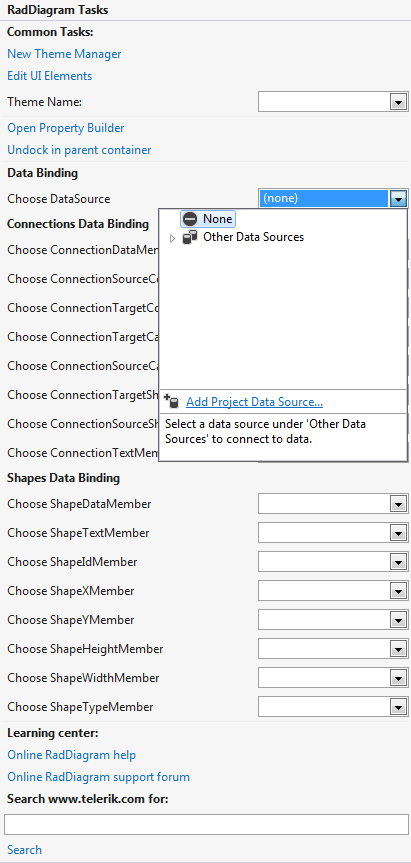
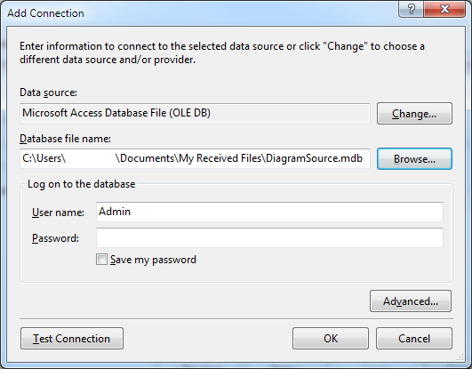
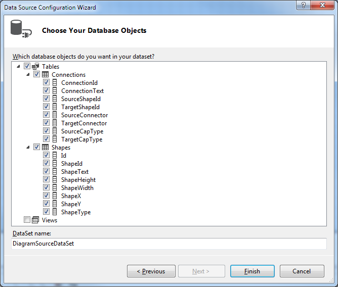
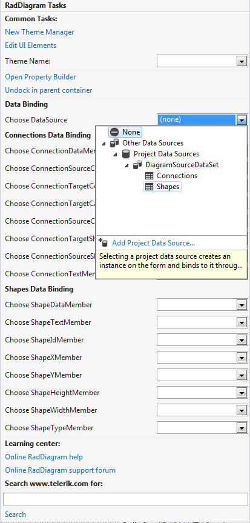
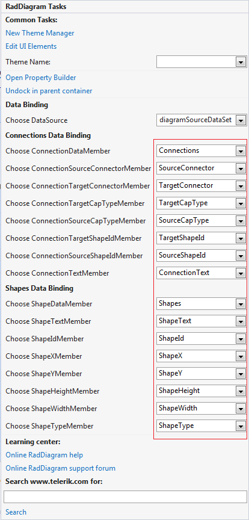
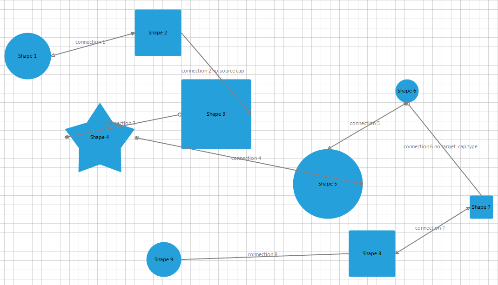

# Design Time Data Binding

This tutorial will show you how to bind __RadDiagram__ from the Visual Studio design time surface, by only using the __RadDiagram__ design-time support, and without writing any code. The tutorial uses a data base containing two tables illustrated below:

Follow the steps:

1. Open Visual Studio and start a new Windows Forms project. Open the form, created by the project.

1. Drag a __RadDiagram__ from the toolbox to your form.

1. Select __RadDiagram__ and open its ActionList (smart tag). In it, there is a __DataSource__ property. Select the *Add Project Data Source...* link. This step will display the *Data Source Configuration Wizard*.

	

1. In the *Data Source Configuration Wizard >> Choose a Data Source Type* page, select the Database icon. Click the Next button.

	

1. In the *Choose Your data Connection* page click the *New Connection...* button. This step will display the *Add Connection* dialog.

	

1. Select the *Microsoft Access Database File* data source. After specifying the *Database file name*, click the OK button to close the *Change Data Source dialog*.

	

1. In the *Choose Your Database Objects* page, select the "Shapes" and "Connections" check-boxes. Click the Finish button to close the *Data Source Configuration Wizard*.

	

1. In the *Smart tag >> DataSource* drop down, select the "Shapes" table. This step will create DataSet, BindingSource and TableAdapter objects for the shapes table. Repeat the same step for the "Connections" table.

	

1. Select the generated DataSet for the __DataSource__ property. 

	

1. In the smart tag or in the properties window set the member properties in the following way.

	

1. Run the application

	
