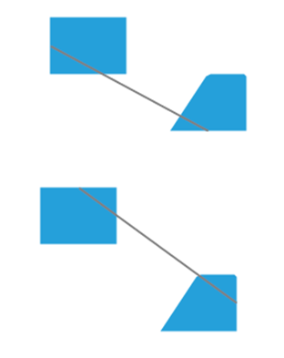
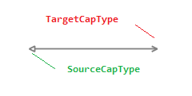
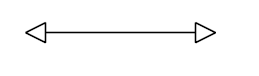
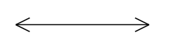
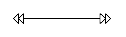
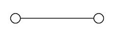
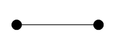
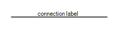
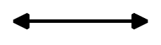
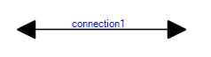

# Connections


This tutorial will walk you through the functionality and the main features of __RadDiagramConnection__.

>note Before proceeding with this topic, it is recommended to get familiar with the [visual structure]() of the __RadDiagram__.
>


## Overview

__RadDiagramConnection__ is basically an object that connects zero, one or two shapes:


You can use its extensive API to configure its source and target points or shapes. You can choose from a list of predefined cap types thus customizing the start and end point of the connection to better fit in your application scenario. You can also control the type of a connection using the __ConnectionType__ property, add a custom content and customize the overall look and feel of the items.

## Configure the Source and Target of a Connection

The __RadDiagramConnection__ class exposes the following properties that allow you to control the start and end points of a connection:

* __StartPoint/EndPoint__ - these properties are of type Telerik.Windows.Diagrams.Core.*Point* and they set or get the start/end point of a connection.
            

* __Source/Target__ - these properties get or set the source/target __RadDiagramShape__ of a connection.
            

* __SourceConnectorPosition/TargetConnectorPosition__ - there are five predefined strings that you can use to define where to position the connectors of the connection:           
            

	* __Auto__ - use it if you want to automatically determine the start/end point of a connection. This option will allow the connection to dynamically determine which shape connector to be used as a start/end point. Based on the end point position, the __SourceConnectorPosition__ will be set to the nearest shape connector. Alternatively, the __TargetConnectorPosition__ will be set to the nearest shape connector, based on the start point position of the connection.
                

	* __Left__ - use it to define the left connector of a shape as the source/target point of the connection
                

	* __Top__ - use it to define the top connector of a shape as the source/target point of the connection
                

	* __Right__ - use it to define the right connector of a shape as the source/target point of the connection
                

	* __Bottom__ - use it to define the bottom connector of a shape as the source/target point of the connection



* __SourceCapType/TargetCapType__ - both properties are an enumeration of type __CapType__ that allow you to choose a cap from a set of predefined Cap types. For more detailed information, please, view the CapTypes section below. 



* __SourceCapSize/TargetCapSize__ - these properties are of type Size and they get or set the size of the __SourceCap/TargetCap__.


## Connection Types

* __ConnectionPoints__ - if you want to change the route of the connection, you can add connection points in code-behind through the RadDiagramConnection.__ConnectionPoints__ property. You can populate the __ConnectionPoints__ collection with objects of type *Point*: 

{{source=..\SamplesCS\Diagram\DiagramItems.cs region=AddConnection}} 
{{source=..\SamplesVB\Diagram\DiagramItems.vb region=AddConnection}} 

````C#
            
RadDiagramConnection connection1 = new RadDiagramConnection() { Name = "connection1" };
            
connection1.Source = shape1;
connection1.Target = starShape;
connection1.ConnectionPoints.Add(new Point(200, 30));
radDiagram1.Items.Add(connection1);

````
````VB.NET
Dim connection1 As New RadDiagramConnection() With { _
    .Name = "connection1" _
}
connection1.Source = shape1
connection1.Target = starShape
connection1.ConnectionPoints.Add(New Point(200, 30))
RadDiagram1.Items.Add(connection1)

````

{{endregion}} 


>note You can refer to the [Shapes]() article where the shapes are defined.
>


* __ConnectionType__ - controls the connection type. As an enumeration of type Telerik.Windows.Diagrams.Core.ConnectionType, it exposes the following members:
            

\* __Polyline__ - this type allows you to define multiple points a connection has to pass through. By default, such a connection have two points it has to pass through - its source connector (or StartPoint) and its target connector (or EndPoint). This is why by default the Polyline __ConnectionType__ visualizes a straight connection. Sample of a straight Polyline connection between two shapes:

 


{{source=..\SamplesCS\Diagram\DiagramItems.cs region=PolylineConnection}} 
{{source=..\SamplesVB\Diagram\DiagramItems.vb region=PolylineConnection}} 

````C#
            
RadDiagramShape sourceShape = new RadDiagramShape()
{
    Text = "source",
    Shape = new RoundRectShape(5),
    BackColor = Color.Red
};
            
sourceShape.Position = new Telerik.Windows.Diagrams.Core.Point(150, 100);
radDiagram1.AddShape(sourceShape);
            
RadDiagramShape targetShape = new RadDiagramShape()
{
    Text = "target",
    Shape = new RoundRectShape(5),
    BackColor = Color.Red
};
            
targetShape.Position = new Telerik.Windows.Diagrams.Core.Point(400, 300);
radDiagram1.AddShape(targetShape);
            
RadDiagramConnection polylineConnection = new RadDiagramConnection() { Name = "connection1" };
            
polylineConnection.Source = sourceShape;
polylineConnection.Target = targetShape;
polylineConnection.ConnectionType = Telerik.Windows.Diagrams.Core.ConnectionType.Polyline;
radDiagram1.AddShape(polylineConnection);

````
````VB.NET
Dim sourceShape As New RadDiagramShape() With { _
    .Text = "source", _
    .Shape = New RoundRectShape(5), _
    .BackColor = Color.Red _
}
sourceShape.Position = New Telerik.Windows.Diagrams.Core.Point(150, 100)
RadDiagram1.AddShape(sourceShape)
Dim targetShape As New RadDiagramShape() With { _
    .Text = "target", _
    .Shape = New RoundRectShape(5), _
    .BackColor = Color.Red _
}
targetShape.Position = New Telerik.Windows.Diagrams.Core.Point(400, 300)
RadDiagram1.AddShape(targetShape)
Dim polylineConnection As New RadDiagramConnection() With { _
    .Name = "connection1" _
}
polylineConnection.Source = sourceShape
polylineConnection.Target = targetShape
polylineConnection.ConnectionType = Telerik.Windows.Diagrams.Core.ConnectionType.Polyline
RadDiagram1.Items.Add(polylineConnection)

````

{{endregion}} 


If you want to change the route of the connection, you can add connection points in code-behind through the RadDiagramConnection.__ConnectionPoints__ property. You can populate the __ConnectionPoints__ collection with objects of type Point: 


{{source=..\SamplesCS\Diagram\DiagramItems.cs region=ConnectionPolylineWithPoints}} 
{{source=..\SamplesVB\Diagram\DiagramItems.vb region=ConnectionPolylineWithPoints}} 

````C#
            
polylineConnection.ConnectionPoints.Add(new Point(300, 140));
polylineConnection.ConnectionPoints.Add(new Point(330, 280));

````
````VB.NET
polylineConnection.ConnectionPoints.Add(New Point(300, 140))
polylineConnection.ConnectionPoints.Add(New Point(330, 280))

````

{{endregion}} 


Sample of a curved Polyline connection:


\* __Bezier__ - this connection type allows you to create a Bézier curve. The Bezier connection is a curve specified by four points: two end points (p1 and p2) - the source/start and target/end of the connection and two handle points (h1 and h2) and a tension parameter. The curve begins at p1 and ends at p2 and it doesn't   pass through the handle points, but the handle points act as magnets, pulling the curve in certain directions and influencing the way the curve bends. The following illustration shows a Bézier RadDiagramConnection along with its endpoints and handle points.

 The RadDiagramConnection. __BezierTension__ parameter defines the curve that will be produced for a given set of end and handle points. The following illustration shows a Bezier connection:

 

{{source=..\SamplesCS\Diagram\DiagramItems.cs region=BezierConnection}} 
{{source=..\SamplesVB\Diagram\DiagramItems.vb region=BezierConnection}} 

````C#
            
RadDiagramConnection bezierConnection = new RadDiagramConnection() { Name = "connection1" };
            
bezierConnection.Source = sourceShape;
bezierConnection.Target = targetShape;
bezierConnection.BezierTension = 16;
bezierConnection.ConnectionType = Telerik.Windows.Diagrams.Core.ConnectionType.Bezier;
radDiagram1.Items.Add(bezierConnection);

````
````VB.NET
Dim bezierConnection As New RadDiagramConnection() With { _
    .Name = "connection1" _
}
bezierConnection.Source = sourceShape
bezierConnection.Target = targetShape
bezierConnection.BezierTension = 16
bezierConnection.ConnectionType = Telerik.Windows.Diagrams.Core.ConnectionType.Bezier
RadDiagram1.Items.Add(bezierConnection)

````

{{endregion}} 


By default, when you create a Bezier connection and attach its endpoints to __RadDiagramShapes__, the position of the handle points of the connection will be calculated based on the connector positions. Both handle points will be added to the RadDiagramConnection.__ConnectionPoints__ collection. The following snapshot illustrates the default direction of the Bezier connection handles based on the position of the connector to which the connection is attached.

 

The offset between a Bezier connection handle point and its corresponding endpoint is controlled thorough the __BezierAutoOffset__ DiagramConstants. Its default value is *30px*, but you can change it to better fit your needs.When attaching a Bezier connection to a RadDiagramShape you need to consider if it is attached to a built-in connector or to a custom connector. If the connection is attached to a custom connector, then you will have to manually set the position of the Bezier handle points. You can change the position of the points after you access them from the RadDiagramConnection. __ConnectionPoints__ collection, but you will also have to set the RadDiagramConnection. __IsModified__ property to True to apply the changes. If you don't want to manually traverse the __ConnectionPoints__ collection and then set the __IsModified__ property, you can use the RadDiagramConnection. __SetBezierHandles(Point,Point)__ method. It facilitates the definition of custom coordinates for the two handle points of a Bezier connection.

>note Please note that if you create custom connectors which names include any of the following strings:
>
* "right"
* "left"
* "bottom"
* "up" the Bezier Connection handle points will point at the direction indicated by the respective string.>On the other hand, if you attach a Bezier Connection to a custom connector which name doesn't indicate a direction, the handle points of the connection will match the start and end point of the connection.
>


\* __Spline__ - this connection type represents a cardinal spline. The connection is specified by an array of points - the connection passes smoothly through each point in the array; there are no sharp corners and no abrupt changes in the tightness of the curve. The following illustration shows a set of points and a spline connection that passes through each point in the set. Sample of a Spline connection:

 

{{source=..\SamplesCS\Diagram\DiagramItems.cs region=SplineConnection}} 
{{source=..\SamplesVB\Diagram\DiagramItems.vb region=SplineConnection}} 

````C#
            
RadDiagramConnection splineConnection = new RadDiagramConnection() { Name = "connection1" };
            
splineConnection.Source = sourceShape;
splineConnection.Target = targetShape;            
splineConnection.ConnectionType = Telerik.Windows.Diagrams.Core.ConnectionType.Spline;
splineConnection.ConnectionPoints.Add(new Point(140, 20));
splineConnection.ConnectionPoints.Add(new Point(250, 150));
splineConnection.ConnectionPoints.Add(new Point(350, 50));    
radDiagram1.Items.Add(splineConnection);

````
````VB.NET
Dim splineConnection As New RadDiagramConnection() With { _
    .Name = "connection1" _
}
splineConnection.Source = sourceShape
splineConnection.Target = targetShape
splineConnection.ConnectionType = Telerik.Windows.Diagrams.Core.ConnectionType.Spline
splineConnection.ConnectionPoints.Add(New Point(140, 20))
splineConnection.ConnectionPoints.Add(New Point(250, 150))
splineConnection.ConnectionPoints.Add(New Point(350, 50))
RadDiagram1.Items.Add(splineConnection)

````

{{endregion}} 


## Cap Types

__CapType__ enumeration members:

* __None__:

 

{{source=..\SamplesCS\Diagram\DiagramItems.cs region=CapTypeNone}} 
{{source=..\SamplesVB\Diagram\DiagramItems.vb region=CapTypeNone}} 

````C#
            
connection1.SourceCapType = Telerik.Windows.Diagrams.Core.CapType.None;
connection1.TargetCapType = Telerik.Windows.Diagrams.Core.CapType.None;

````
````VB.NET
connection1.SourceCapType = Telerik.Windows.Diagrams.Core.CapType.None
connection1.TargetCapType = Telerik.Windows.Diagrams.Core.CapType.None

````

{{endregion}} 


* __Arrow1__:

 

{{source=..\SamplesCS\Diagram\DiagramItems.cs region=CapTypeArrow1}} 
{{source=..\SamplesVB\Diagram\DiagramItems.vb region=CapTypeArrow1}} 

````C#
connection1.SourceCapType = Telerik.Windows.Diagrams.Core.CapType.Arrow1;
connection1.TargetCapType = Telerik.Windows.Diagrams.Core.CapType.Arrow1;

````
````VB.NET
connection1.SourceCapType = Telerik.Windows.Diagrams.Core.CapType.Arrow1
connection1.TargetCapType = Telerik.Windows.Diagrams.Core.CapType.Arrow1

````

{{endregion}} 


* __Arrow1Filled__:

 


{{source=..\SamplesCS\Diagram\DiagramItems.cs region=CapTypeArrow1Filled}} 
{{source=..\SamplesVB\Diagram\DiagramItems.vb region=CapTypeArrow1Filled}} 

````C#
            
connection1.SourceCapType = Telerik.Windows.Diagrams.Core.CapType.Arrow1Filled;
connection1.TargetCapType = Telerik.Windows.Diagrams.Core.CapType.Arrow1Filled;

````
````VB.NET
connection1.SourceCapType = Telerik.Windows.Diagrams.Core.CapType.Arrow1Filled
connection1.TargetCapType = Telerik.Windows.Diagrams.Core.CapType.Arrow1Filled

````

{{endregion}} 


* __Arrow2__:

 

{{source=..\SamplesCS\Diagram\DiagramItems.cs region=CapTypeArrow2}} 
{{source=..\SamplesVB\Diagram\DiagramItems.vb region=CapTypeArrow2}} 

````C#
            
connection1.SourceCapType = Telerik.Windows.Diagrams.Core.CapType.Arrow2;
connection1.TargetCapType = Telerik.Windows.Diagrams.Core.CapType.Arrow2;

````
````VB.NET
connection1.SourceCapType = Telerik.Windows.Diagrams.Core.CapType.Arrow2
connection1.TargetCapType = Telerik.Windows.Diagrams.Core.CapType.Arrow2

````

{{endregion}} 


* __Arrow2Filled__:

 
 
{{source=..\SamplesCS\Diagram\DiagramItems.cs region=CapTypeArrow2Filled}} 
{{source=..\SamplesVB\Diagram\DiagramItems.vb region=CapTypeArrow2Filled}} 

````C#
connection1.SourceCapType = Telerik.Windows.Diagrams.Core.CapType.Arrow2Filled;
connection1.TargetCapType = Telerik.Windows.Diagrams.Core.CapType.Arrow2Filled;

````
````VB.NET
connection1.SourceCapType = Telerik.Windows.Diagrams.Core.CapType.Arrow2Filled
connection1.TargetCapType = Telerik.Windows.Diagrams.Core.CapType.Arrow2Filled

````

{{endregion}} 
 

* __Arrow3__:

 

{{source=..\SamplesCS\Diagram\DiagramItems.cs region=CapTypeArrow3}} 
{{source=..\SamplesVB\Diagram\DiagramItems.vb region=CapTypeArrow3}} 

````C#
    
connection1.SourceCapType = Telerik.Windows.Diagrams.Core.CapType.Arrow3;
connection1.TargetCapType = Telerik.Windows.Diagrams.Core.CapType.Arrow3;

````
````VB.NET
connection1.SourceCapType = Telerik.Windows.Diagrams.Core.CapType.Arrow3
connection1.TargetCapType = Telerik.Windows.Diagrams.Core.CapType.Arrow3

````

{{endregion}} 
 

* __Arrow4__:

 
 
{{source=..\SamplesCS\Diagram\DiagramItems.cs region=CapTypeArrow4}} 
{{source=..\SamplesVB\Diagram\DiagramItems.vb region=CapTypeArrow4}} 

````C#
    
connection1.SourceCapType = Telerik.Windows.Diagrams.Core.CapType.Arrow4;
connection1.TargetCapType = Telerik.Windows.Diagrams.Core.CapType.Arrow4;

````
````VB.NET
connection1.SourceCapType = Telerik.Windows.Diagrams.Core.CapType.Arrow4
connection1.TargetCapType = Telerik.Windows.Diagrams.Core.CapType.Arrow4

````

{{endregion}} 


* __Arrow4Filled__:

 
 

{{source=..\SamplesCS\Diagram\DiagramItems.cs region=CapTypeArrow4Filled}} 
{{source=..\SamplesVB\Diagram\DiagramItems.vb region=CapTypeArrow4Filled}} 

````C#
    
connection1.SourceCapType = Telerik.Windows.Diagrams.Core.CapType.Arrow4Filled;
connection1.TargetCapType = Telerik.Windows.Diagrams.Core.CapType.Arrow4Filled;

````
````VB.NET
connection1.SourceCapType = Telerik.Windows.Diagrams.Core.CapType.Arrow4Filled
connection1.TargetCapType = Telerik.Windows.Diagrams.Core.CapType.Arrow4Filled

````

{{endregion}} 


* __Arrow5__:

 

{{source=..\SamplesCS\Diagram\DiagramItems.cs region=CapTypeArrow5}} 
{{source=..\SamplesVB\Diagram\DiagramItems.vb region=CapTypeArrow5}} 

````C#
    
connection1.SourceCapType = Telerik.Windows.Diagrams.Core.CapType.Arrow5;
connection1.TargetCapType = Telerik.Windows.Diagrams.Core.CapType.Arrow5;

````
````VB.NET
connection1.SourceCapType = Telerik.Windows.Diagrams.Core.CapType.Arrow5
connection1.TargetCapType = Telerik.Windows.Diagrams.Core.CapType.Arrow5

````

{{endregion}} 


* __Arrow5Filled__:

 

{{source=..\SamplesCS\Diagram\DiagramItems.cs region=CapTypeArrow5Filled}} 
{{source=..\SamplesVB\Diagram\DiagramItems.vb region=CapTypeArrow5Filled}} 

````C#
    
connection1.SourceCapType = Telerik.Windows.Diagrams.Core.CapType.Arrow5Filled;
connection1.TargetCapType = Telerik.Windows.Diagrams.Core.CapType.Arrow5Filled;

````
````VB.NET
connection1.SourceCapType = Telerik.Windows.Diagrams.Core.CapType.Arrow5Filled
connection1.TargetCapType = Telerik.Windows.Diagrams.Core.CapType.Arrow5Filled

````

{{endregion}} 

* __Arrow6__:

 

{{source=..\SamplesCS\Diagram\DiagramItems.cs region=CapTypeArrow6}} 
{{source=..\SamplesVB\Diagram\DiagramItems.vb region=CapTypeArrow6}} 

````C#
    
connection1.SourceCapType = Telerik.Windows.Diagrams.Core.CapType.Arrow6;
connection1.TargetCapType = Telerik.Windows.Diagrams.Core.CapType.Arrow6;

````
````VB.NET
connection1.SourceCapType = Telerik.Windows.Diagrams.Core.CapType.Arrow6
connection1.TargetCapType = Telerik.Windows.Diagrams.Core.CapType.Arrow6

````

{{endregion}} 


* __Arrow6Filled__:

 


{{source=..\SamplesCS\Diagram\DiagramItems.cs region=CapTypeArrow6Filled}} 
{{source=..\SamplesVB\Diagram\DiagramItems.vb region=CapTypeArrow6Filled}} 

````C#
    
connection1.SourceCapType = Telerik.Windows.Diagrams.Core.CapType.Arrow6Filled;
connection1.TargetCapType = Telerik.Windows.Diagrams.Core.CapType.Arrow6Filled;

````
````VB.NET
connection1.SourceCapType = Telerik.Windows.Diagrams.Core.CapType.Arrow6Filled
connection1.TargetCapType = Telerik.Windows.Diagrams.Core.CapType.Arrow6Filled

````

{{endregion}} 


## Set Content

You can label a connection by setting its __Content__ property.

 


{{source=..\SamplesCS\Diagram\DiagramItems.cs region=Content}} 
{{source=..\SamplesVB\Diagram\DiagramItems.vb region=Content}} 

````C#
            
connection1.Content = "connection label";

````
````VB.NET
connection1.Content = "connection label"

````

{{endregion}} 


## Customize the Connection Appearance

You can easily customize the visual appearance of the __RadDiagramConnection__ by using the following properties:

* __BackColor__: gets or sets the color that specifies how the __RadDiagramConnection__ is painted.


{{source=..\SamplesCS\Diagram\DiagramItems.cs region=ConnectionBackColor}} 
{{source=..\SamplesVB\Diagram\DiagramItems.vb region=ConnectionBackColor}} 

````C#
            
connection1.BackColor = Color.Red;

````
````VB.NET
connection1.BackColor = Color.Red

````

{{endregion}} 


* __StrokeThickness__: gets or sets the width of the __RadDiagramConnection__ outline.

 

{{source=..\SamplesCS\Diagram\DiagramItems.cs region=StrokeThickness}} 
{{source=..\SamplesVB\Diagram\DiagramItems.vb region=StrokeThickness}} 

````C#
connection1.StrokeThickness = 5;

````
````VB.NET
connection1.StrokeThickness = 5

````

{{endregion}} 


* __ForeColor__: gets or sets the color that specifies how the __RadDiagramConnection__'s text is painted.

 

{{source=..\SamplesCS\Diagram\DiagramItems.cs region=ConnectionForeColor}} 
{{source=..\SamplesVB\Diagram\DiagramItems.vb region=ConnectionForeColor}} 

````C#
            
connection1.ForeColor = Color.Blue;

````
````VB.NET
connection1.ForeColor = Color.Blue

````

{{endregion}} 


* __StrokeDashArray__: gets or sets a collection of Double values that indicate the pattern of dashes and gaps that is used to outline the __RadDiagramConnection__. 

{{source=..\SamplesCS\Diagram\DiagramItems.cs region=StrokeDashArray}} 
{{source=..\SamplesVB\Diagram\DiagramItems.vb region=StrokeDashArray}} 

````C#
connection1.StrokeDashArray = new Telerik.WinControls.UI.Diagrams.DoubleCollection(new List<float> { 2, 2, 2, 2 });

````
````VB.NET
connection1.StrokeDashArray = New Telerik.WinControls.UI.Diagrams.DoubleCollection(New List(Of Single)() From { _
    2, _
    2, _
    2, _
    2 _
})

````

{{endregion}} 


## Connection Edit Mode

You can set the __RadDiagramConnection__ in edit mode by using the __IsInEditMode__ property. By default, when an item enters edit mode, the RadDiagramConnection.__Content__ is displayed inside a TextBox control so that you can change its value.


>note Apart from setting the __IsInEditMode__ property to *true*, you can also enter edit mode by pressing F2 or double-clicking on the connection. For more information please refer to the [Editing]() article.
>


## Connection Bridge

The connection bridge is essentially what you see when two connections collide. __RadDiagram__ allows you to define what kind of bridge to display through the RadDiagram.__ConnectionBridge__ property. It is an enumeration of type __Telerik.Windows.Diagrams.Core.BridgeType__ that exposes the following members:

* __None__ - there is no bridge to visualize the intersection of the connections


* __Bow__- a half circle is displayed to indicate the intersection of the connections


* __Gap__ - a gap is displayed to indicate the intersection of the connections


## Connection Selection State

The following properties allow you to track and control the selection state of a connection:

* __IsSelected__ - gets or sets whether the connection is selected.
            

## Connection ZIndex

You can get or set the z-order rendering behavior of the RadDiagramConnection through the __ZIndex__ property.
        

## Connection Bounds

You can get the bounds of a __RadDiagramConnection__ through the __Bounds__ property. It is of type __Rect__ and it describes the width, height and location of the connection's bounds.
        
