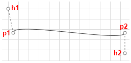

# Connection Types

* __ConnectionPoints__ - if you want to change the route of the connection, you can add connection points in code-behind through the RadDiagramConnection.__ConnectionPoints__ property. You can populate the __ConnectionPoints__ collection with objects of type *Point*: 

{{source=..\SamplesCS\Diagram\DiagramItems.cs region=AddConnection}} 
{{source=..\SamplesVB\Diagram\DiagramItems.vb region=AddConnection}} 

````C#
            
RadDiagramConnection connection1 = new RadDiagramConnection() { Name = "connection1" };
            
connection1.Source = shape1;
connection1.Target = starShape;
connection1.ConnectionPoints.Add(new Point(200, 30));
radDiagram1.Items.Add(connection1);

````
````VB.NET
Dim connection1 As New RadDiagramConnection() With { _
    .Name = "connection1" _
}
connection1.Source = shape1
connection1.Target = starShape
connection1.ConnectionPoints.Add(New Point(200, 30))
RadDiagram1.Items.Add(connection1)

````

{{endregion}} 


>note You can refer to the [Shapes]() article where the shapes are defined.
>


* __ConnectionType__ - controls the connection type. As an enumeration of type Telerik.Windows.Diagrams.Core.ConnectionType, it exposes the following members:
            

\* __Polyline__ - this type allows you to define multiple points a connection has to pass through. By default, such a connection have two points it has to pass through - its source connector (or StartPoint) and its target connector (or EndPoint). This is why by default the Polyline __ConnectionType__ visualizes a straight connection. Sample of a straight Polyline connection between two shapes:

 


{{source=..\SamplesCS\Diagram\DiagramItems.cs region=PolylineConnection}} 
{{source=..\SamplesVB\Diagram\DiagramItems.vb region=PolylineConnection}} 

````C#
            
RadDiagramShape sourceShape = new RadDiagramShape()
{
    Text = "source",
    Shape = new RoundRectShape(5),
    BackColor = Color.Red
};
            
sourceShape.Position = new Telerik.Windows.Diagrams.Core.Point(150, 100);
radDiagram1.AddShape(sourceShape);
            
RadDiagramShape targetShape = new RadDiagramShape()
{
    Text = "target",
    Shape = new RoundRectShape(5),
    BackColor = Color.Red
};
            
targetShape.Position = new Telerik.Windows.Diagrams.Core.Point(400, 300);
radDiagram1.AddShape(targetShape);
            
RadDiagramConnection polylineConnection = new RadDiagramConnection() { Name = "connection1" };
            
polylineConnection.Source = sourceShape;
polylineConnection.Target = targetShape;
polylineConnection.ConnectionType = Telerik.Windows.Diagrams.Core.ConnectionType.Polyline;
radDiagram1.AddShape(polylineConnection);

````
````VB.NET
Dim sourceShape As New RadDiagramShape() With { _
    .Text = "source", _
    .Shape = New RoundRectShape(5), _
    .BackColor = Color.Red _
}
sourceShape.Position = New Telerik.Windows.Diagrams.Core.Point(150, 100)
RadDiagram1.AddShape(sourceShape)
Dim targetShape As New RadDiagramShape() With { _
    .Text = "target", _
    .Shape = New RoundRectShape(5), _
    .BackColor = Color.Red _
}
targetShape.Position = New Telerik.Windows.Diagrams.Core.Point(400, 300)
RadDiagram1.AddShape(targetShape)
Dim polylineConnection As New RadDiagramConnection() With { _
    .Name = "connection1" _
}
polylineConnection.Source = sourceShape
polylineConnection.Target = targetShape
polylineConnection.ConnectionType = Telerik.Windows.Diagrams.Core.ConnectionType.Polyline
RadDiagram1.Items.Add(polylineConnection)

````

{{endregion}} 


If you want to change the route of the connection, you can add connection points in code-behind through the RadDiagramConnection.__ConnectionPoints__ property. You can populate the __ConnectionPoints__ collection with objects of type Point: 


{{source=..\SamplesCS\Diagram\DiagramItems.cs region=ConnectionPolylineWithPoints}} 
{{source=..\SamplesVB\Diagram\DiagramItems.vb region=ConnectionPolylineWithPoints}} 

````C#
            
polylineConnection.ConnectionPoints.Add(new Point(300, 140));
polylineConnection.ConnectionPoints.Add(new Point(330, 280));

````
````VB.NET
polylineConnection.ConnectionPoints.Add(New Point(300, 140))
polylineConnection.ConnectionPoints.Add(New Point(330, 280))

````

{{endregion}} 


Sample of a curved Polyline connection:


\* __Bezier__ - this connection type allows you to create a Bézier curve. The Bezier connection is a curve specified by four points: two end points (p1 and p2) - the source/start and target/end of the connection and two handle points (h1 and h2) and a tension parameter. The curve begins at p1 and ends at p2 and it doesn't   pass through the handle points, but the handle points act as magnets, pulling the curve in certain directions and influencing the way the curve bends. The following illustration shows a Bézier RadDiagramConnection along with its endpoints and handle points.

 The RadDiagramConnection. __BezierTension__ parameter defines the curve that will be produced for a given set of end and handle points. The following illustration shows a Bezier connection:

 

{{source=..\SamplesCS\Diagram\DiagramItems.cs region=BezierConnection}} 
{{source=..\SamplesVB\Diagram\DiagramItems.vb region=BezierConnection}} 

````C#
            
RadDiagramConnection bezierConnection = new RadDiagramConnection() { Name = "connection1" };
            
bezierConnection.Source = sourceShape;
bezierConnection.Target = targetShape;
bezierConnection.BezierTension = 16;
bezierConnection.ConnectionType = Telerik.Windows.Diagrams.Core.ConnectionType.Bezier;
radDiagram1.Items.Add(bezierConnection);

````
````VB.NET
Dim bezierConnection As New RadDiagramConnection() With { _
    .Name = "connection1" _
}
bezierConnection.Source = sourceShape
bezierConnection.Target = targetShape
bezierConnection.BezierTension = 16
bezierConnection.ConnectionType = Telerik.Windows.Diagrams.Core.ConnectionType.Bezier
RadDiagram1.Items.Add(bezierConnection)

````

{{endregion}} 


By default, when you create a Bezier connection and attach its endpoints to __RadDiagramShapes__, the position of the handle points of the connection will be calculated based on the connector positions. Both handle points will be added to the RadDiagramConnection.__ConnectionPoints__ collection. The following snapshot illustrates the default direction of the Bezier connection handles based on the position of the connector to which the connection is attached.

 

The offset between a Bezier connection handle point and its corresponding endpoint is controlled thorough the __BezierAutoOffset__ DiagramConstants. Its default value is *30px*, but you can change it to better fit your needs.When attaching a Bezier connection to a RadDiagramShape you need to consider if it is attached to a built-in connector or to a custom connector. If the connection is attached to a custom connector, then you will have to manually set the position of the Bezier handle points. You can change the position of the points after you access them from the RadDiagramConnection. __ConnectionPoints__ collection, but you will also have to set the RadDiagramConnection. __IsModified__ property to True to apply the changes. If you don't want to manually traverse the __ConnectionPoints__ collection and then set the __IsModified__ property, you can use the RadDiagramConnection. __SetBezierHandles(Point,Point)__ method. It facilitates the definition of custom coordinates for the two handle points of a Bezier connection.

>note Please note that if you create custom connectors which names include any of the following strings:
>
* "right"
* "left"
* "bottom"
* "up" the Bezier Connection handle points will point at the direction indicated by the respective string.>On the other hand, if you attach a Bezier Connection to a custom connector which name doesn't indicate a direction, the handle points of the connection will match the start and end point of the connection.
>


\* __Spline__ - this connection type represents a cardinal spline. The connection is specified by an array of points - the connection passes smoothly through each point in the array; there are no sharp corners and no abrupt changes in the tightness of the curve. The following illustration shows a set of points and a spline connection that passes through each point in the set. Sample of a Spline connection:

 

{{source=..\SamplesCS\Diagram\DiagramItems.cs region=SplineConnection}} 
{{source=..\SamplesVB\Diagram\DiagramItems.vb region=SplineConnection}} 

````C#
            
RadDiagramConnection splineConnection = new RadDiagramConnection() { Name = "connection1" };
            
splineConnection.Source = sourceShape;
splineConnection.Target = targetShape;            
splineConnection.ConnectionType = Telerik.Windows.Diagrams.Core.ConnectionType.Spline;
splineConnection.ConnectionPoints.Add(new Point(140, 20));
splineConnection.ConnectionPoints.Add(new Point(250, 150));
splineConnection.ConnectionPoints.Add(new Point(350, 50));    
radDiagram1.Items.Add(splineConnection);

````
````VB.NET
Dim splineConnection As New RadDiagramConnection() With { _
    .Name = "connection1" _
}
splineConnection.Source = sourceShape
splineConnection.Target = targetShape
splineConnection.ConnectionType = Telerik.Windows.Diagrams.Core.ConnectionType.Spline
splineConnection.ConnectionPoints.Add(New Point(140, 20))
splineConnection.ConnectionPoints.Add(New Point(250, 150))
splineConnection.ConnectionPoints.Add(New Point(350, 50))
RadDiagram1.Items.Add(splineConnection)

````

{{endregion}} 
